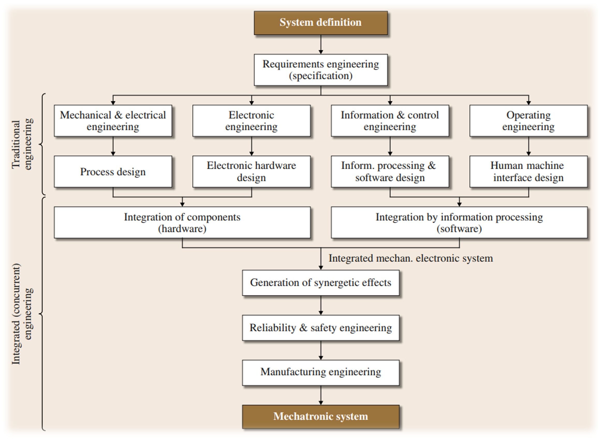
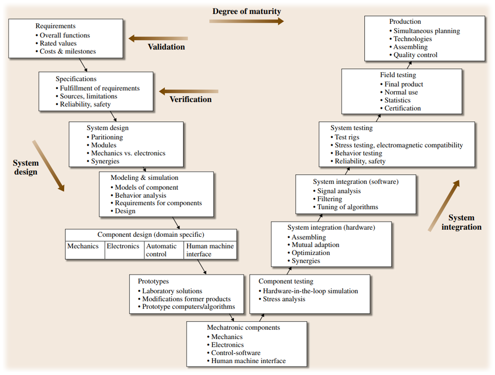
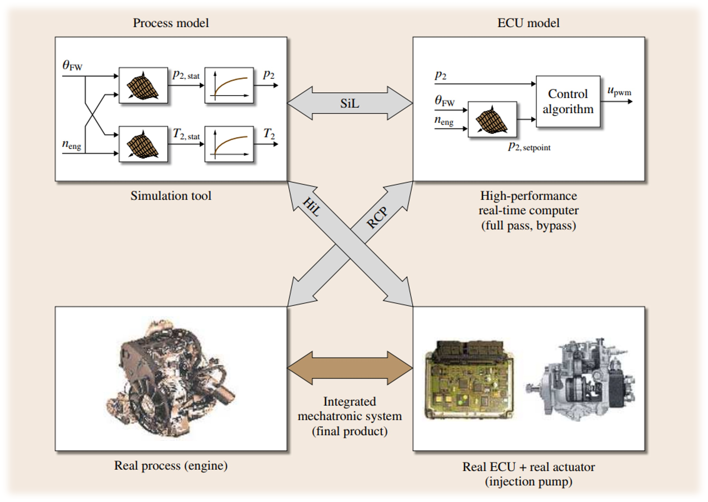

# Cornell Notes

## Topic: Mechatronic System Design

## Date: 08/09/2026

---

<strong><em>"DO NOT JUST TALK ABOUT IT — SHOW IT"</em></strong>

---

### Cue Column (Questions, Keywords, or Prompts)

- Design Procedures for Mechatronic Systems
- Computer-Aided Design of Mechatronic Systems

---

### Notes Section (Main Notes)

### Design Procedures for Mechatronic Systems

The design of mechatronic systems requires systematic development and use of modern software design tools.

Mechatronic design is also an iterative procedure.

### `V` development scheme for mechatronic systems

*Source: Chapter 1 PDF, page 15.*

*Source: Chapter 1 PDF, page 16.*

### Computer-Aided Design of Mechatronic Systems

*Source: Chapter 1 PDF, page 17.*

---

### Summary Section (Summary of Notes)

Brief summary of the key ideas and takeaways
