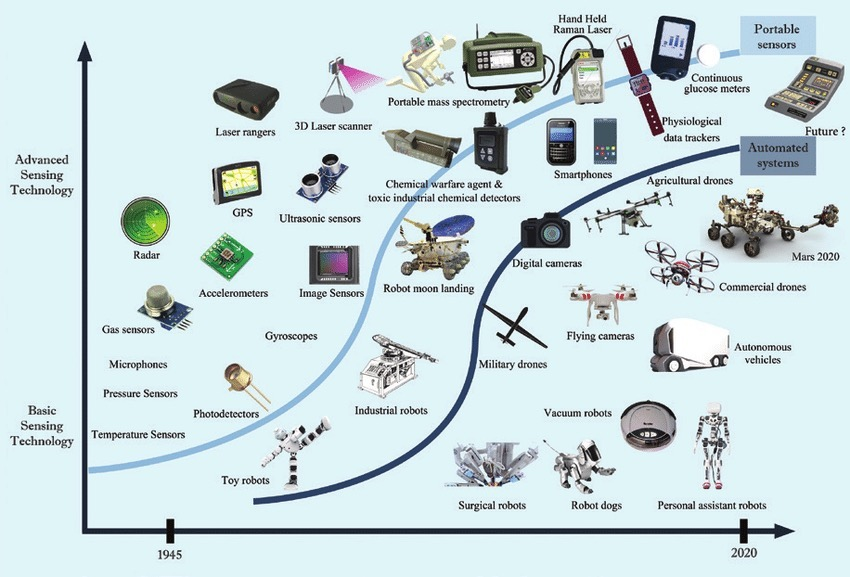
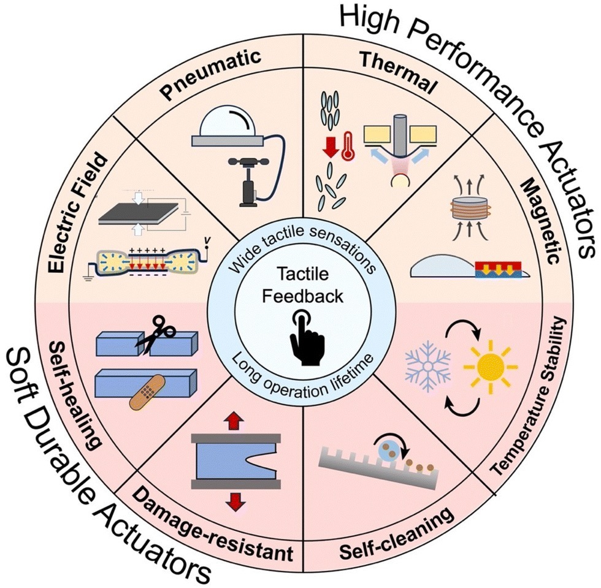
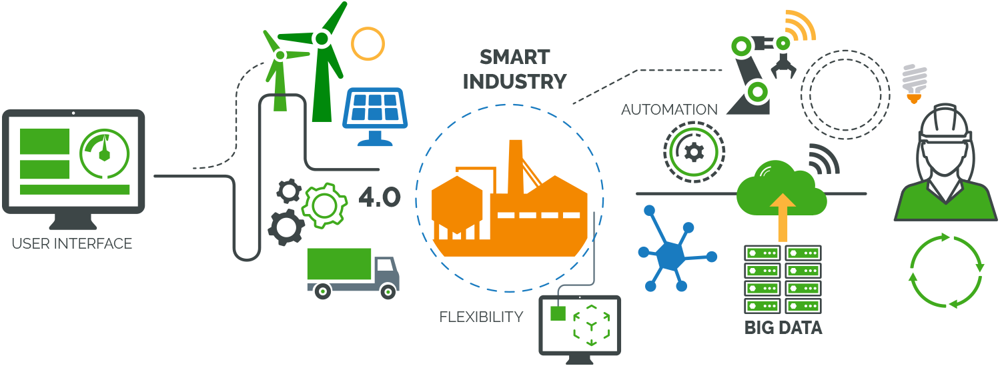
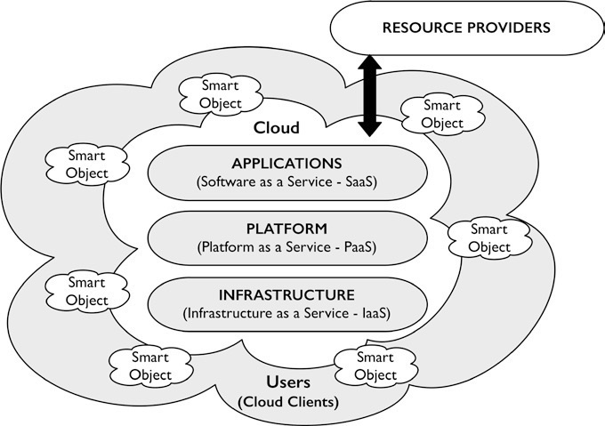
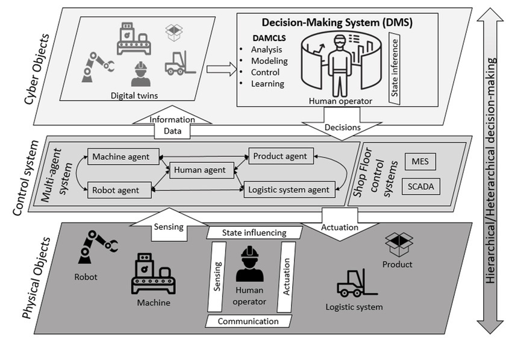
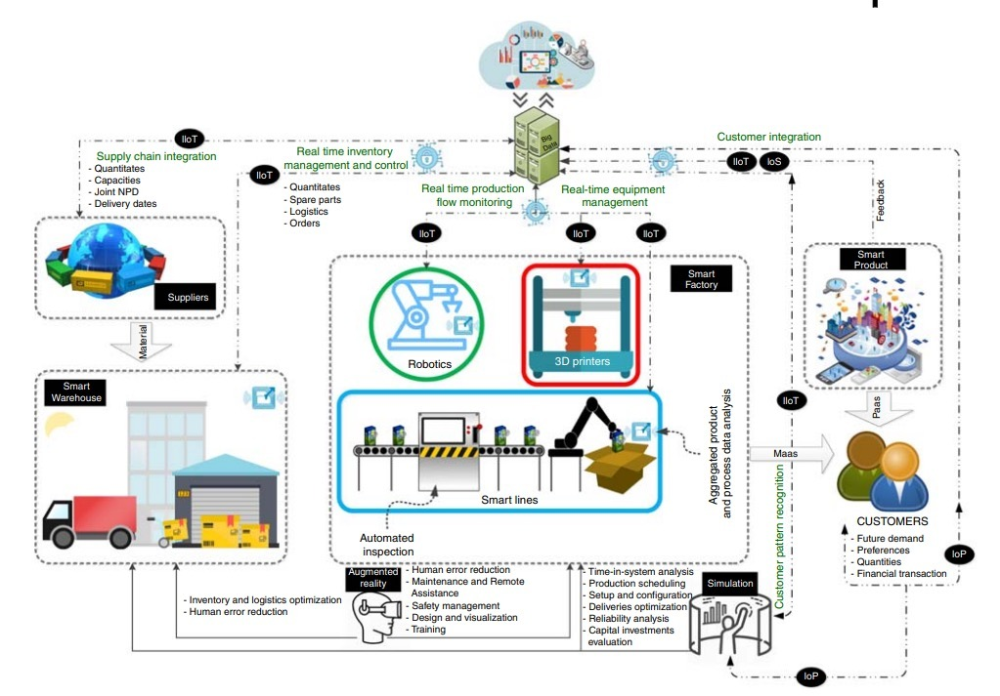

# Cornell Notes

## Topic: Recent Trends in Mechatronics

## Date: 08/09/2026

---

<strong><em>"DO NOT JUST TALK ABOUT IT — SHOW IT"</em></strong>

---

### Cue Column (Questions, Keywords, or Prompts)

Cues

---

### Notes Section (Main Notes)

### Advanced Sensors and Actuators

- Micro-Electro-Mechanical Systems (MEMS)
- Tactile / Touch Sensors
- Flexible / Stretchable Sensors
- Wearable Health Sensors
- Soft Actuators
- Piezoelectric Actuators
- Bio-Inspired Actuators

*Source: Chapter 1 PDF, page 19.*

*Source: Chapter 1 PDF, page 19.*

**Advanced Sensors and Actuators:** These are key components in modern mechatronic systems, enabling precise measurement and control. Advanced sensors gather accurate real-time data, while actuators convert this data into actions, enhancing system efficiency and performance across industries.

### Cloud-based structures for Internet of Things (IoT)

**Cloud-based structures for Internet of Things (IoT):** These are scalable, flexible platforms that allow IoT devices to collect, store, and process data in real-time via cloud computing. By leveraging the cloud, IoT systems can achieve enhanced connectivity, data analytics, and remote control, enabling smarter and more efficient applications across various industries.

*Source: Chapter 1 PDF, page 20.*

*Source: Chapter 1 PDF, page 20.*

### Cyber-Physical Systems (CPS)

A Cyber-Physical System (CPS) is a system that intergrates physical and computational components to monitor and control the physical processes seamlessly.

In other words, A cyber-physical system is a collection of computing devices communicating with one another and interacting with the physical world via sensors and actuators in a feedback loop.

*Source: Chapter 1 PDF, page 21.*

### Artificial Intelligence (AI) and Machine Learning (ML)

*Source: Chapter 1 PDF, page 22.*

---

### Summary Section (Summary of Notes)

Brief summary of the key ideas and takeaways
