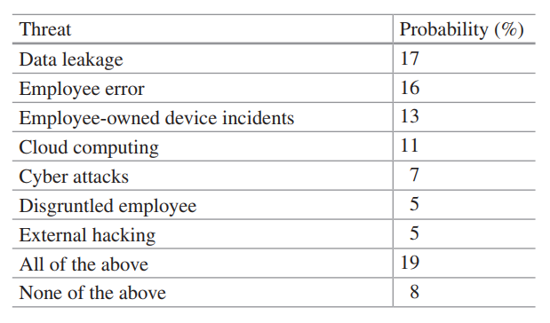
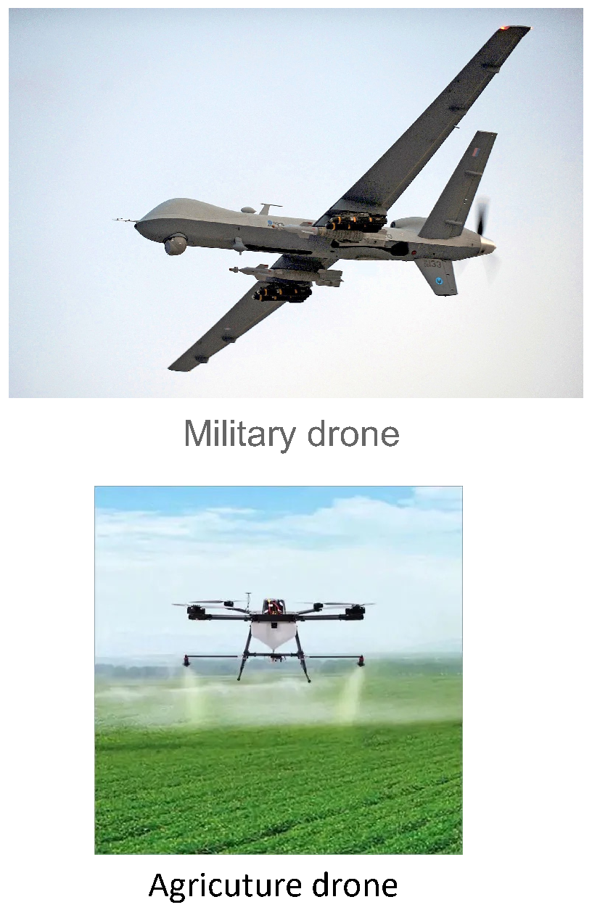
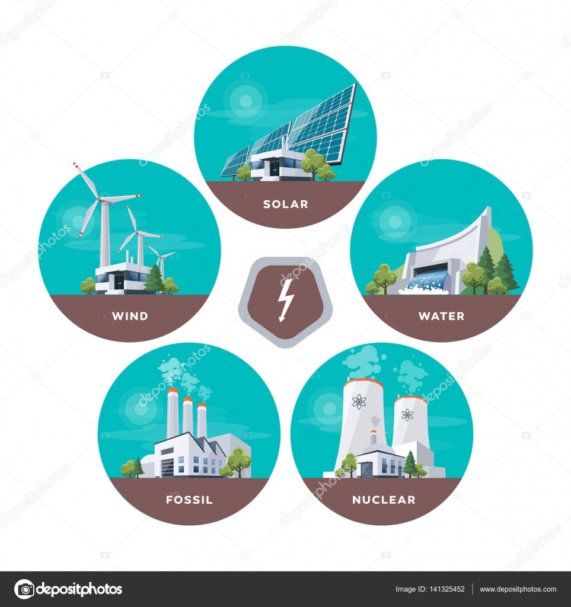
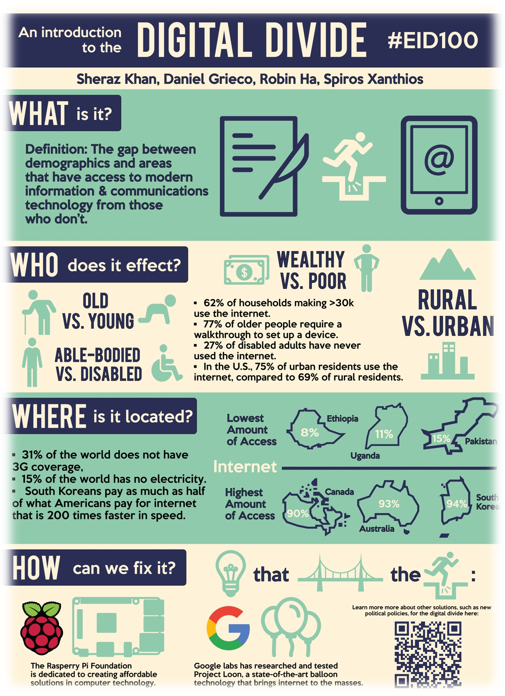
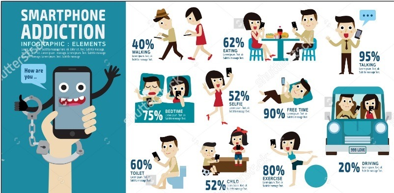
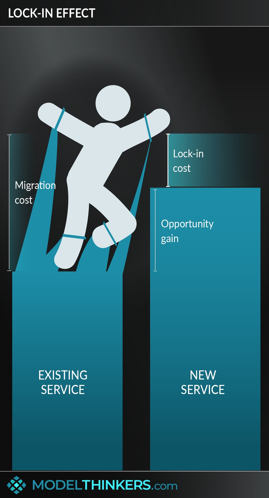
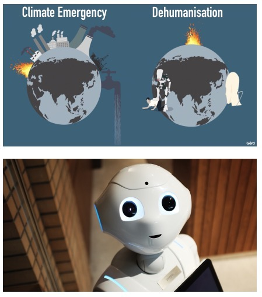
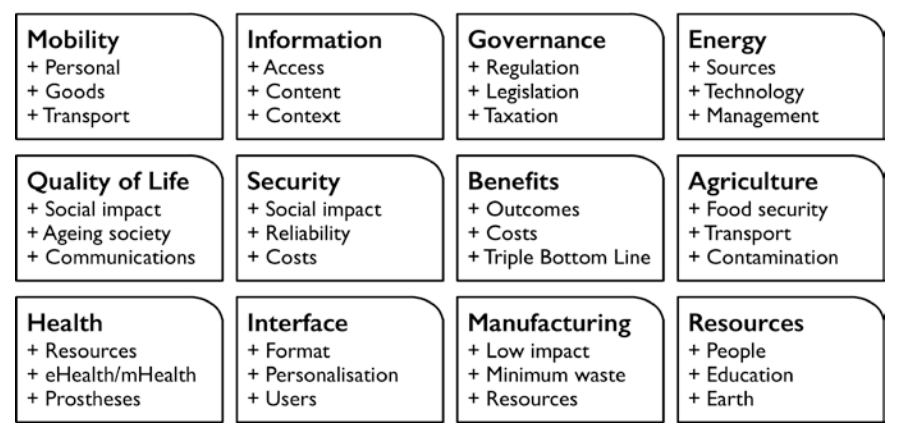
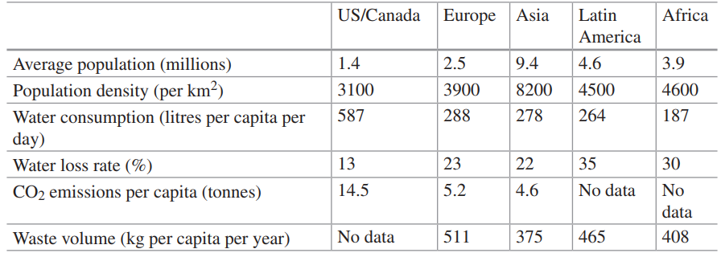
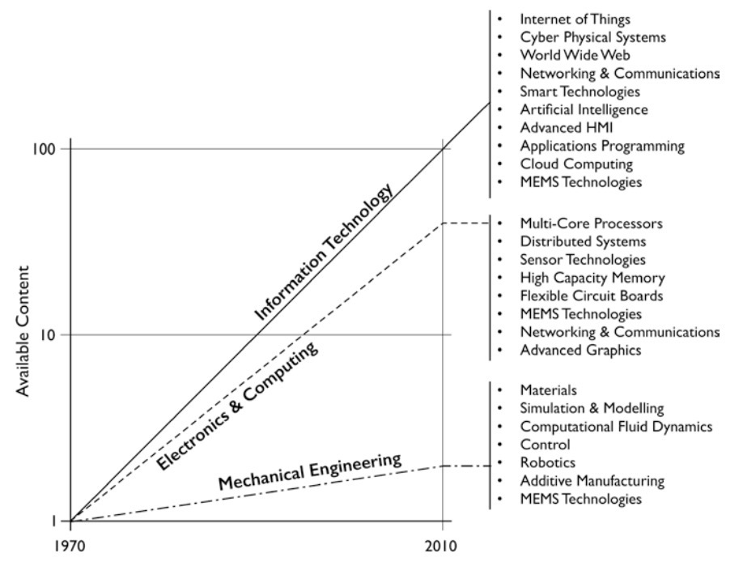

# Cornell Notes

## Topic: Challenges of Mechatronic System

## Date: 08/09/2026

---

<strong><em>"DO NOT JUST TALK ABOUT IT — SHOW IT"</em></strong>

---

### Cue Column (Questions, Keywords, or Prompts)

Cues

---

### Notes Section (Main Notes)

### Privacy and Security

*Source: Chapter 1 PDF, page 24.*

### Complexity and Ethics

*Source: Chapter 1 PDF, page 25.*

*Source: Chapter 1 PDF, page 26.*

*Source: Chapter 1 PDF, page 27.*

*Source: Chapter 1 PDF, page 28.*

*Source: Chapter 1 PDF, page 29.*

*Source: Chapter 1 PDF, page 30.*

### Sustainability

*Source: Chapter 1 PDF, page 31.*

*Source: Chapter 1 PDF, page 31.*

### Education

*Source: Chapter 1 PDF, page 32.*

---

### Summary Section (Summary of Notes)

Brief summary of the key ideas and takeaways
