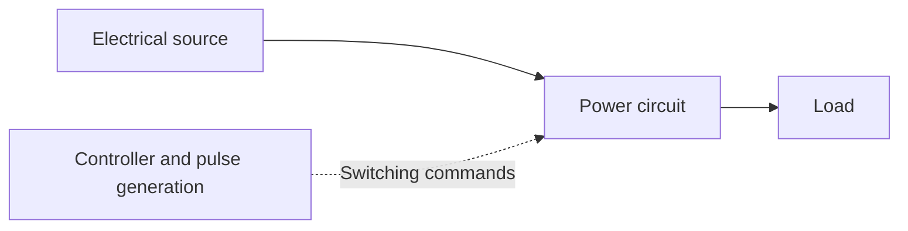
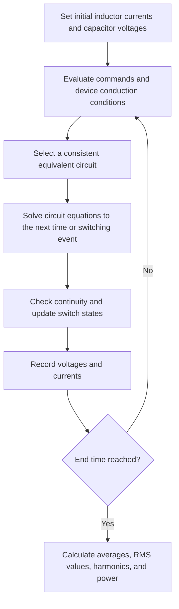

# Cornell Notes

## Topic: Chapter 1 - Introduction to Power Electronics

## Date: 11/09/2026

---

<p align="center"><strong><em>"DO NOT JUST TALK ABOUT IT — SHOW IT"</em></strong></p>

---

### Cue Column (Questions, Keywords, or Prompts)

| Questions / keywords | Where to look in the notes |
| --- | --- |
| What does power electronics convert and control? | I.1: Scope and converter structure |
| What are rectifiers, inverters, and AC/DC voltage converters? | I.1: Converter classification |
| How do a diode, an SCR, and a transistor switch differ? | I.2: Ideal semiconductor switches |
| Why does an SCR remain ON after its gate pulse ends? | I.2: Latching and holding current |
| What do peak, average, and RMS values tell us? | I.3.1: Waveform measurements |
| What are the fundamental, harmonics, and Fourier coefficients? | I.3.2: Fourier analysis |
| How do the chapter's shape factors differ from conventional form factor? | I.3.3: Waveform quality |
| What is the difference between ripple and AC harmonic distortion? | I.3.3: Ripple factor and THD |
| Why can power factor be below one even without a phase shift? | I.3.4: Power and power factor |
| How do we choose the correct equivalent circuit during switching? | I.3.5: Analysis methods and Example 0 |
| What changes between startup and periodic steady state? | I.3.6-I.3.7: Worked Examples 1 and 2 |
| How can Fourier superposition simplify a circuit calculation? | I.3.8: Worked Example 3 |
| How does a simulator follow a switching circuit through time? | I.3.9: Numerical and experimental methods |
| What must I be able to explain or calculate after this chapter? | I.4 and I.5: Review checklist and exercises |
| Which unfamiliar terms should I learn first? | Technical vocabulary |
| Where can I study further? | I.6: References and further reading |

---

### Notes Section (Main Notes)

**Primary source:** Huỳnh Văn Kiểm, [Chapter 1: Introduction](../../03_resources/07_Dien-Tu-Cong-Suat-Huynh-Van-Kiem/Chuong1_Modau.pdf), pages 1-8, course handout from the second semester of 2004-2005. Page references below refer to this PDF.

These notes explain every chapter section in English, including its worked examples, exercise statements, and reference list. Additional definitions, derivations, and modern references are identified where relevant. The PDF is a historical teaching outline; corrections to its notation and formulas are collected near the end of the main notes.

#### I.1. Scope and basic concepts

*Source: page 1, section I.1 and Figure 1.0.*

**Power electronics** is the application of electronic devices and circuits to the conversion and control of electrical energy. The chapter also mentions the names **high-power electronics** and **electrical energy conversion engineering**, and places the subject within applied or industrial electronics. Power electronics also includes low-power converters; the name does not impose a minimum power rating.

A converter changes the electrical form supplied to a load, such as its voltage level, current, frequency, or AC/DC character. A **load** is whatever receives the electrical power: a motor, heater, battery-charging circuit, or electronic device.

| Input → output | Conversion | Converter name | Example |
| --- | --- | --- | --- |
| AC → DC | Rectification | Rectifier | Producing a DC supply from an AC source |
| AC → AC | AC voltage control or frequency conversion | AC voltage controller or frequency converter | Heater power control or an AC motor drive |
| DC → DC | DC voltage conversion | DC-DC converter; often called a chopper in this course | Changing one DC voltage level to another |
| DC → AC | Inversion | Inverter | Supplying an AC motor from a DC bus |

An AC voltage controller can change the effective voltage while retaining the supply frequency. A frequency converter changes frequency, often through an intermediate DC stage. A variable-frequency drive (VFD) is an application of frequency conversion to motor control.

**Terminology correction:** the standard term for DC-to-AC conversion is **inversion**. It does not mean "counter-flow," "backflow," or simply reversing current direction.

The chapter defines a complete converter as:

$$
\text{Converter} = \text{power circuit} + \text{controller}
$$

Its Figure 1.0 can be read as the following English block diagram:



The **power circuit**, also called the **power stage**, carries and converts the load power. The controller determines how its controlled semiconductor switches operate. In the chapter:

$$
\text{Controller} = \text{closed-loop control, if used} + \text{pulse-generation circuit}
$$

The pulse-generation/drive circuitry provides suitable control voltages or currents in the required switching sequence. Closed-loop control is optional; it adds measurement and correction of output error. Diodes switch according to circuit conditions and do not receive gate commands.

The course concentrates on semiconductor devices operating as switches. Ideally, an ON switch has zero voltage drop, and an OFF switch carries zero current. Thus its instantaneous loss, $p(t)=v(t)i(t)$, is zero in either ideal state. Real devices have conduction losses and losses during switching transitions. Converters may also be classified by how their switches are controlled and commutated, meaning how current transfers between conducting devices.

#### I.2. Ideal semiconductor switches

*Source: pages 1-2, section I.2 and Figure 1.1.*

The chapter uses idealized devices so the circuit-analysis method is not tied to one manufacturer's component. Its current-voltage plots show the allowed ON and OFF states: conduction lies along the current axis when device voltage is zero; blocking lies along the voltage axis when current is zero.

| Device | When it turns ON | When it turns OFF | Ideal blocking/conduction behavior |
| --- | --- | --- | --- |
| Diode | Circuit conditions forward-bias it and support forward current | Forward current ceases and reverse voltage is applied | Conducts anode-to-cathode current; blocks reverse voltage |
| SCR, a conventional thyristor | It is forward-biased and receives an adequate gate trigger | Its current falls below the holding current and it has time to recover | Conducts forward current; can block forward or reverse voltage within its ratings |
| Controlled unidirectional switch, represented by a transistor | An appropriate control signal is applied | The control signal is removed or driven to its OFF state | The chapter's ideal model conducts one current direction and blocks positive switch voltage |

**Diode:** $v_{AK}=v_A-v_K$ is the anode-to-cathode voltage. The source describes forward bias as $v_{AK}>0$; once an ideal diode conducts, its drop is modeled as $v_{AK}=0$. An ideal conducting diode has $i_D\geq0$; an ideal blocking diode has $i_D=0$ and $v_{AK}\leq0$. The rest of the circuit determines the actual current.

**SCR:** SCR stands for **silicon-controlled rectifier**. Unlike a transistor, a conventional SCR can stay ON after the gate signal is removed. This is called **latching**. An OFF, forward-biased SCR can remain blocking until triggered; removing the gate signal does not turn an already latched SCR OFF.

The handout simplifies SCR turn-off to "current becomes zero." For a real device, distinguish:

- **Latching current, $I_L$:** the minimum main current needed to establish conduction that persists after the gate trigger is removed.
- **Holding current, $I_H$:** the minimum main current needed to maintain established conduction. Turn-off requires the current to fall below this level, together with suitable recovery time and circuit conditions.

Further explanation: [STMicroelectronics AN303: Latching current](https://www.st.com/resource/en/application_note/an303-thyristors-and-triacs-latching-current-stmicroelectronics.pdf) and [AN302: Holding current](https://www.st.com/resource/en/application_note/an302-thyristors-and-triacs-holding-current--an-important-parameter-stmicroelectronics.pdf).

**Transistor switch:** the chapter gives two implementations. A **BJT** uses base-current drive; a **power MOSFET** is controlled through its gate-to-source voltage, $v_{GS}$. Although a MOSFET is voltage-controlled, its driver must supply and remove gate charge during switching.

The unidirectional switch is a circuit model, not a universal description of every transistor. For example, a power MOSFET has a body diode and can conduct reverse channel current under appropriate conditions. More complex real-device behavior can be represented with combinations of ideal switches and diodes, as the chapter notes.

#### I.3.1. What circuit analysis determines: peak, average, and RMS values

*Source: pages 2-3, section I.3.1 and equation 1.1.*

The starting information is the circuit, the switch-control signals, and the load characteristics. Analysis determines the voltage and current waveforms of the components, followed by useful voltage, current, and power measures.

Use these notation conventions throughout this note:

| Symbol | Meaning |
| --- | --- |
| $v(t)$, $i(t)$ | Instantaneous voltage and current |
| $v_o(t)$, $i_o(t)$ | Instantaneous output/load voltage and current; subscript $o$ means output |
| $V_0$, $I_0$ | Average/DC components; subscript $0$ is zero |
| $V_{\mathrm{rms}}$, $I_{\mathrm{rms}}$ | RMS values; the PDF writes $V_R$, $I_R$ |
| $\hat V_n$, $\hat I_n$ | Peak amplitudes of the $n$th sinusoidal harmonic |
| $V_{n,\mathrm{rms}}$, $I_{n,\mathrm{rms}}$ | RMS values of that harmonic |
| $T$, $f$, $\omega$ | Period, frequency, and angular frequency; $f=1/T$, $\omega=2\pi f$ |

For a periodic waveform, integrate over one complete period:

$$
I_0=\frac{1}{T}\int_0^T i(t)\,dt,
\qquad
I_{\mathrm{rms}}=\sqrt{\frac{1}{T}\int_0^T i^2(t)\,dt}
$$

$$
V_0=\frac{1}{T}\int_0^T v(t)\,dt,
\qquad
V_{\mathrm{rms}}=\sqrt{\frac{1}{T}\int_0^T v^2(t)\,dt}
$$

| Quantity | Physical meaning | Why we calculate it |
| --- | --- | --- |
| Peak, e.g. $\max\lvert i(t)\rvert$ | Largest instantaneous magnitude | Component stress and rating selection; positive and negative voltage peaks may need separate checks |
| Average | Net signed value over a cycle | DC output level and average charge flow |
| RMS: root mean square | Equivalent DC magnitude giving the same average heating in a resistor | Heating, current ratings, and apparent power |

For a resistor, $P_R=R I_{\mathrm{rms}}^2$. A sinusoid can have zero average current while still heating the resistor because its RMS current is nonzero.

**Additional example:** a waveform equal to $I_p$ for fraction $D$ of each period and zero otherwise has $I_0=DI_p$ and $I_{\mathrm{rms}}=I_p\sqrt D$. For $I_p=10\,\mathrm A$ and $D=0.25$, the average is $2.5\,\mathrm A$ but the RMS is $5\,\mathrm A$.

Further reading: [Tektronix: Fundamentals of AC power measurements](https://www.tek.com/en/documents/application-note/fundamentals-ac-power-measurements).

#### I.3.2. Fourier analysis and higher harmonics

*Source: page 3, section I.3.2 and equation 1.2.*

A **Fourier series** expresses a periodic waveform as a DC component plus sinusoidal components. The **fundamental** has frequency $f$; the $n$th **harmonic** has frequency $nf$. Switching often creates nonsinusoidal waveforms containing several harmonics.

$$
v(t)=V_0+\sum_{n=1}^{\infty}\left[A_n\sin(n\omega t)+B_n\cos(n\omega t)\right]
$$

$$
A_n=\frac{2}{T}\int_0^T v(t)\sin(n\omega t)\,dt,
\qquad
B_n=\frac{2}{T}\int_0^T v(t)\cos(n\omega t)\,dt
$$

The same harmonic can be written as:

$$
v_n(t)=\hat V_n\sin(n\omega t-\phi_n),
\qquad
\hat V_n=\sqrt{A_n^2+B_n^2}
$$

For this particular sine-minus-phase convention, $A_n=\hat V_n\cos\phi_n$ and $B_n=-\hat V_n\sin\phi_n$. Therefore use $\phi_n=\operatorname{atan2}(-B_n,A_n)$, rather than the inconsistent inverse-tangent expression printed in the handout. The two-argument function also selects the correct quadrant; phase is irrelevant when harmonic amplitude is zero.

Because distinct harmonics are orthogonal over a complete period, their squared RMS values add:

$$
V_{\mathrm{rms}}^2=V_0^2+\sum_{n=1}^{\infty}V_{n,\mathrm{rms}}^2
=V_0^2+\frac{1}{2}\sum_{n=1}^{\infty}\hat V_n^2
$$

For a sinusoidal harmonic, $V_{n,\mathrm{rms}}=\hat V_n/\sqrt2$. The same relationships apply to current.

**Notation correction:** $T=2\pi/\omega$. Page 3 prints the reciprocal relation incorrectly. The PDF also uses $V_1$ for a peak amplitude in some formulas and an RMS value in others; the explicit subscripts and hats here prevent that ambiguity.

#### I.3.3. Waveform quality: shape factors, ripple, and THD

*Source: page 3, following equation 1.2.*

The handout calls the ratio of the useful component to total RMS a **form factor**. Preserve its convention when using course formulas:

$$
KF_{\mathrm{DC}}=\frac{V_0}{V_{\mathrm{rms}}},
\qquad
KF_{\mathrm{AC}}=\frac{V_{1,\mathrm{rms}}}{V_{\mathrm{rms}}}
$$

The DC expression assumes a positive average output. A magnitude-based version uses $\lvert V_0\rvert$. For these ratios, a value close to one means that most of the waveform's squared RMS content is in the desired component.

**Convention warning:** many measurement references define ordinary form factor in the opposite direction, $V_{\mathrm{rms}}/V_{\mathrm{avg,rectified}}$, where $V_{\mathrm{avg,rectified}}$ is the average of $\lvert v(t)\rvert$. For a nonnegative DC-output waveform, that is the reciprocal of the chapter's $KF_{\mathrm{DC}}$. Always check the formula, not just the name. See [Tektronix: DMM specifications, form factor](https://www.tek.com/en/documents/whitepaper/understanding-handheld-dmm-specifications).

For a DC output, separate the average from the time-varying **ripple**:

$$
V_{\mathrm{ripple,rms}}=\sqrt{V_{\mathrm{rms}}^2-V_0^2},
\qquad
r=\frac{V_{\mathrm{ripple,rms}}}{\lvert V_0\rvert}
$$

The source labels $r$ as DC "THD"; **ripple factor** is the clearer term because the desired component is DC, not a sinusoidal fundamental. This ratio is undefined when $V_0=0$.

For an AC waveform, **total harmonic distortion (THD)** compares all higher harmonics with the fundamental:

$$
\mathrm{THD}_V=
\frac{\sqrt{\sum_{n=2}^{\infty}V_{n,\mathrm{rms}}^2}}{V_{1,\mathrm{rms}}}
$$

When the waveform has no DC component, this becomes the expression used in the chapter:

$$
\mathrm{THD}_V=\frac{\sqrt{V_{\mathrm{rms}}^2-V_{1,\mathrm{rms}}^2}}{V_{1,\mathrm{rms}}}
$$

If a DC offset exists, also subtract $V_0^2$ inside the square root. THD is undefined if the fundamental is zero. Multiply a ratio by $100\%$ to express it as a percentage.

For positive DC output, $r=\sqrt{KF_{\mathrm{DC}}^{-2}-1}$. For AC without a DC offset, $\mathrm{THD}_V=\sqrt{KF_{\mathrm{AC}}^{-2}-1}$.

Further reading: [Texas Instruments: Total harmonic distortion](https://www.ti.com/document-viewer/lit/html/SSZTDA2/GUID-A52B0A72-B6F3-4F7F-89A8-0748B331042F).

#### I.3.4. Active power, apparent power, and power factor

*Source: pages 3-4, equations 1.3-1.4 and the voltage/current waveform illustration.*

**Active power** is the average rate of net energy transfer. **Apparent power** is the product of total RMS voltage and current. **Power factor** compares the two:

$$
P=\frac{1}{T}\int_0^T v(t)i(t)\,dt\quad[\mathrm W]
$$

$$
S=V_{\mathrm{rms}}I_{\mathrm{rms}}\quad[\mathrm{VA}],
\qquad
\mathrm{PF}=\frac{P}{S}
$$

For a consuming load, a low positive PF means more RMS current is required to deliver a given active power at a fixed RMS voltage. Apparent power is a loading measure, not another amount of energy consumed per second.

**Power factor is different from efficiency.** Conversion efficiency is $\eta=P_{\mathrm{out}}/P_{\mathrm{in}}$. A converter can have low internal losses but poor input current waveform quality and consequently poor PF.

The chapter distinguishes DC power, fundamental power, and total average active power:

$$
P_{\mathrm{DC}}=V_0I_0
$$

$$
P_1=V_{1,\mathrm{rms}}I_{1,\mathrm{rms}}\cos\theta_1
=\frac{\hat V_1\hat I_1}{2}\cos\theta_1
$$

$$
P=V_0I_0+\sum_{n=1}^{\infty}
V_{n,\mathrm{rms}}I_{n,\mathrm{rms}}\cos\theta_n
$$

Here $\theta_n$ is the phase difference between voltage and current at harmonic $n$. If peak harmonic amplitudes are used, every harmonic product needs the factor $1/2$. For a DC converter, the DC component is usually desired, while ripple may cause additional heating or other unwanted effects.

For a **sinusoidal supply voltage** and a possibly distorted current, only the fundamental current contributes to average active input power:

$$
P=V_{\mathrm{rms}}I_{1,\mathrm{rms}}\cos\theta_1,
\qquad
\mathrm{PF}=\underbrace{\frac{I_{1,\mathrm{rms}}}{I_{\mathrm{rms}}}}_{\text{distortion factor}}
\underbrace{\cos\theta_1}_{\text{displacement factor}}
$$

Thus $\mathrm{PF}=\cos\theta_1$ only when the current is also sinusoidal. The pulsed-current illustration on page 4 shows why a current waveform can have poor PF even when its fundamental is aligned with the supply voltage: higher harmonics increase RMS current without increasing active input power from that sinusoidal voltage.

For current with no DC component:

$$
\mathrm{PF}=\frac{\cos\theta_1}{\sqrt{1+\mathrm{THD}_I^2}}
$$

**Additional example:** if $I_{1,\mathrm{rms}}=8\,\mathrm A$, total $I_{\mathrm{rms}}=10\,\mathrm A$, and $\theta_1=0$, then $\mathrm{PF}=0.8$, despite zero fundamental phase shift.

For a sinusoidal source, unity PF requires an in-phase sinusoidal current. For a constant DC source, it requires a constant current. More generally, $\mathrm{PF}=1$ for a consuming load when $i(t)=k v(t)$ for a positive constant $k$, even if the voltage waveform itself is nonsinusoidal.

Further reading: [Texas Instruments: Power factor, displacement, and distortion](https://www.ti.com/document-viewer/lit/html/SSZTDA4/GUID-74DF7FDF-F08C-47CF-951A-00619A2BE84E).

#### I.3.5. Analysis methods and Example 0: identify the conducting circuit

*Source: page 4, section I.3.4(a), Example 0.*

With ideal switches and linear passive elements, a switching circuit can be studied as a sequence of linear equivalent circuits. The overall behavior is not one fixed linear circuit: the connections change when devices change state.

For each time interval, determine which devices conduct, replace ideal ON devices by short circuits and OFF devices by open circuits, and solve the resulting circuit. Then verify that its currents and voltages satisfy the assumed device states.

The chapter's example is a half-wave rectifier supplying a series $R$-$L$ load. Diode $D_1$ connects the AC source to the load; diode $D_2$ is connected across the load with its cathode at the upper output node. $D_2$ is the **freewheeling diode**: it gives inductor current a path when the source stops supplying it.

```text
AC source v(t) -- D1 (conducts right) --+-- R -- L -- return
                                      |             |
                                      +---- D2 -----+
                         D2 conducts from return to the upper node
```

| State in the source figure | Conditions | Conducting path | Output equation |
| --- | --- | --- | --- |
| (b): $D_1$ ON, $D_2$ OFF | Positive source half-cycle with forward load current | Source → $D_1$ → $R$ → $L$ → source | $v_o=v(t)$; $L\,di_o/dt+Ri_o=v(t)$ |
| (c): $D_1$ OFF, $D_2$ ON | Negative source half-cycle while $i_o>0$ | $R$ → $L$ → $D_2$ → $R$ | $v_o=0$; $L\,di_o/dt+Ri_o=0$ |
| (d): both diodes OFF | Zero stored current and no source condition forcing conduction | No load-current path | $i_o=0$ |

For an ideal $R$-$L$ freewheeling loop with $R,L>0$, positive current decays exponentially and does not reach exactly zero in finite time. The zero-current state is still useful for initial conditions or other loads/models. Do not assume it occurs during every negative half-cycle of this example.

At a switching boundary, finite inductor voltage implies continuous inductor current, and finite capacitor current implies continuous capacitor voltage:

$$
i_L(t_s^+)=i_L(t_s^-),\qquad v_C(t_s^+)=v_C(t_s^-)
$$

#### I.3.6. Worked Example 1: startup of the RL rectifier

*Source: page 5, section I.3.4(b), equations vd1.1-vd1.2. The average-voltage calculation below completes the quantity requested in the example statement.*

Given a sinusoidal source $v(t)=\hat V\sin\omega t$, with $\hat V=\sqrt2 V_s$ and $V_s$ the supply RMS voltage, close the supply at $t=0$ with $i_o(0)=0$. Define:

$$
\tau=\frac{L}{R},\qquad Z=\sqrt{R^2+(\omega L)^2},
\qquad \phi=\tan^{-1}\left(\frac{\omega L}{R}\right)
$$

For the first positive half-cycle, $0\leq t\leq\pi/\omega$, $D_1$ conducts:

$$
L\frac{di_o}{dt}+Ri_o=\hat V\sin\omega t
$$

$$
i_o(t)=\frac{\hat V}{Z}
\left[\sin(\omega t-\phi)+\sin\phi\,e^{-t/\tau}\right]
$$

The first term is a sinusoidal forced response. The exponential is the transient needed to satisfy the initial condition. At $t=0$, the two terms cancel, giving zero current.

Let $I_{\mathrm{half}}=i_o(\pi/\omega)$. During the negative half-cycle, use local time $s=t-\pi/\omega$. $D_2$ carries the stored inductor current:

$$
L\frac{di_o}{ds}+Ri_o=0,
\qquad i_o(s)=I_{\mathrm{half}}e^{-s/\tau}
$$

At the next positive half-cycle, the remaining current is $I_{\mathrm{half}}e^{-\pi/(\omega\tau)}>0$. Successive cycles therefore start with different currents until the waveform approaches a repeating cycle. This is the transition from **startup transient** to **periodic steady state** shown on page 5.

The output voltage is a positive half-sine followed by zero:

$$
v_o(\theta)=
\begin{cases}
\hat V\sin\theta,&0\leq\theta<\pi\\
0,&\pi\leq\theta<2\pi
\end{cases},\qquad \theta=\omega t
$$

$$
V_0=\frac{1}{2\pi}\int_0^\pi\hat V\sin\theta\,d\theta
=\frac{\hat V}{\pi}=\frac{\sqrt2 V_s}{\pi}
$$

For this waveform, $V_{\mathrm{rms}}=\hat V/2$ as an additional RMS check. In periodic steady state the inductor's average voltage is zero, so $I_0=V_0/R$.

#### I.3.7. Worked Example 2: solve periodic steady state directly

*Source: pages 5-6, section I.3.4(c), equations vd2.1-vd2.3. The expressions below correct the printed sign error and explicitly solve the boundary currents.*

Instead of following many startup cycles, let the initial current $I_{\mathrm{start}}$ be unknown and require the state at the end of one period to equal the state at its beginning.

During the positive half-cycle:

$$
i_o(t)=\frac{\hat V}{Z}\sin(\omega t-\phi)
+\left[I_{\mathrm{start}}+\frac{\hat V}{Z}\sin\phi\right]e^{-t/\tau}
$$

The **plus sign** in the square brackets is necessary: substituting $t=0$ must give $i_o(0)=I_{\mathrm{start}}$. The minus sign in the source's vd2.1 fails this check and propagates into vd2.2.

For compactness, define $a=e^{-\pi/(\omega\tau)}$ and $b=(\hat V/Z)\sin\phi$. Then:

$$
I_{\mathrm{half}}=b+(I_{\mathrm{start}}+b)a,
\qquad I_{\mathrm{start}}=aI_{\mathrm{half}}
$$

Solving these equations for $R,L>0$ gives:

$$
I_{\mathrm{half}}=\frac{b}{1-a},
\qquad I_{\mathrm{start}}=\frac{ab}{1-a}
$$

Use the positive-half-cycle expression above and $i_o(s)=I_{\mathrm{half}}e^{-s/\tau}$ during the negative half-cycle to obtain the entire repeating current waveform.

The method gives exact periodic boundary conditions for this ideal model. Calculating RMS current or other measures can still require lengthy integrations of trigonometric and exponential terms. The source contrasts this method with startup analysis; startup solutions also approach the same steady state when their long-time limit is taken.

#### I.3.8. Fourier superposition and Worked Example 3

*Source: pages 6-7, section I.3.4(d), the RC circuit and its pulse waveform.*

For a **linear time-invariant load**, calculate the response to the DC component and to each sinusoidal Fourier component separately, then add the responses. For example, a series RL load has harmonic impedance $Z_n=R+j n\omega L$.

This applies to the linear load once its applied waveform is known; it does not allow arbitrary superposition across a complete nonlinear switching circuit whose conduction states may change. An infinite Fourier sum can represent the exact steady-state response under the usual convergence conditions. Keeping only selected harmonics makes a practical approximation.

For average/DC analysis of a periodic steady state, an ideal capacitor carries zero average current and an ideal inductor has zero average voltage. In the DC equivalent circuit, replace the capacitor by an open circuit and the inductor by a short circuit.

**Example 3:** a unipolar pulse source drives $R_1=100\,\Omega$ in series with a parallel combination of $R_2=100\,\Omega$ and $C=1\,\mu\mathrm F$:

```text
Pulse source v(t) -- R1 = 100 ohm --+-- R2 = 100 ohm -- return
                                  |
                                  +-- C = 1 microfarad -- return
```

The source is $200\,\mathrm V$ for $T/3$ and zero for the remaining $2T/3$. Its duty cycle is $D=1/3$. Find the average current through $R_2$ and average voltage across it.

$$
\overline v_{\mathrm{source}}=\frac{1}{T}\int_0^{T/3}200\,dt
=\frac{200}{3}\,\mathrm V
$$

In the DC equivalent, the capacitor is open and the two resistors are in series:

$$
\overline i_{R_2}=\frac{200/3}{100+100}=\frac13\,\mathrm A
$$

$$
\overline v_{R_2}=100\left(\frac13\right)
=\frac{100}{3}\,\mathrm V\approx33.3\,\mathrm V
$$

The original calls the averaged source voltage $V_0$; the output across $R_2$ is $V_{o1}$. Keeping those quantities separate avoids mistaking $66.7\,\mathrm V$ for the requested resistor voltage.

The capacitor charges and discharges within each cycle, so its instantaneous voltage is not constant. It shapes the ripple while leaving the DC-equivalent calculation above unchanged. The source sketch shows the ripple envelope settling into a repeating waveform. As an additional check, the capacitor's time constant is $(R_1\parallel R_2)C=50\,\mu\mathrm s$ for an ideal voltage source.

Further reading: [MIT: Fourier series, superposition, and Laplace transforms](https://ocw.mit.edu/courses/18-03sc-differential-equations-fall-2011/pages/unit-iii-fourier-series-and-laplace-transform/).

#### I.3.9. Other analysis methods: discrete transforms, simulation, and experiments

*Source: page 7, sections I.3.4(e)-(f).*

The chapter lists **discrete Laplace-transform methods** but does not develop them. Their role here is to point toward methods that describe circuit behavior at discrete instants or cycle boundaries.

It also proposes studying a mathematical model by computer simulation or studying a physical circuit in a laboratory. Numerical simulation calculates voltage and current changes over time increments $\Delta t$ by solving the circuit equations.

The printed algorithm box is incomplete: it gives initialization at $t=0^+$ and begins a step based on control signals and switch voltages/currents. The following is an **expanded learning outline**, not a verbatim continuation of that box:



The time step and switching-event handling must be fine enough to capture the relevant dynamics. For a periodic result, verify that beginning and ending state values match over a cycle. Practical experiments also reveal nonideal effects excluded from the simplest model, such as device voltage drops and component losses.

#### I.4. Chapter review checklist

*Source: page 7, section I.4.*

The chapter emphasizes two core outcomes: calculating and interpreting average/RMS voltage and current, and using semiconductor-switch operating principles to analyze a power circuit.

- [ ] Classify a converter from its input/output electrical forms.
- [ ] Explain which devices need gate control and how an SCR turns OFF.
- [ ] Calculate peak, average, and RMS quantities from a waveform.
- [ ] Distinguish DC, fundamental, higher harmonics, ripple, and THD.
- [ ] Calculate active power, apparent power, and true power factor.
- [ ] Identify conduction intervals and justify each equivalent circuit.
- [ ] Preserve inductor-current and capacitor-voltage continuity at switching.
- [ ] Distinguish a startup transient from a periodic steady state.
- [ ] Apply a periodic boundary condition or a valid DC equivalent to a worked example.

The checklist expands the source's two objectives into specific self-test questions covered by its examples.

#### I.5. Exercises from the chapter

*Source: pages 7-8, section I.5. Statements are translated and circuit connections are described in English. Hints are added for study; the source provides no worked solutions to these four exercises.*

**Exercise 1: DC-fed RL load with a freewheeling diode.** A DC source $E$ supplies a series $R$-$L$ load through switch $K$. Diode $D$ is antiparallel across the complete RL load, with its cathode at the node after $K$. At $t=0$, close $K$ with $i_o(0)=0$. After it has been closed long enough for the current to approach its DC steady value, open $K$. Calculate and sketch $i_o(t)$.

*Hint:* while $K$ is closed, solve $L\,di_o/dt+Ri_o=E$. After it opens, solve $L\,di_o/dt+Ri_o=0$ in the diode loop, using the current immediately before opening as the new initial current. The characteristic time is $L/R$.

**Exercise 2: DC step applied to a series RLC circuit.** The conducting loop is source $E$ → switch $K$ → capacitor $C$ → resistor $R$ → inductor $L$ → source. Calculate and sketch load current $i_o(t)$ and capacitor voltage $v_C(t)$ after closing $K$, for:

- (a) No initial stored energy: $i_o(0)=0$ and $v_C(0)=0$.
- (b) $i_o(0)=0$ and $v_C(0)=-E$.

*Hint:* with capacitor voltage measured as a drop in the current direction, use:

$$
L\frac{di_o}{dt}+Ri_o+v_C=E,
\qquad C\frac{dv_C}{dt}=i_o
$$

The zero-energy condition concerns both $\tfrac12Li_o^2$ and $\tfrac12Cv_C^2$. Negative initial capacitor voltage describes polarity, not negative stored energy.

**Exercise 3: add a series diode.** Repeat Exercise 2 with a diode in series with the source, oriented to permit forward load current. Assume $R$ is small enough for an oscillatory response. Reconsider both initial conditions from Exercise 2.

*Hint:* the diode allows only nonnegative current. Solve the conducting RLC interval, find when current first reaches zero, and then check whether the diode blocks. Do not continue an unrestricted RLC solution into negative current when the diode forbids it.

**Exercise 4: add an antiparallel diode.** Repeat Exercise 2 with a diode connected antiparallel across the entire RLC branch, with its cathode at the node after $K$ and its anode at the return. Assume $R$ is small enough for oscillation. Include cases (a) and (b), plus:

- (c) $v_C(0)=-E$ and $i_o(0)=I_1$ at the instant $K$ closes.

*Hint:* derive diode states from the actual terminal voltage and allowed current direction. With an ideal positive source still connected through closed $K$, the antiparallel diode is reverse-biased; its mere presence does not establish a conducting interval. If considering a later opening of $K$, state that as an additional scenario: Exercise 4 does not specify an opening time.

For the series RLC cases, oscillatory/underdamped behavior means:

$$
\alpha=\frac{R}{2L}<\omega_0=\frac{1}{\sqrt{LC}},
\qquad \omega_d=\sqrt{\omega_0^2-\alpha^2}
$$

Here $\omega_0$ is the undamped natural angular frequency and $\omega_d$ is the damped oscillation frequency. These definitions are added to explain the source's phrase "R is sufficiently small."

#### Technical vocabulary

| Term | Plain-English definition |
| --- | --- |
| AC / DC | Alternating current / direct current. A DC output can still contain ripple; DC does not automatically mean perfectly constant. |
| Power stage | The part of a converter that carries and processes load power. |
| Rectifier / inverter | An AC-to-DC converter / a DC-to-AC converter. |
| Chopper | A switching circuit used for DC conversion, commonly by periodically connecting and disconnecting a source. |
| Gate drive | The voltage/current supplied to a controlled device's control terminal to switch it correctly. |
| Open-loop / closed-loop control | Control without output-error feedback / control that uses feedback to adjust behavior. |
| Anode / cathode | The diode or SCR terminals defining its forward conduction direction, from anode to cathode. |
| Forward bias / reverse bias | Terminal polarity favoring forward conduction / polarity opposing forward conduction. |
| Blocking | Supporting a voltage while carrying negligible current. |
| SCR / thyristor | A latching semiconductor switch triggered into conduction by its gate under suitable conditions. |
| BJT | Bipolar junction transistor; the chapter's current-driven transistor-switch example. |
| MOSFET | Metal-oxide-semiconductor field-effect transistor; controlled by gate-to-source voltage. |
| Latching / holding current | Current needed to establish conduction after a trigger / current needed to sustain established conduction. |
| Commutation | Transfer of current between conducting paths, often turning one device OFF and another ON. |
| Freewheeling diode | A diode that provides a circulation path for inductive-load current when the main source path stops conducting. |
| Antiparallel | Connected across the same two terminals with the opposite conduction polarity. |
| Passive element | A component such as a resistor, inductor, or capacitor that dissipates or stores energy rather than independently supplying it. |
| Duty cycle | Fraction of a period spent in a specified ON/high state: $D=t_{\mathrm{on}}/T$. |
| Peak / average / RMS | Maximum magnitude / signed mean / equivalent resistive-heating magnitude. |
| Fundamental / harmonic | Component at the base frequency / component at an integer multiple of that frequency. |
| Phase difference | Relative timing of two sinusoidal waveforms, expressed as an angle. |
| Ripple | Time-varying content superimposed on the desired DC component. |
| THD | RMS magnitude of higher harmonics divided by the RMS fundamental magnitude. |
| Active / apparent power | Net average energy-transfer rate in watts / RMS voltage-current product in volt-amperes. |
| Power factor / efficiency | Active-to-apparent power ratio / output-to-input active power ratio. |
| Impedance | The voltage-to-current relationship for sinusoidal analysis, including resistance and reactance; measured in ohms. |
| Time constant | A characteristic exponential-response time, such as $L/R$ for an RL circuit. After one time constant, a free decay is $e^{-1}\approx36.8\%$ of its initial value. |
| Transient | The changing response after startup, switching, or another disturbance, before the long-term behavior is reached. |
| Periodic steady state | A repeating waveform satisfying $x(t+T)=x(t)$; the source calls this quasi-steady state. It need not be constant within a cycle. |
| State variable | A quantity describing stored energy and circuit memory, commonly inductor current or capacitor voltage. |
| Initial condition | A state-variable value at the start of an analysis interval. |
| Superposition | Adding responses to separate inputs in a linear system. |
| Laplace transform | A mathematical representation that converts linear differential equations into algebraic equations while incorporating initial conditions. |
| Underdamped | A response with decaying oscillation rather than a purely nonoscillatory approach to equilibrium. |

#### Source corrections and reading cautions

| Source location | Clarification used in these notes |
| --- | --- |
| Page 1, converter names | DC → AC is inversion; "high-power electronics" is one historical name, not a restriction on all power electronics. |
| Page 2, ideal devices | Keep ideal model assumptions separate from real SCR holding/latching behavior and MOSFET reverse-current paths. |
| Page 3, period | Use $T=2\pi/\omega$, not $\omega/(2\pi)$. |
| Page 3, Fourier phase | With $A_n\sin+B_n\cos=\hat V_n\sin(\cdot-\phi_n)$, use $\phi_n=\operatorname{atan2}(-B_n,A_n)$. |
| Pages 3-4, harmonic amplitudes | Distinguish peak amplitudes from RMS values; harmonic power contains $1/2$ when peak amplitudes are used. |
| Page 3, form factor and "DC THD" | Retain the chapter's defined useful-component/RMS ratios; explain their difference from conventional form factor and use "ripple factor" for the DC ratio. |
| Pages 3-4, power factor | True PF is $P/S$; it is not generally $\cos\theta_1$ for distorted waveforms and is not conversion efficiency. |
| Page 5, vd2.1-vd2.2 | Correct the coefficient to $I_{\mathrm{start}}+(\hat V/Z)\sin\phi$ so the initial condition is satisfied. |
| Pages 5-6, method limitations | Startup solutions can approach steady state; Fourier analysis is exact in its full form, while finite harmonic truncation is approximate. |
| Page 7, simulation algorithm | The printed box stops partway through step 1; the full flow above is an explicitly added explanation. |
| Page 8, bibliography | Names and URLs are historical; the modern links below are separately checked learning resources. |

#### I.6. References and further reading

*Source: page 1 course bibliography and page 8, section I.6. Additional web resources checked on 11 September 2026.*

**Books and teaching materials named on page 1:**

| Material, rendered in English | Details supplied by the chapter |
| --- | --- |
| *Power Electronics: Circuits, Devices, and Applications* | M. H. Rashid; Pearson/Prentice Hall, 2004. The handout does not state an edition number. |
| *Power Electronics 1: Lectures and Exercises* | Nguyễn Văn Nhờ, Faculty of Electrical and Electronics Engineering, Ho Chi Minh City University of Technology. English rendering of a Vietnamese title. |
| *Power Electronics* | Nguyễn Bính; Science and Technics Publishing House, Hanoi. English rendering of a Vietnamese title. |
| *Power Electronics and Electric Motor Control* | A translation from English is mentioned; author and edition are not supplied. English rendering of the listed title. |

**International journals, organizations, and conferences listed on page 8:** the following preserves the historical list. Abbreviations and incomplete titles reflect the handout; these are not claims about current publication titles or event schedules.

| Category | Entries in the chapter |
| --- | --- |
| Digital library | IEEE e_Library; the page prints `ieeexplore.ieee.org/`. Use the current [IEEE Xplore](https://ieeexplore.ieee.org/) portal. |
| IEEE journals | IEEE Transactions on Aerospace and Systems; IEEE Transactions on Industrial Electronics; IEEE Transactions on Industry Applications; IEEE Transactions on Power Delivery; IEEE Transactions on Power Electronics |
| Other journal entries | IEE Proceedings on Electric Power; Journal of Electrical Machinery and Power Systems |
| Conferences and meetings | Applied Power Electronics Conference (APEC); European Power Electronics Conference (EPE); IEEE Industrial Electronics Conference (IECON); IEEE Industry Applications Society (IAS) Annual Meeting |
| Further conferences | International Conference on Electrical Machines (ICEM); International Power Electronics Conference (IPEC); International Power Electronics Congress (CIEP) |
| Further events | International Telecommunications Energy Conference (INTELEC); Power Conversion Intelligent Motion (PCIM); Power Electronics Specialist Conference (PESC) |

**Additional learning links, with a suggested reading order:**

| Resource | What to explore |
| --- | --- |
| [MIT OpenCourseWare: 6.622 Power Electronics](https://ocw.mit.edu/courses/6-622-power-electronics-spring-2023/) | Start with the introductory lectures, then rectifiers. The course provides lectures and supporting materials for converter analysis. |
| [Tektronix: Fundamentals of AC power measurements](https://www.tek.com/en/documents/application-note/fundamentals-ac-power-measurements) | Review RMS, waveform measurements, and their physical meaning. |
| [TI: Total harmonic distortion](https://www.ti.com/document-viewer/lit/html/SSZTDA2/GUID-A52B0A72-B6F3-4F7F-89A8-0748B331042F) | Connect Fourier components to the THD definition. |
| [TI: Power factor, displacement, and distortion](https://www.ti.com/document-viewer/lit/html/SSZTDA4/GUID-74DF7FDF-F08C-47CF-951A-00619A2BE84E) | Understand why correcting phase alone does not eliminate distortion-related poor PF. |
| [ST AN303: Latching current](https://www.st.com/resource/en/application_note/an303-thyristors-and-triacs-latching-current-stmicroelectronics.pdf) and [ST AN302: Holding current](https://www.st.com/resource/en/application_note/an302-thyristors-and-triacs-holding-current--an-important-parameter-stmicroelectronics.pdf) | Relate the ideal SCR model to practical device conditions. |
| [MIT: Fourier series and Laplace transforms](https://ocw.mit.edu/courses/18-03sc-differential-equations-fall-2011/pages/unit-iii-fourier-series-and-laplace-transform/) | Strengthen the mathematics behind the chapter's analytical methods. |
| [IEEE Power Electronics Society: Publications](https://www.ieee-pels.org/publications/) | Explore current journals and magazines after learning the fundamentals. |
| [IEEE Transactions on Power Electronics](https://www.ieee-pels.org/publications/transactions-on-power-electronics/) | See research on converter analysis, control, devices, and applications. |

---

### Summary Section (Summary of Notes)

Power electronics converts and controls electrical energy using semiconductor switching circuits and their controllers. Rectifiers convert AC to DC; inverters convert DC to AC; other converters change DC voltage or AC voltage/frequency. Diodes respond to circuit bias, conventional SCRs latch after triggering, and transistor switches provide controlled turn-on and turn-off within their device limits.

Waveform analysis begins with peak, average, and RMS values. Average identifies the DC component; RMS determines resistive heating. Fourier analysis separates the DC component, fundamental, and higher harmonics, enabling ripple and distortion calculations. Active power is the average of $v(t)i(t)$, apparent power is $V_{\mathrm{rms}}I_{\mathrm{rms}}$, and true power factor is $P/S$. Distortion can reduce power factor even with no fundamental phase displacement.

To analyze a converter, determine each conducting state, solve its equivalent circuit, and enforce the correct state transitions and energy-storage continuity. Startup analysis uses known initial conditions; periodic steady-state analysis requires the end state to equal the beginning state. Fourier superposition, numerical simulation, and experiments provide complementary ways to understand the same circuit. The RL rectifier and pulsed RC examples show how these ideas produce current waveforms and useful average quantities.
