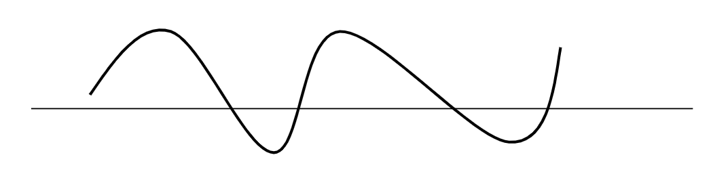
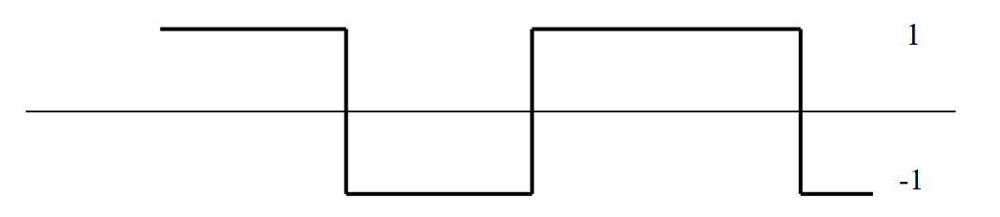

# Cornell Notes

## Topic: 

### What is a signal? 
### Example of signal
### Analog vs Discrete vs Digital

## Date: 07/09/2026

---

<strong><em>"DO NOT JUST TALK ABOUT IT — SHOW IT"</em></strong>

---

### Cue Column (Questions, Keywords, or Prompts)
- What is a signal?

---

### Notes Section (Main Notes)

#### Discrete-time Signals and Systems

***Continuous-time signals*** are defined over a continuum of times and thus are represented by a continuous independent variable.

***Discrete-time signals*** are defined at discrete times and thus the independent variable has discrete values.

***Analog signals*** are those for which both time and amplitude are continuous.

***Digital signals*** are those for which both time and amplitude are discrete.

### Analog vs. Digital

The amplitude of an analog signal can take any real or complex value at each time/sample

The amplitude of a digital signal takes values from a discrete set

### Signals

*Continuous-time signals* are functions of a real argument

- *x(t)* where *t* can take any real value
- x(t) may be 0 for a given range of values of t

*Discrete-time signals* are functions of an argument that takes values from a discrete set
- x[n] where n belongs to {...-3,-2,-1,0,1,2,3...}
- Integer index n instead of time t for discrete-time systems

x may be an array of values (multi channel signal)

Values for x may be real or complex.

---

### Summary Section (Summary of Notes)

[Insert a brief summary of the key ideas and takeaways]