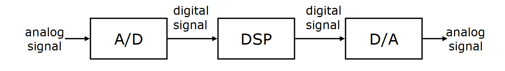

# Cornell Notes

## Topic: Analog and Digital Signal Processing

## Date: 07/09/2026

---

<strong><em>"DO NOT JUST TALK ABOUT IT — SHOW IT"</em></strong>

---

### Cue Column (Questions, Keywords, or Prompts)
- What is a signal?

---

### Notes Section (Main Notes)

#### Analog Signal Processing

Humans are the most advanced signal processors
- speech and pattern recognition, speech synthesis,...

We encounter many types of signals in various applications
- Electrial signals: voltage, current, magnetic and electric fields,...
- Mechanical signals: velocity, force, displacement...
- Acoustic signals: sound, vibration,...
- Other signals: presure, temperature,...

Most real-world signals are analog
- They are continuous in time and amplitude
- Convert to voltage or currents using sensors and transducers (bộ chuyển đổi năng lượng hoặc bộ biến đổi)

Analog circuits process these signals using
- Resistors, Capacitors, Inductors, Amplifiers,...

Analog signal processing examples
- Audio processing in FM radios
- Video processing in traditional TV sets

#### Limitations of Analog Signal Processing?

Accuracy limitations due to:
- Component tolerances
- Undesired nonlinearities

Limited repeatability due to:
- Tolerances
- Changes in environmental conditions
  - Temperature
  - Vibration

Sensitivity to electrical noise

Limited dynamic range for voltage and currents

Inflexibility to changes

Difficulty of implementing certain operations
- Nonlinear operations
- Time-varying operations

Difficulty of storing information

#### Digital Signal Processing

Represent signal by a sequence of numbers
- Sampling or analog-to-digital conversions

Perform processing on these numbers with a digital processors
- Digital signal processing

Reconstruct analog signal from processed numbers
- Reconstruction or digital-to-analog conversion

**Analog input - analog output**
- Digital recording of music

**Analog input - digital output**
- Touch tone phone dialing

**Digital input - analog output**
- Text to speech

**Digital input - digital output**
- Compression of a file on computer

#### Pros and Cons of Digital Signal Processing?

Pros:
- Accuracy can be controlled by choosing word length
- Repeatable
- Sensitivity to electrical noise is minimal
- Dynamic range can be controlled using floating point numbers
- Flexibility can be achieved with software implementations
- Non-linear and time varying operations are easier to implement
- Digital storage is cheap
- Digital information can be encrypted for security
- Price/performance and reduced time-to-market

Cons:
- Sampling causes loss of information
- A/D and D/A requires mixed-signal hardware
- Limited speed of processors
- Quantization and round-off errors

---

### Summary Section (Summary of Notes)

[Insert a brief summary of the key ideas and takeaways]