# Cornell Notes 02: Reconstruction, impulses, basic sequences and system vocabulary

[All topics](./README.md) | [Previous](./01_intro.md) | [Next](./03_discrete_time_systems.md)

**Lecture:** [PDF pages 21-40](../../03_resources/01_lectures/00_Intro.pdf#page=21) (20 pages). **Updated:** 2026-09-14.

**Source convention:** PDF page numbers are one-based viewer pages. Each original slide is reproduced beneath its written note to preserve the complete source content. “Clarification” marks explanatory additions or corrections; “Lyons supplement” marks textbook enrichment.

## Cue Column

| Cue / retrieval question | Study target |
| --- | --- |
| Why does a zero-order hold need an output filter? | Spectral images and sinc droop. |
| How can pulses reconstruct a continuous waveform? | Shift, scale and add an interpolation kernel. |
| Are $\delta(t)$ and $\delta[n]$ the same object? | Distribution with unit area versus sequence with one nonzero value. |
| How are step and impulse sequences related? | Accumulation and first difference. |
| How do exponentials and sinusoids build signals? | Elementary sequences and convergence. |
| What questions classify a system? | Linearity, invariance, causality, stability, memory and invertibility. |

## Notes Section: mathematical toolkit

$$
x_r(t)=\sum_{n=-\infty}^{\infty}x[n]g_r(t-nT),\qquad
x[n]=\sum_{k=-\infty}^{\infty}x[k]\delta[n-k].
$$

The first equation builds a continuous-time waveform from pulses; the second builds a sequence from unit samples. Do not interchange the two delta objects.

$$
\delta[n]=\begin{cases}1&n=0\\0&n\ne0\end{cases},\qquad
u[n]=\begin{cases}1&n\ge0\\0&n<0\end{cases}.
$$

$$
u[n]=\sum_{k=0}^{\infty}\delta[n-k],\qquad \delta[n]=u[n]-u[n-1].
$$

## Notes Section: page-by-page lecture coverage

### PDF page 21 - Hold distortion and post-filter compensation

The hold leaves spectral replicas and introduces amplitude droop in the Nyquist band. The lecture plots its sinc-shaped magnitude against the ideal rectangular reconstruction response and shows its linear phase. Ideal compensation would satisfy $G_{SH}(j\Omega)H_r(j\Omega)=G_{BL}(j\Omega)$, giving

$$
H_r(j\Omega)=\begin{cases}
\dfrac{\Omega T/2}{\sin(\Omega T/2)}e^{j\Omega T/2},&|\Omega|<\pi/T,\\
0,&\text{otherwise}.
\end{cases}
$$

**Clarification:** this brick-wall, phase-advance formula is an ideal target; a practical causal filter approximates it with delay and a transition band. The slide's Nyquist-band variable should describe signal frequency, $|f|<f_s/2$.

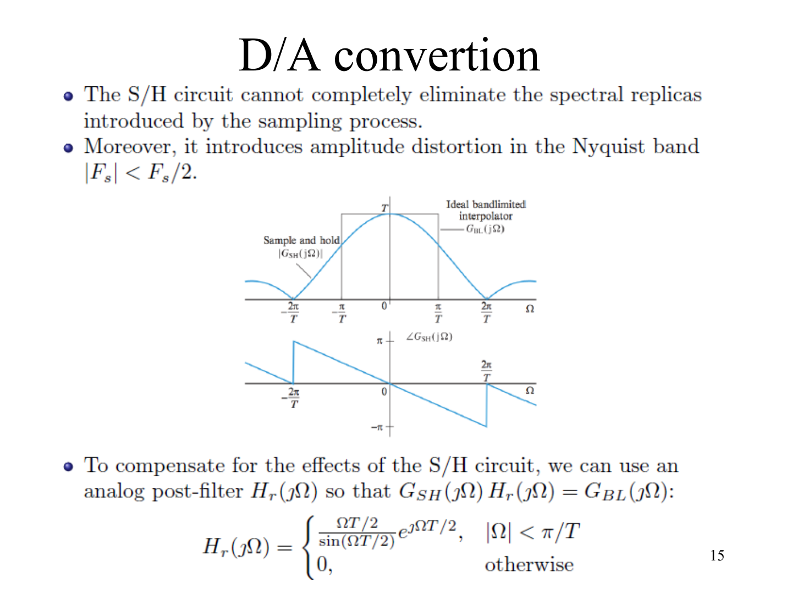

*Original slide, including all figures and annotations: [lecture PDF p. 21](../../03_resources/01_lectures/00_Intro.pdf#page=21).*

### PDF page 22 - Interpolation as shifted-pulse addition

The general formula $x_r(t)=\sum_nx[n]g_r(t-nT)$ uses an interpolating reconstruction function $g_r$. Each pulse is shifted to $nT$ and scaled by sample $x[n]$. Overlapping pulses fill the gaps between samples. The drawing shows individual contributions and their sum; arbitrary interpolation does not guarantee recovery of the original signal.

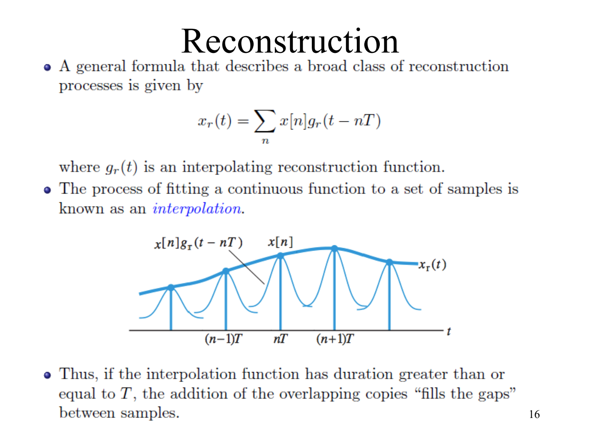

*Original slide, including all figures and annotations: [lecture PDF p. 22](../../03_resources/01_lectures/00_Intro.pdf#page=22).*

### PDF page 23 - Reconstruction in the frequency domain

Fourier transforming the pulse sum gives

$$
X_r(j\Omega)=G_r(j\Omega)\sum_nx[n]e^{-j\Omega nT}
=G_r(j\Omega)X(e^{j\Omega T}).
$$

The ideal reconstruction response is $G_{BL}(j\Omega)=T$ inside $|\Omega|<\Omega_s/2$ and zero outside. Its gain $T$ compensates the $1/T$ spectral scale introduced by ideal impulse sampling. With non-overlapping replicas, the selected baseband equals the original spectrum. Boundary equality needs care if a sinusoidal component lies exactly at Nyquist.

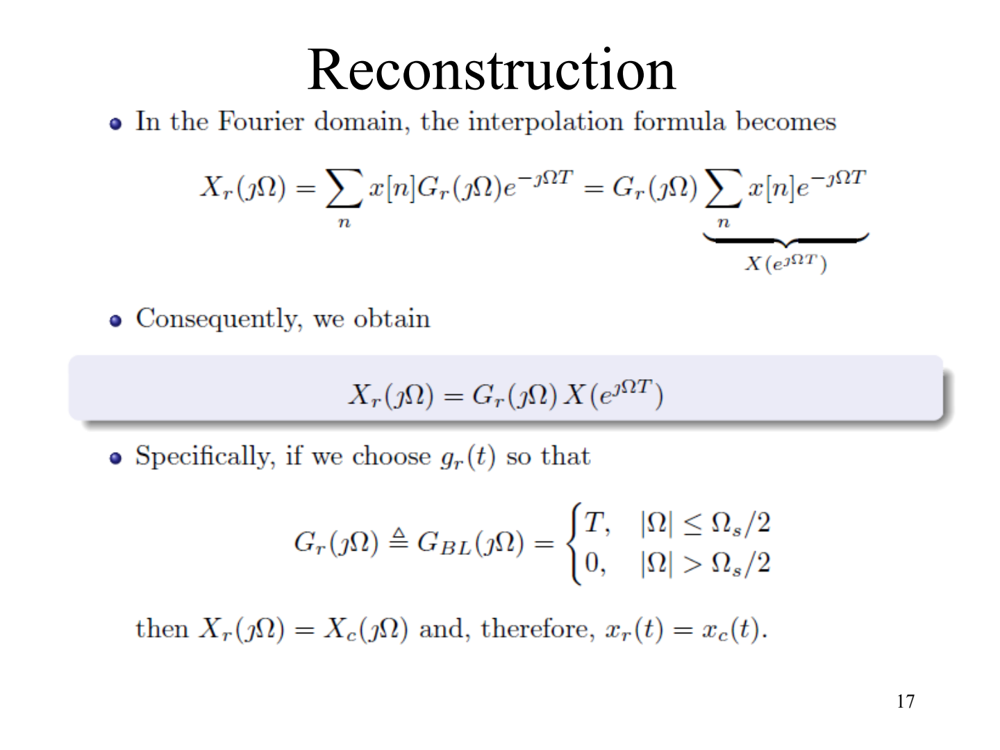

*Original slide, including all figures and annotations: [lecture PDF p. 23](../../03_resources/01_lectures/00_Intro.pdf#page=23).*

### PDF page 24 - Ideal sinc interpolation

The inverse transform of the rectangular reconstruction response is $g_{BL}(t)=\sin(\pi t/T)/(\pi t/T)$. Therefore

$$
x_c(t)=\sum_{n=-\infty}^{\infty}x[n]\,
\frac{\sin[\pi(t-nT)/T]}{\pi(t-nT)/T}.
$$

An ideal DAC implements this formula for a correctly sampled bandlimited signal. At a zero denominator use the limit value 1. Infinite time support makes exact sinc interpolation an ideal model rather than a finite real-time implementation.

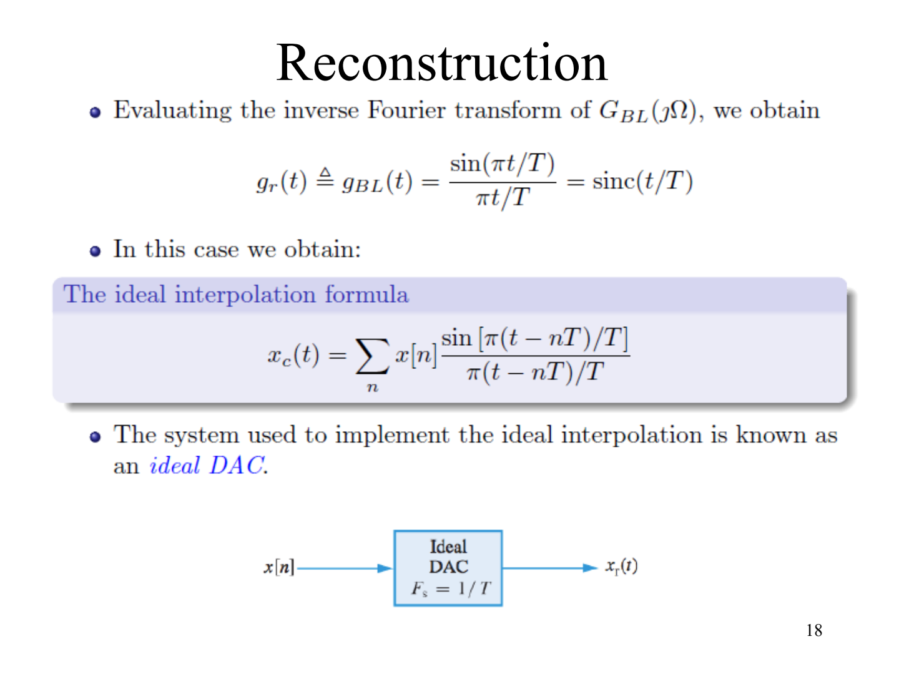

*Original slide, including all figures and annotations: [lecture PDF p. 24](../../03_resources/01_lectures/00_Intro.pdf#page=24).*

### PDF page 25 - Why the sinc sum passes through the samples

The sinc kernel is 1 at its center and zero at every other integer multiple of $T$. At $t=mT$, all terms vanish except $x[m]$, so the sum equals the given sample. The time-domain lobes and rectangular frequency response are shown together. **Key distinction:** the interpolant still passes through the samples after aliasing; that fact alone cannot prove it equals the original waveform between samples.

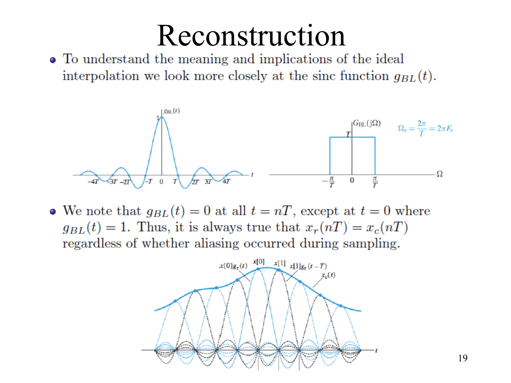

*Original slide, including all figures and annotations: [lecture PDF p. 25](../../03_resources/01_lectures/00_Intro.pdf#page=25).*

### PDF page 26 - Impulse-train model of sampling

Model sampling in two stages: multiply $x_c(t)$ by $s(t)=\sum_n\delta(t-nT)$, then map the weighted impulses into sequence values $x[n]=x_c(nT)$. The intermediate signal is $x_s(t)=\sum_nx_c(nT)\delta(t-nT)$. The diagram deliberately distinguishes a continuous-time impulse train from a discrete-time stem plot, even though the weights are the same.

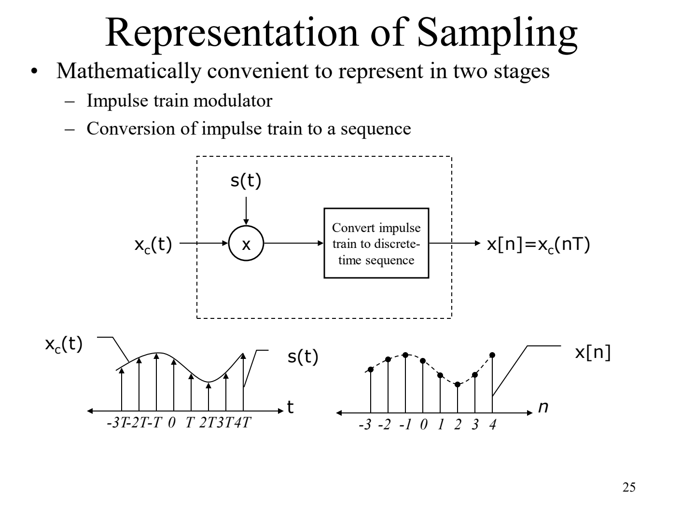

*Original slide, including all figures and annotations: [lecture PDF p. 26](../../03_resources/01_lectures/00_Intro.pdf#page=26).*

### PDF page 27 - Unit sample sequence

$\delta[n]$ is 1 at $n=0$ and 0 elsewhere. Its shifted version $\delta[n-k]$ locates a single sample at index $k$. It plays the same testing/building-block role in discrete-time systems that the Dirac impulse plays in continuous time, while remaining an ordinary sequence with finite sample values.

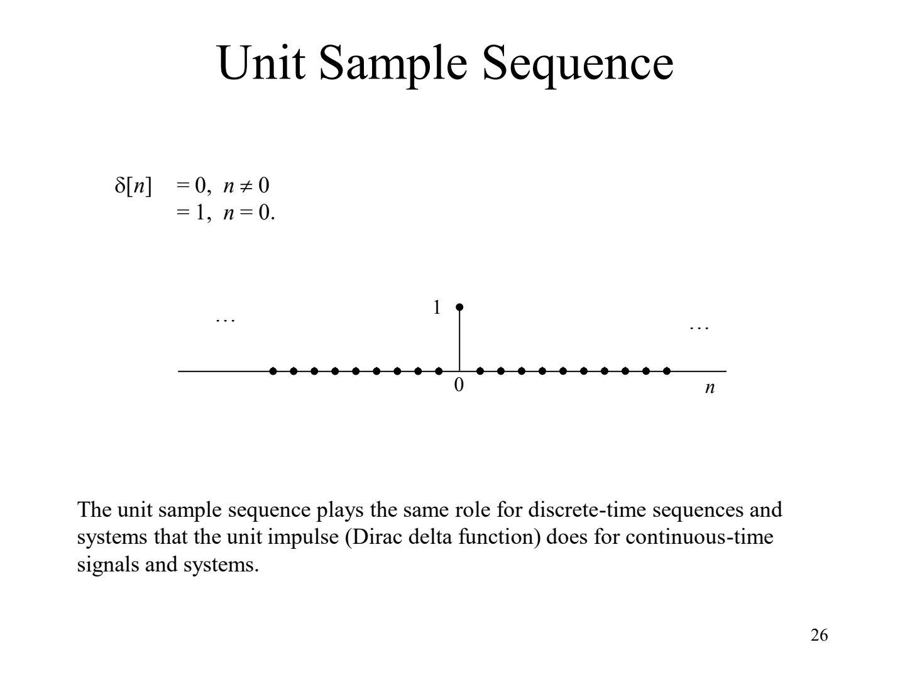

*Original slide, including all figures and annotations: [lecture PDF p. 27](../../03_resources/01_lectures/00_Intro.pdf#page=27).*

### PDF page 28 - Continuous impulse and physical idealizations

The Dirac impulse describes localized quantities, such as ideal point optical sources and point charges. The infinite-height/zero-width spike is a visualization of a distribution with unit area, not an ordinary finite-valued function. It is useful under integrals and as an ideal system input.

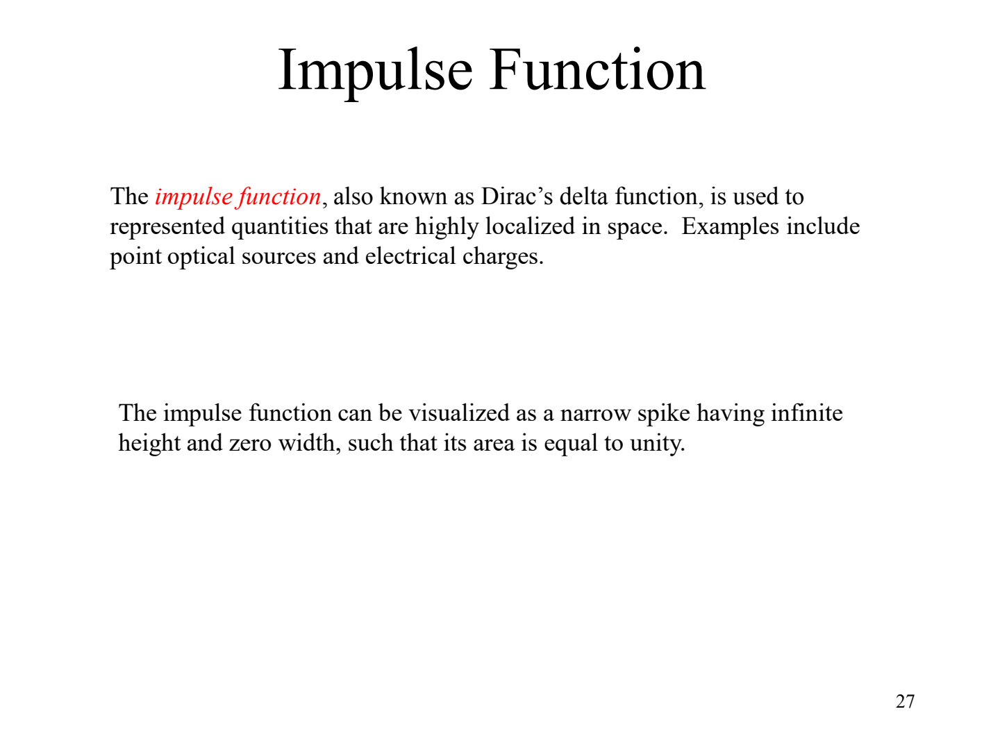

*Original slide, including all figures and annotations: [lecture PDF p. 28](../../03_resources/01_lectures/00_Intro.pdf#page=28).*

### PDF page 29 - Delta definition and sifting

For a continuous test function at $t_0$ and an integration interval containing $t_0$,

$$
\int_{t_1}^{t_2}f(t)\delta(t-t_0)\,dt=f(t_0),\qquad t_1<t_0<t_2.
$$

Away from $t_0$, the impulse is zero. The lecture adopts the average of left/right limits at a discontinuity. **Clarification:** that is a symmetric limiting convention, not a universal rule for multiplying a distribution by an arbitrary discontinuous function.

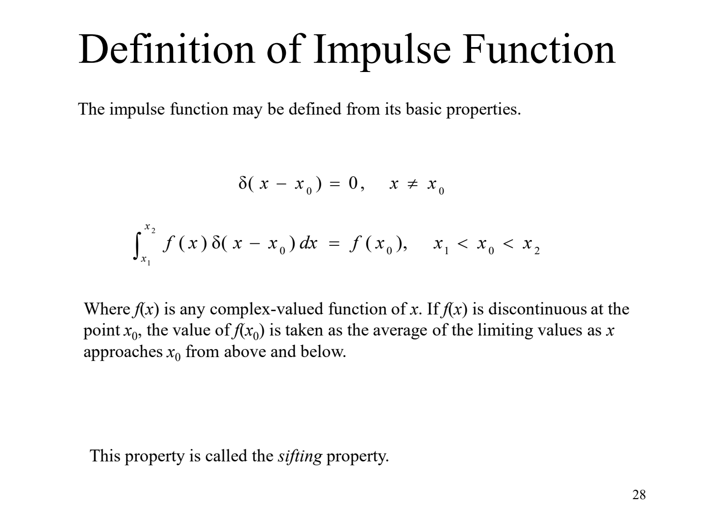

*Original slide, including all figures and annotations: [lecture PDF p. 29](../../03_resources/01_lectures/00_Intro.pdf#page=29).*

### PDF page 30 - Graphical representation of impulse weight

The spike drawn at $t_0$ has a label 1 to denote its unit weight/area. It does not mean the Dirac impulse has numerical height 1. A scaled impulse $A\delta(t-t_0)$ is drawn with weight $A$; its integral is $A$.

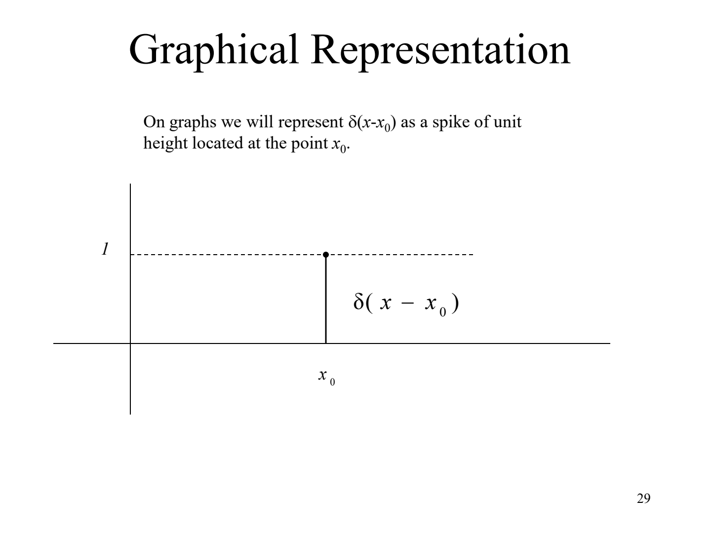

*Original slide, including all figures and annotations: [lecture PDF p. 30](../../03_resources/01_lectures/00_Intro.pdf#page=30).*

### PDF page 31 - An impulse samples a function

The sifting relation also gives $f(t)\delta(t-t_0)=f(t_0)\delta(t-t_0)$. The graph is one spike at $t_0$ with weight $f(t_0)$. This relation explains why multiplying a waveform by an impulse train retains only sample values.

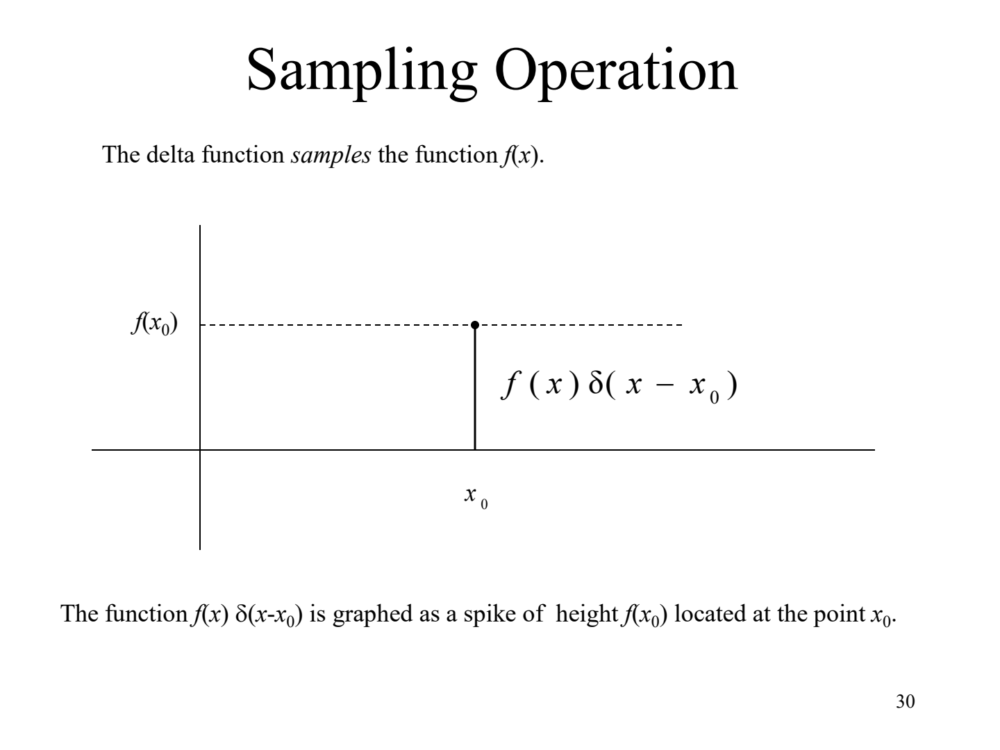

*Original slide, including all figures and annotations: [lecture PDF p. 31](../../03_resources/01_lectures/00_Intro.pdf#page=31).*

### PDF page 32 - Step sequence and first difference

$u[n]$ is 1 for $n\ge0$ and 0 for $n<0$. It equals the sum of impulses beginning at zero, or $u[n]=\sum_{k=-\infty}^{n}\delta[k]$. Conversely, $u[n]-u[n-1]=\delta[n]$. Thus accumulation changes impulse into step, and backward differencing changes step into impulse.

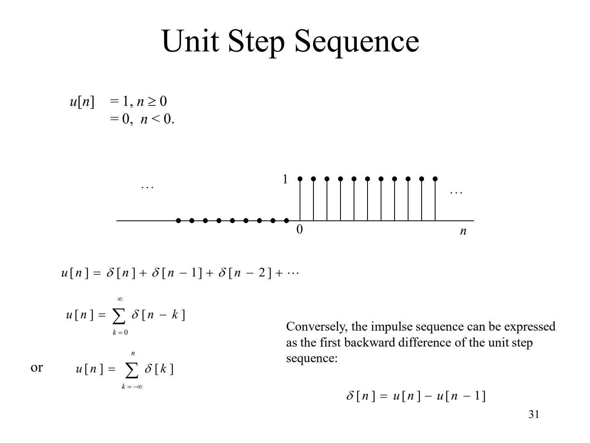

*Original slide, including all figures and annotations: [lecture PDF p. 32](../../03_resources/01_lectures/00_Intro.pdf#page=32).*

### PDF page 33 - Exponential sequences

The general exponential is $x[n]=Aa^n$. Multiplying by $u[n]$ creates the right-sided sequence $Aa^nu[n]$. For real $0<a<1$, its magnitude decays; $a>1$ grows; negative $a$ alternates sign. A complex $a=re^{j\omega_0}$ combines an envelope $r^n$ with rotation. The support condition matters in every later sum/transform.

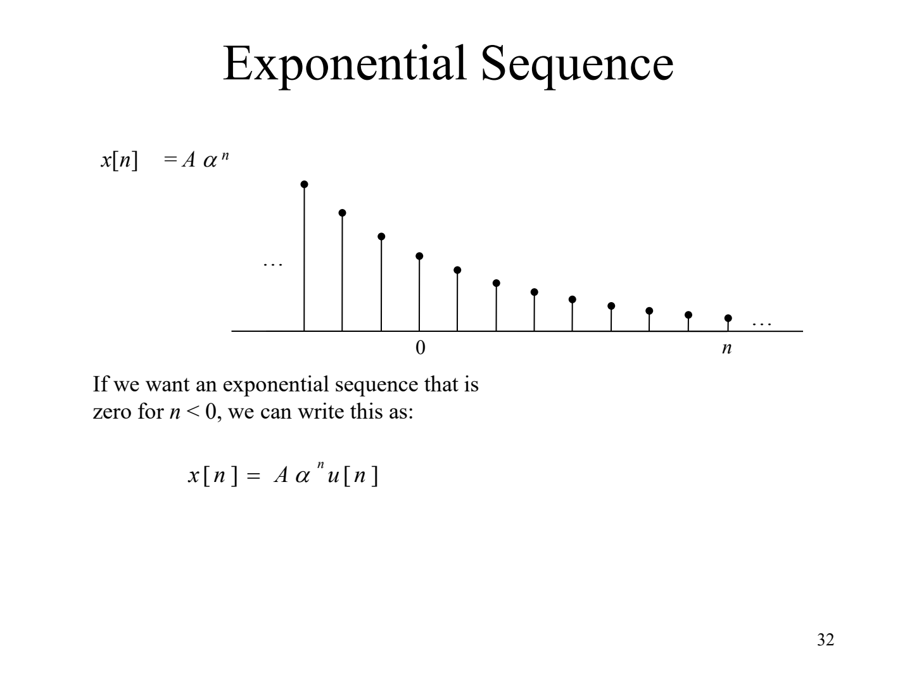

*Original slide, including all figures and annotations: [lecture PDF p. 33](../../03_resources/01_lectures/00_Intro.pdf#page=33).*

### PDF page 34 - Geometric sums and an indexing correction

For $|a|<1$, $\sum_{n=0}^{\infty}a^n=1/(1-a)$. For $a\ne1$,

$$
\sum_{n=0}^{N-1}a^n=\frac{1-a^N}{1-a},\qquad
\sum_{n=N_1}^{N_2}a^n=\frac{a^{N_1}-a^{N_2+1}}{1-a}.
$$

**Source correction:** the slide calls a sum from 0 through $N$ “$N$ terms”; it has $N+1$ terms, with numerator $1-a^{N+1}$. For $a=1$, count the terms directly. An infinite geometric sum does not converge when $|a|\ge1$.

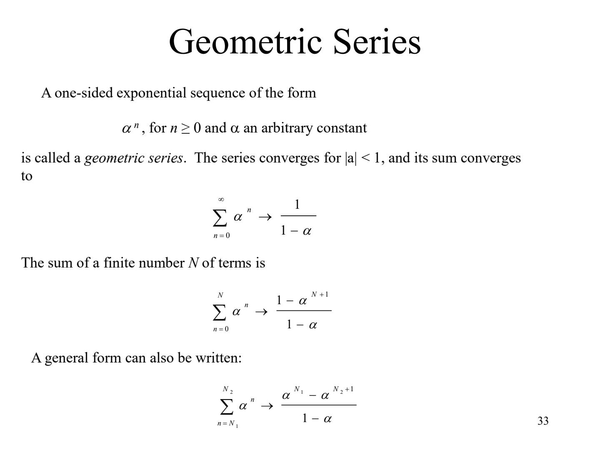

*Original slide, including all figures and annotations: [lecture PDF p. 34](../../03_resources/01_lectures/00_Intro.pdf#page=34).*

### PDF page 35 - Sinusoidal sequences

A real sinusoid is $x[n]=A\cos(\omega_0n+\phi)$, where $A$ is amplitude, $\omega_0$ is rad/sample and $\phi$ is phase. The stem diagram conveys discrete indices. **Preview:** unlike continuous-time sinusoids, a discrete-time sinusoid need not be periodic; periodicity requires a rational frequency relative to $2\pi$, apart from degenerate constant/zero cases.

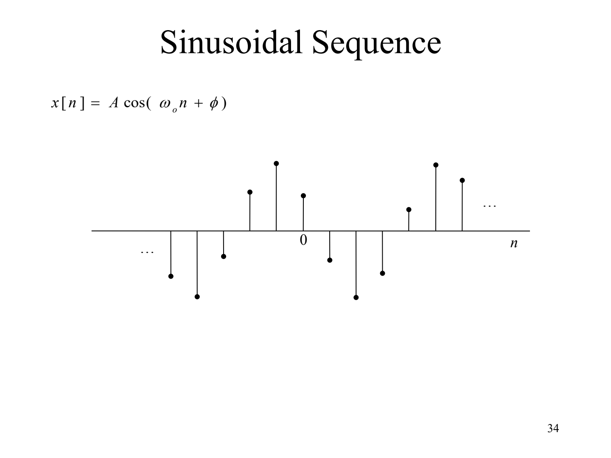

*Original slide, including all figures and annotations: [lecture PDF p. 35](../../03_resources/01_lectures/00_Intro.pdf#page=35).*

### PDF page 36 - Building any sequence from impulses

Each nonzero sample is a scaled and shifted unit impulse. The illustrated sequence has positive stems at $n=-3,1$ and negative stems at $n=2,7$. With positive labels denoting their magnitudes it is $p[n]=a_{-3}\delta[n+3]+a_1\delta[n-1]-a_2\delta[n-2]-a_7\delta[n-7]$. Equivalently use signed sample values in the universal identity $p[n]=\sum_kp[k]\delta[n-k]$; do not subtract an already signed negative value twice.

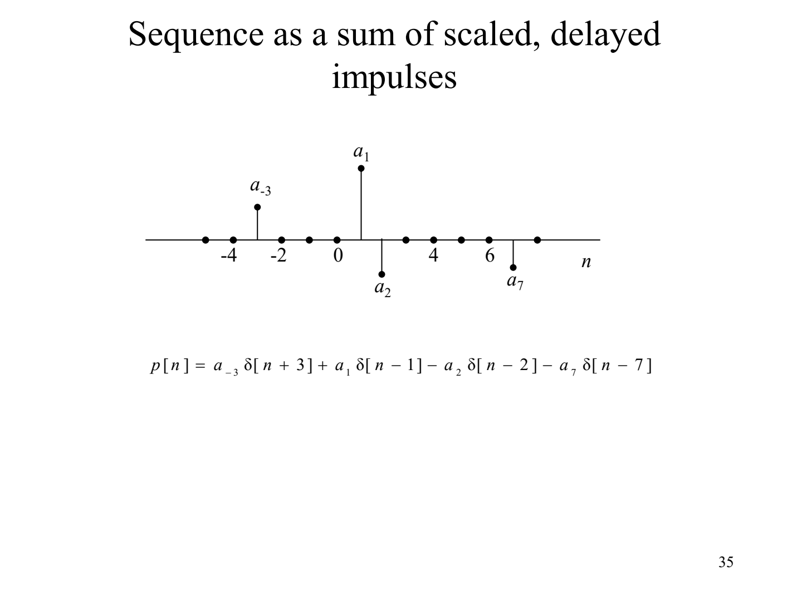

*Original slide, including all figures and annotations: [lecture PDF p. 36](../../03_resources/01_lectures/00_Intro.pdf#page=36).*

### PDF page 37 - Elementary sequence operations

Addition and multiplication are sample-by-sample operations; scalar multiplication changes every sample by the same factor. An integer delay is $y[n]=x[n-n_d]$: positive $n_d$ shifts right. The one-sided exponential example can be written piecewise or as $Ka^nu[n]$. Pointwise multiplication is different from convolution, which will sum shifted products.

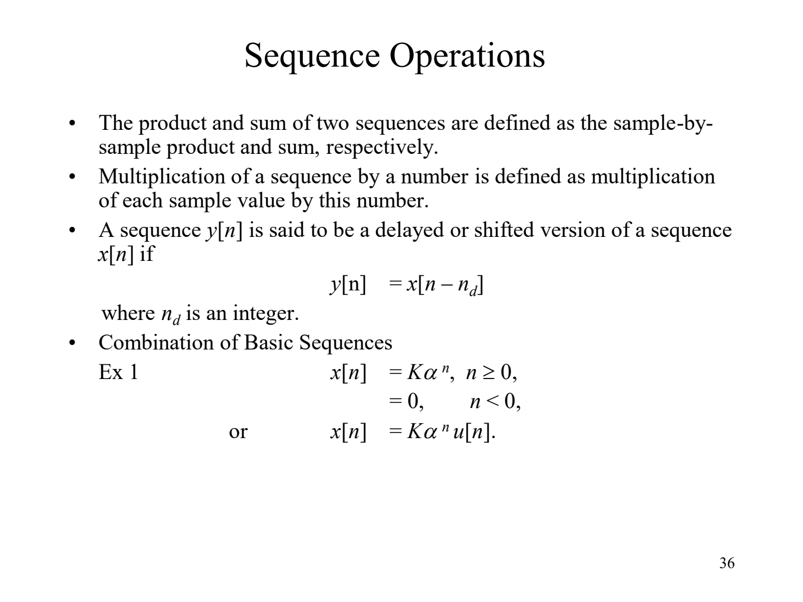

*Original slide, including all figures and annotations: [lecture PDF p. 37](../../03_resources/01_lectures/00_Intro.pdf#page=37).*

### PDF page 38 - Transition to systems

This divider introduces systems after the signal building blocks. The next question is what mapping acts on a sequence, and which properties that mapping has. Keep it as the boundary between describing a signal and describing its processing rule.

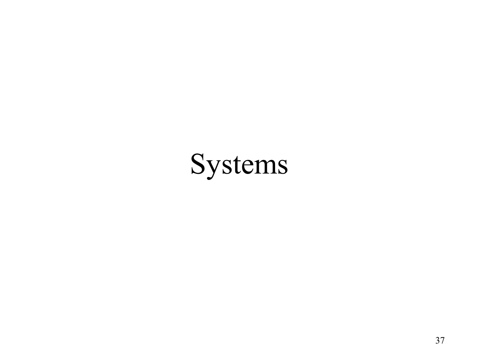

*Original slide, including all figures and annotations: [lecture PDF p. 38](../../03_resources/01_lectures/00_Intro.pdf#page=38).*

### PDF page 39 - A system maps input to output

A discrete-time system is a transformation $T$ with $y[n]=T\{x[n]\}$. The input/output block need not be a physical device: it may describe a mathematical rule or numerical algorithm. The slide introduces linearity, causality and time invariance as first classification questions.

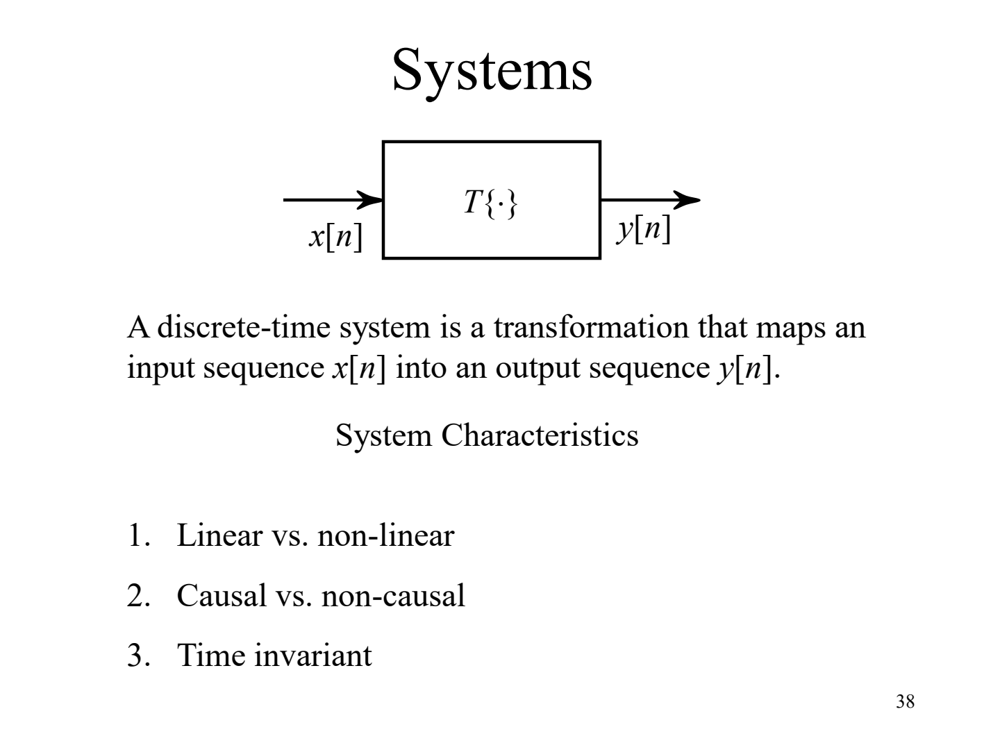

*Original slide, including all figures and annotations: [lecture PDF p. 39](../../03_resources/01_lectures/00_Intro.pdf#page=39).*

### PDF page 40 - Six system characteristics

The full checklist is linear/nonlinear, time-invariant/time-varying, causal/noncausal, stable/unstable, memoryless/state-sensitive, and invertible/noninvertible. These are independent tests. For example, squaring can be time-invariant and memoryless while nonlinear and noninvertible on all real inputs. Topic 03 develops definitions and counterexamples for each.

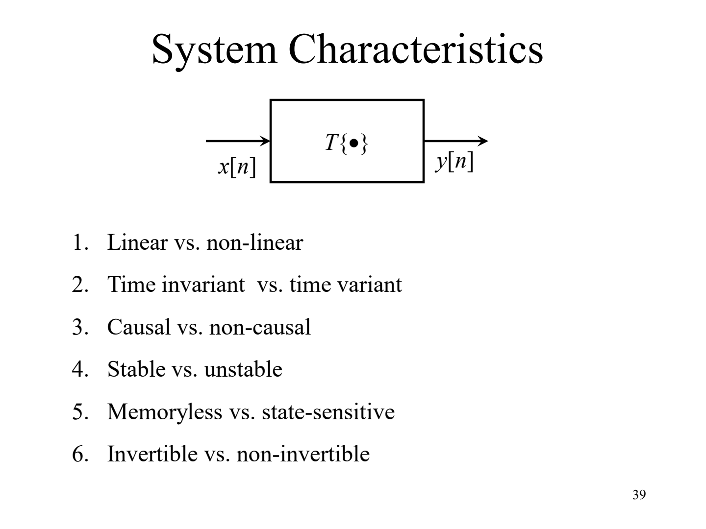

*Original slide, including all figures and annotations: [lecture PDF p. 40](../../03_resources/01_lectures/00_Intro.pdf#page=40).*

## Lyons supplement: spectral copies explain reconstruction

Read [§2.2, printed pp. 38-41 / PDF pp. 63-66](../../03_resources/03-Understanding-Digital-Signal-Processing.pdf#page=63). Lyons presents sampling as spectral replication at multiples of $f_s$. If replicas overlap, a low-pass reconstruction filter cannot separate their summed contributions. This gives a frequency-domain explanation for the multiple-curves-through-samples picture.

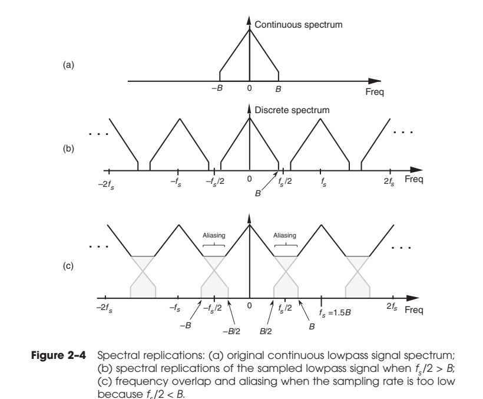

*Extracted figure crop: Figure 2-4, printed p. 39 / PDF p. 64.*

For amplitude, magnitude and power terminology, use [§1.2, printed pp. 8-9 / PDF pp. 33-34](../../03_resources/03-Understanding-Digital-Signal-Processing.pdf#page=33). For a complex value, power-like quantities use $|x[n]|^2$, not $x[n]^2$.

## Worked example: shifts, sums and reconstruction

**Author-created example.** If $x[-1]=2$, $x[0]=-1$, $x[2]=3$, with all other samples zero,

$$
x[n]=2\delta[n+1]-\delta[n]+3\delta[n-2].
$$

A two-sample delay is $y[n]=2\delta[n-1]-\delta[n-2]+3\delta[n-4]$. Its nonzero values occur at 1, 2 and 4. The ideal sinc interpolant of the original samples is $2\operatorname{sinc}(t/T+1)-\operatorname{sinc}(t/T)+3\operatorname{sinc}(t/T-2)$; it matches the three sample values and every specified zero sample.

For $a=1/2$, four exponential terms sum to $1+1/2+1/4+1/8=15/8$, while the infinite sum is 2. This checks the finite-series indexing.

## Retrieval practice and answer key

1. What is $\delta[n-3]$ at $n=3$? **1**; it is zero elsewhere.
2. What is $\int f(t)\delta(t-3)dt$ over the full real line for continuous $f$? **$f(3)$.**
3. Does matching every measured sample prove correct analog reconstruction? **No; aliasing can make the original ambiguous.**
4. Does shifting an infinite two-sided sinc by a finite delay make it causal? **No.** It still extends to negative time/index.

## Summary Section

Reconstruction adds shifted interpolation pulses; exact recovery additionally needs a non-aliased, bandlimited source. Impulses, steps, exponentials and sinusoids form a reusable signal vocabulary. Explicit support, units and indexing prevent mistakes when moving from these signals to system analysis.
