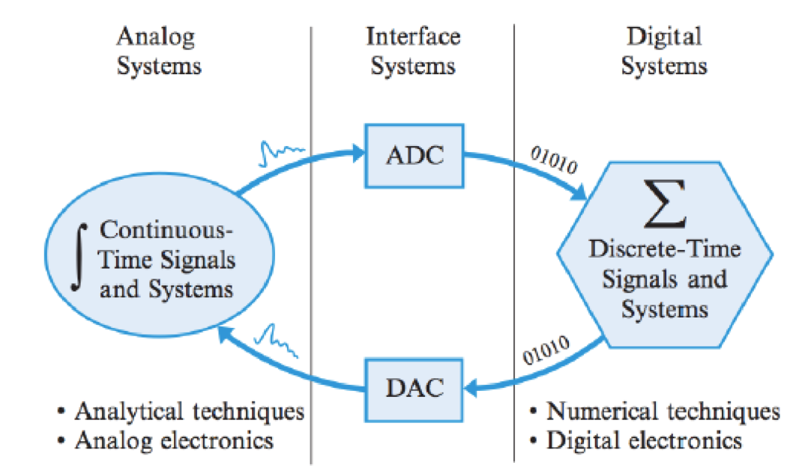
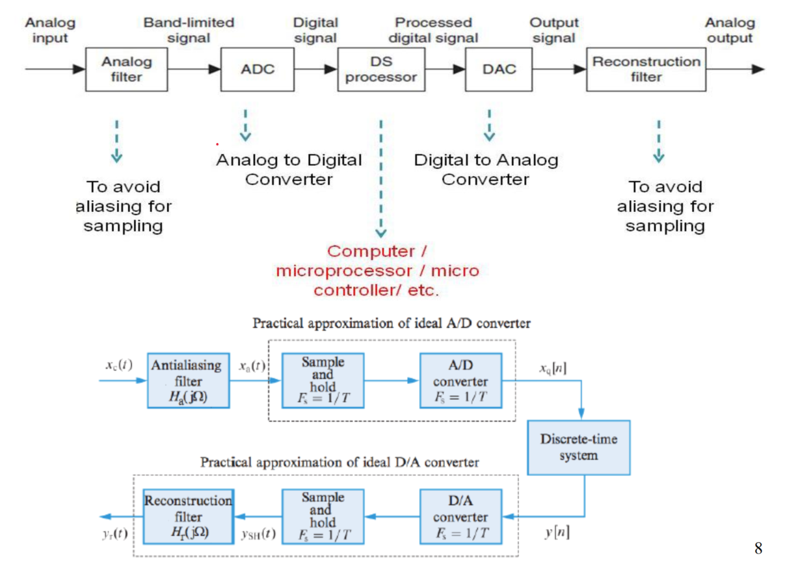
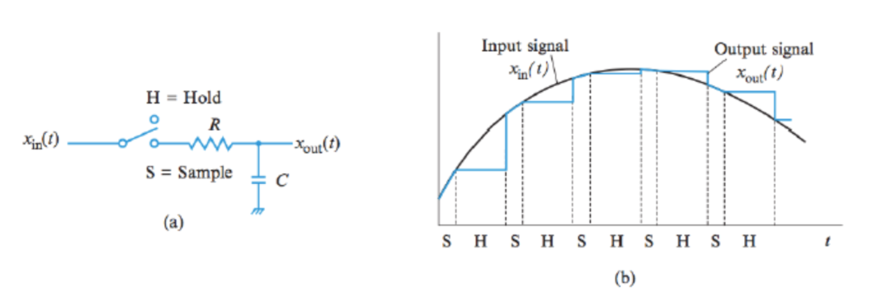

# Cornell Notes

## Topic: Analog, digital, mixed signal processing

## Date: 13/09/2026

---

<strong><em>"DO NOT JUST TALK ABOUT IT — SHOW IT"</em></strong>

---

### Cue Column (Questions, Keywords, or Prompts)

---

### Notes Section (Main Notes)

#### Analog, Digital, Mixed signal processing

#### Digital Signal Processing

#### Sampling and Reconstruction

The main fucntion of the *low-pass antialiasing filter* is to band-limit the input signal to the folding frequency without distortion.

I should be noted that even if the signal is band-limited, there is always wide-band additive noise which will be folded back to create aliasing.

When an analog voltage is connected directly to an ADC, the conversion process can be adversely affected if the voltage is changing during the conversion time.

The quality of the conversion process can be improved by using a *sample-and-hold (S/H) circuit*

---

### Summary Section (Summary of Notes)

[Insert a brief summary of the key ideas and takeaways]