# Cornell Notes 03: System properties, LTI convolution, FIR/IIR, causality and stability

[All topics](./README.md) | [Previous](./02_reconstruction_and_sequences.md) | [Next](./04_difference_equations_and_applications.md)

**Lecture:** [PDF pages 41-60](../../03_resources/01_lectures/00_Intro.pdf#page=41) (20 pages). **Updated:** 2026-09-14.

**Source convention:** PDF page numbers are one-based viewer pages. Each original slide is reproduced beneath its written note to preserve the complete source content. “Clarification” marks explanatory additions or corrections; “Lyons supplement” marks textbook enrichment.

## Cue Column

| Cue / retrieval question | Study target |
| --- | --- |
| What two tests define linearity? | Additivity and homogeneity. |
| How do you test shift invariance? | Compare shift-then-process with process-then-shift. |
| Why does convolution describe an LTI system? | Expand input into impulses, then use the two LTI properties. |
| Can a nonlinear system be BIBO stable? | Use squaring as a counterexample to a false implication. |
| What do causality and stability require of $h[n]$? | Zero negative-index support; absolute summability. |
| Does FIR mean causal? Does IIR mean unstable? | Neither implication is generally valid. |

## Notes Section: key definitions

For an LTI system under its specified zero-state operation,

$$
y[n]=(x*h)[n]=\sum_{k=-\infty}^{\infty}x[k]h[n-k].
$$

| Property | Test |
| --- | --- |
| Linear | $T\{ax_1+bx_2\}=aT\{x_1\}+bT\{x_2\}$ |
| Time-invariant | $T\{x[n-n_0]\}=y[n-n_0]$ for every integer shift |
| Causal | Output at $n_0$ uses only inputs with index $n\le n_0$ |
| Memoryless | Output at $n$ uses only $x[n]$ |
| BIBO stable | Every bounded input gives a bounded output |
| Invertible | No two allowed inputs give the same output |

For LTI systems, causality means $h[n]=0$ for $n<0$; BIBO stability means $\sum_n|h[n]|<\infty$. A known response to an impulse is insufficient to characterize an arbitrary nonlinear or time-varying system.

## Notes Section: page-by-page lecture coverage

### PDF page 41 - Three example systems

The examples are a four-sample running sum, a three-sample maximum, and an ideal delay. The displayed running operation is $y[n]=x[n]+x[n-1]+x[n-2]+x[n-3]$; **source clarification:** to make it an arithmetic moving average, multiply by $1/4$. The maximum is $\max\{x[n],x[n-1],x[n-2]\}$ and is generally nonlinear. The delay is $x[n-n_0]$.

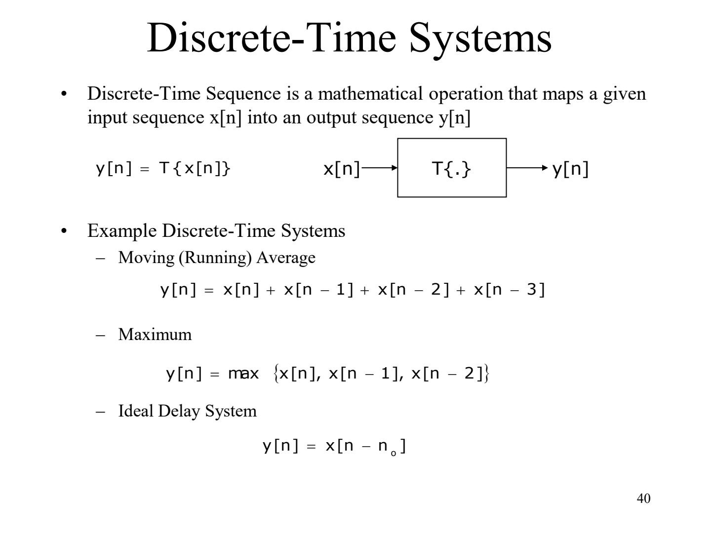

*Original slide, including all figures and annotations: [lecture PDF p. 41](../../03_resources/01_lectures/00_Intro.pdf#page=41).*

### PDF page 42 - Superposition

A linear system maps any linear combination of inputs to the same combination of the individual outputs. This permits a complicated input to be decomposed into elementary inputs whose responses are known. Scaling the input scales the response; it does not change the mapping rule. Nonzero output at zero input immediately disproves linearity for the stated input/output mapping.

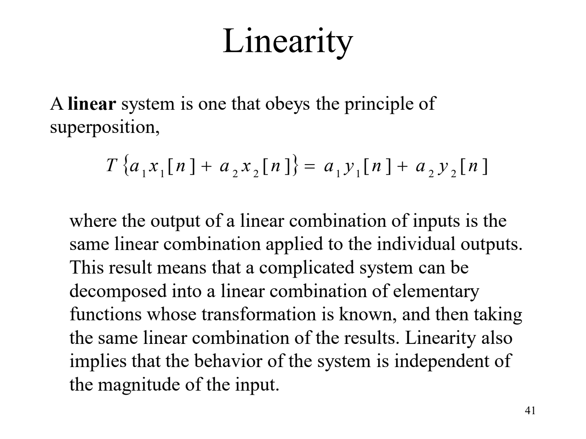

*Original slide, including all figures and annotations: [lecture PDF p. 42](../../03_resources/01_lectures/00_Intro.pdf#page=42).*

### PDF page 43 - Additivity and scaling for a delay

For $T\{x[n]\}=x[n-n_0]$, delaying $x_1+x_2$ yields $x_1[n-n_0]+x_2[n-n_0]$. Delaying $ax$ yields $ax[n-n_0]$. Both additivity and scaling hold, so a fixed ideal delay is linear.

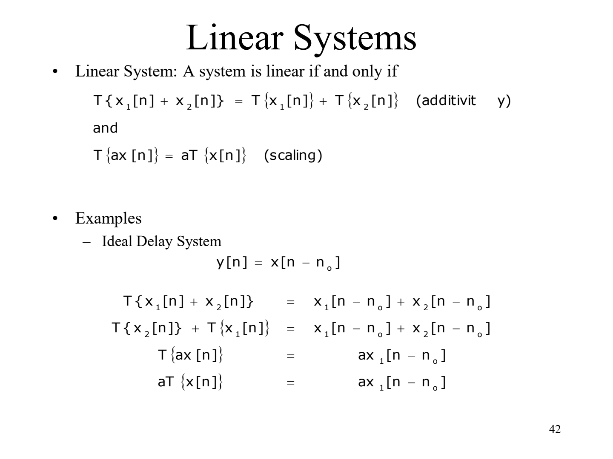

*Original slide, including all figures and annotations: [lecture PDF p. 43](../../03_resources/01_lectures/00_Intro.pdf#page=43).*

### PDF page 44 - Time or shift invariance

If $x[n]$ produces $y[n]$, a time-invariant system must map $x[n-n_0]$ to $y[n-n_0]$. Shape and amplitude remain unchanged; only position changes. Test this for arbitrary inputs/shifts rather than one convenient waveform.

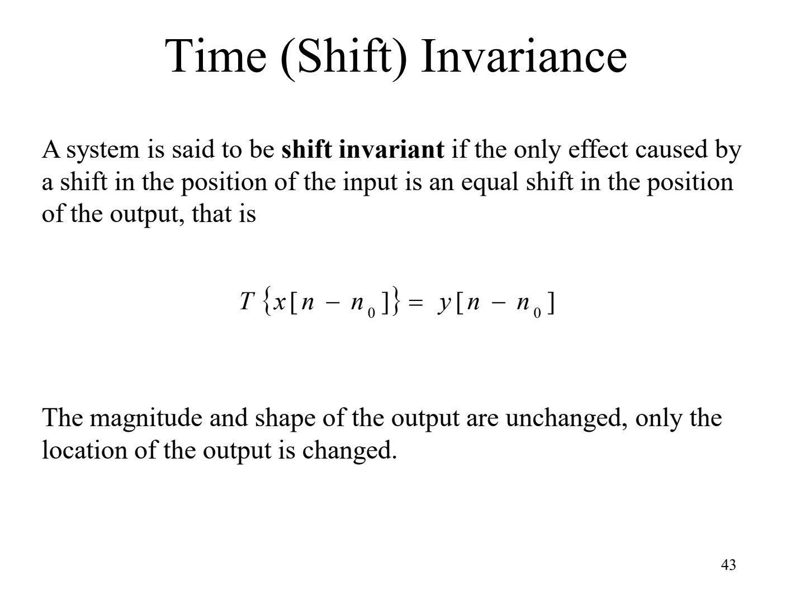

*Original slide, including all figures and annotations: [lecture PDF p. 44](../../03_resources/01_lectures/00_Intro.pdf#page=44).*

### PDF page 45 - Squaring and time compression

Squaring, $y[n]=x^2[n]$, is time-invariant: both paths of the shift test give $x^2[n-n_0]$. It remains nonlinear. For the compressor/downsampler $y[n]=x[Mn]$, delaying the input gives $x[Mn-n_0]$, while delaying the output gives $x[Mn-Mn_0]$. They generally differ for integer $M>1$, so the mapping is time-varying under this same-rate shift test.

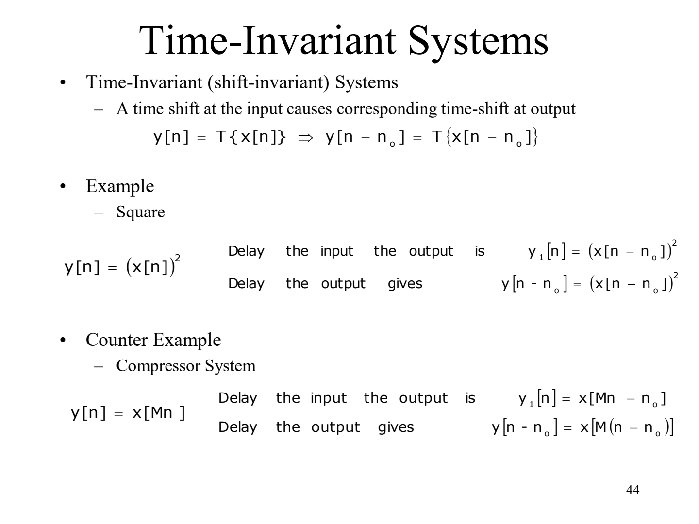

*Original slide, including all figures and annotations: [lecture PDF p. 45](../../03_resources/01_lectures/00_Intro.pdf#page=45).*

### PDF page 46 - Impulse response and identity convolution

Define $h[n]=T\{\delta[n]\}$. Every sequence has the representation $f[n]=\sum_k f[k]\delta[n-k]=f*\delta$. The slide also states the continuous counterpart $f(t)=\int f(\tau)\delta(t-\tau)d\tau$. These identities explain why an impulse is a useful basis element.

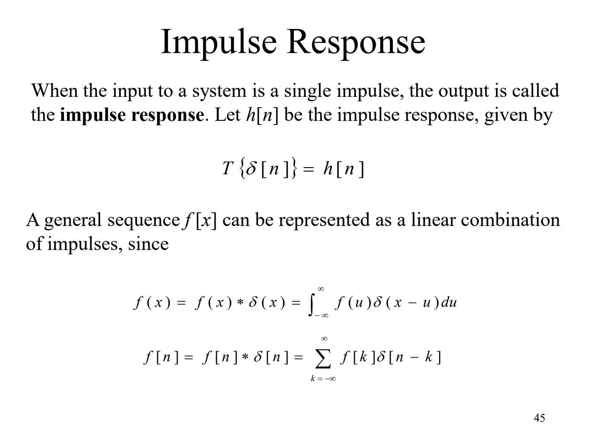

*Original slide, including all figures and annotations: [lecture PDF p. 46](../../03_resources/01_lectures/00_Intro.pdf#page=46).*

### PDF page 47 - Deriving the LTI convolution sum

Expand $x[n]$ into weighted impulses. Linearity lets $T$ pass through the weighted sum; time invariance changes the response to $\delta[n-k]$ into $h[n-k]$. Thus

$$
T\!\left\{\sum_kx[k]\delta[n-k]\right\}=\sum_kx[k]T\{\delta[n-k]\}=\sum_kx[k]h[n-k].
$$

For infinite sums, the usual convergence conditions are needed. The result applies to LTI systems, not to the maximum operation or squaring in general.

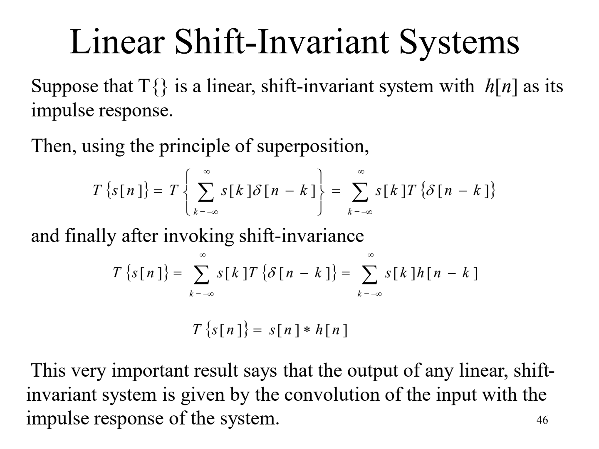

*Original slide, including all figures and annotations: [lecture PDF p. 47](../../03_resources/01_lectures/00_Intro.pdf#page=47).*

### PDF page 48 - Causality and a source typo

Output at $n_0$ must depend only on samples at or before $n_0$. **Source correction:** the slide says $n\le0$ while discussing arbitrary $n_0$; the bound must be $n\le n_0$. A real-time physical implementation cannot use future measurements. Offline processing of a stored record can use later samples; the resulting mathematical rule is then noncausal.

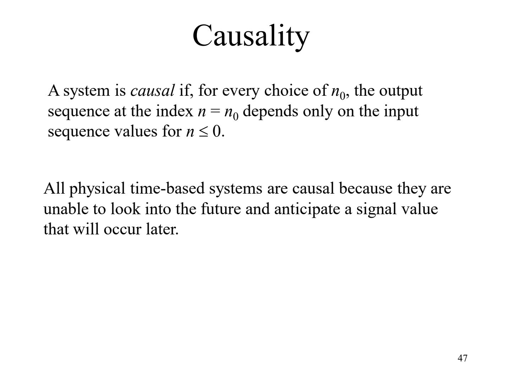

*Original slide, including all figures and annotations: [lecture PDF p. 48](../../03_resources/01_lectures/00_Intro.pdf#page=48).*

### PDF page 49 - Backward versus forward dependence

The backward difference $x[n]-x[n-1]$ is causal. A rule involving $x[n+1]$ is noncausal, whether it is added or subtracted. **Source clarification:** the displayed “forward difference” uses a plus sign; the conventional forward difference is $x[n+1]-x[n]$. Both require one future sample.

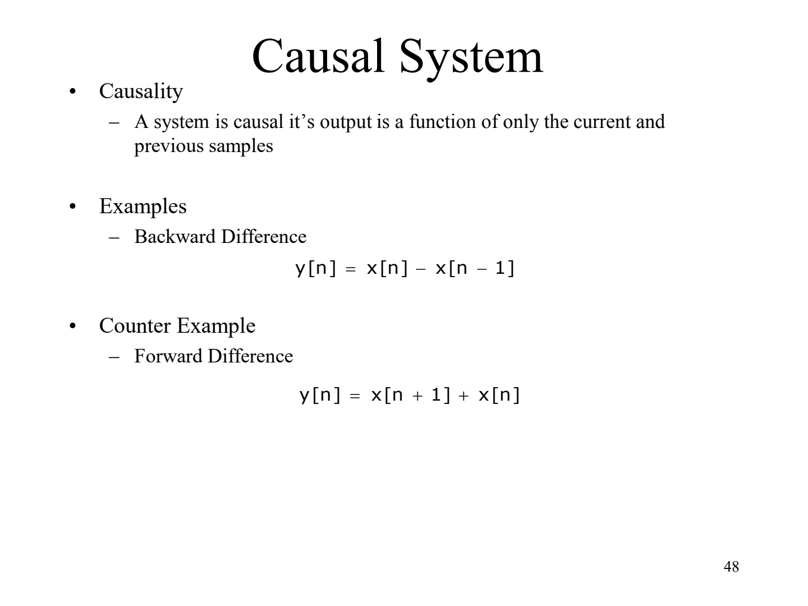

*Original slide, including all figures and annotations: [lecture PDF p. 49](../../03_resources/01_lectures/00_Intro.pdf#page=49).*

### PDF page 50 - Bounded-input bounded-output stability

An input is bounded when a finite $B_x$ exists with $|x[n]|\le B_x$ for every $n$. BIBO stability requires a finite $B_y$ for every bounded input such that $|y[n]|\le B_y$. The bound may depend on the input bound and system. Testing only one bounded input is insufficient to prove stability.

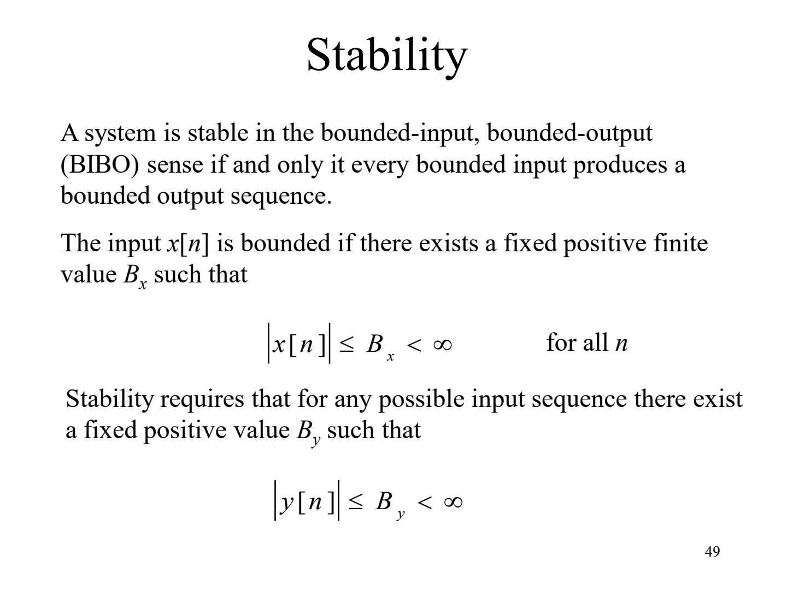

*Original slide, including all figures and annotations: [lecture PDF p. 50](../../03_resources/01_lectures/00_Intro.pdf#page=50).*

### PDF page 51 - A stable nonlinear system and an unstable logarithm

Squaring is BIBO stable because $|x[n]|\le B_x$ implies $|x[n]^2|\le B_x^2$. The logarithm is not stable over all positive bounded sequences: choose $x[n]=10^{-n}$ for $n\ge0$ and 1 otherwise, giving $\log_{10}x[n]=-n$ for $n\ge0$. This avoids the slide's use of $\log 0$, which is undefined. A restricted input domain bounded away from zero changes the conclusion.

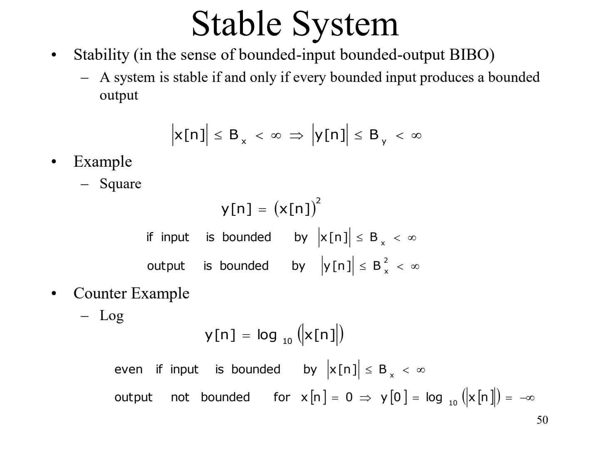

*Original slide, including all figures and annotations: [lecture PDF p. 51](../../03_resources/01_lectures/00_Intro.pdf#page=51).*

### PDF page 52 - Memory and state

A memoryless/static system uses only the present sample. A dynamic system uses information from other indices, often carried in state. Memory here is a property of the mathematical rule; a software implementation may also use storage for unrelated practical reasons.

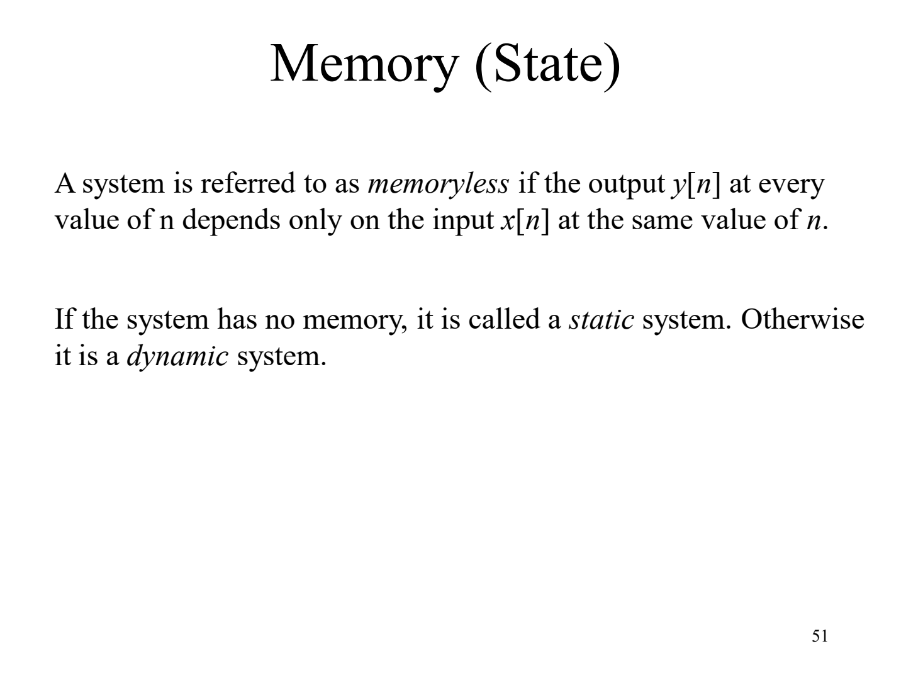

*Original slide, including all figures and annotations: [lecture PDF p. 52](../../03_resources/01_lectures/00_Intro.pdf#page=52).*

### PDF page 53 - Memoryless examples

Squaring and the sign function are memoryless. A nonzero ideal delay uses a different sample and therefore has memory. The zero-delay special case is the identity and is memoryless. A memoryless rule is causal, but it need not be linear or time-invariant; for example $y[n]=nx[n]$ is memoryless and time-varying.

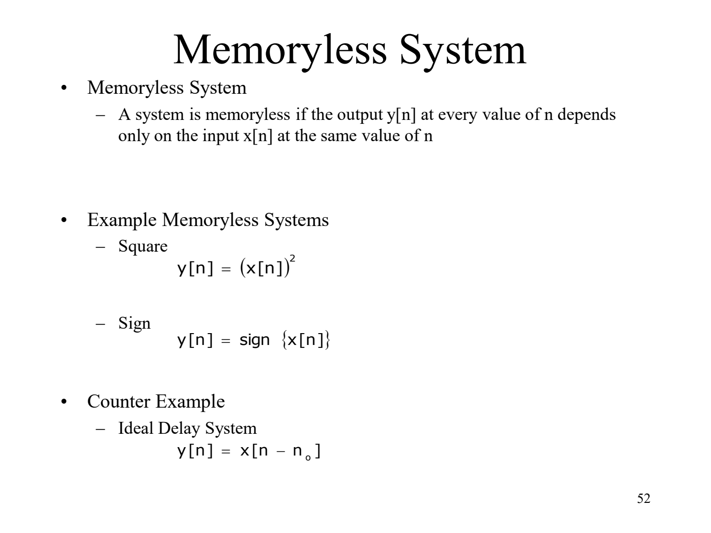

*Original slide, including all figures and annotations: [lecture PDF p. 53](../../03_resources/01_lectures/00_Intro.pdf#page=53).*

### PDF page 54 - Invertibility

A system is invertible on a stated input domain if every output identifies a unique input. Squaring loses the sign of real inputs and is noninvertible over all real sequences. A nonzero scalar gain is invertible. A delay has an inverse advance for unrestricted full sequences, although that inverse is noncausal in real-time use.

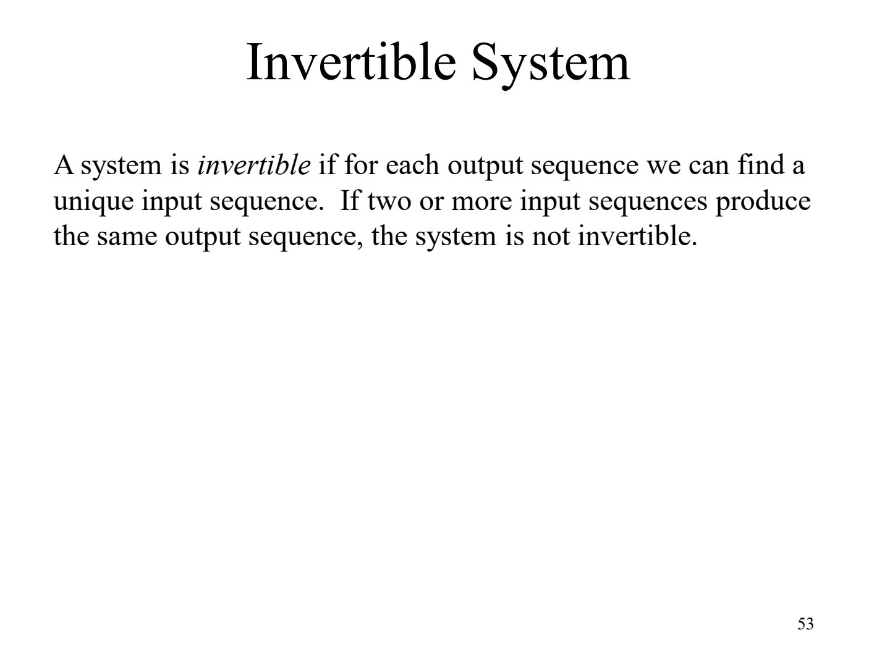

*Original slide, including all figures and annotations: [lecture PDF p. 54](../../03_resources/01_lectures/00_Intro.pdf#page=54).*

### PDF page 55 - Passive and lossless energy behavior

In the lecture's normalized signal-energy sense, passivity means $\sum_n|y[n]|^2\le\sum_n|x[n]|^2<\infty$ for every finite-energy input. Lossless means equality for every such input. A delay is lossless and a gain of magnitude at most 1 is passive. In physical ports, units and impedance/power definitions must be accounted for before interpreting squared sample values as energy.

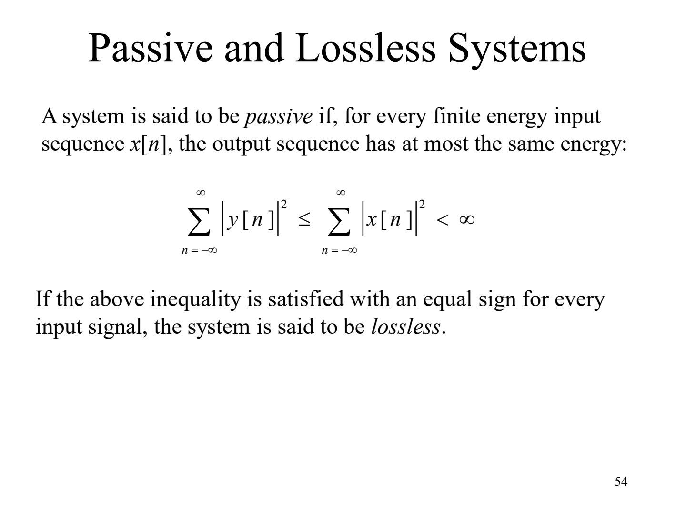

*Original slide, including all figures and annotations: [lecture PDF p. 55](../../03_resources/01_lectures/00_Intro.pdf#page=55).*

### PDF page 56 - Six system rules in one place

The examples are delay $x[n-n_d]$; centered/general moving average $\frac1{M_1+M_2+1}\sum_{k=-M_1}^{M_2}x[n-k]$; squaring; accumulator $\sum_{k=-\infty}^nx[k]$; compressor $x[Mn]$; and backward difference $x[n]-x[n-1]$. The moving average is noncausal if $M_1>0$, because negative $k$ selects future input. The accumulator requires a well-defined sum or an initial-rest/start-time specification.

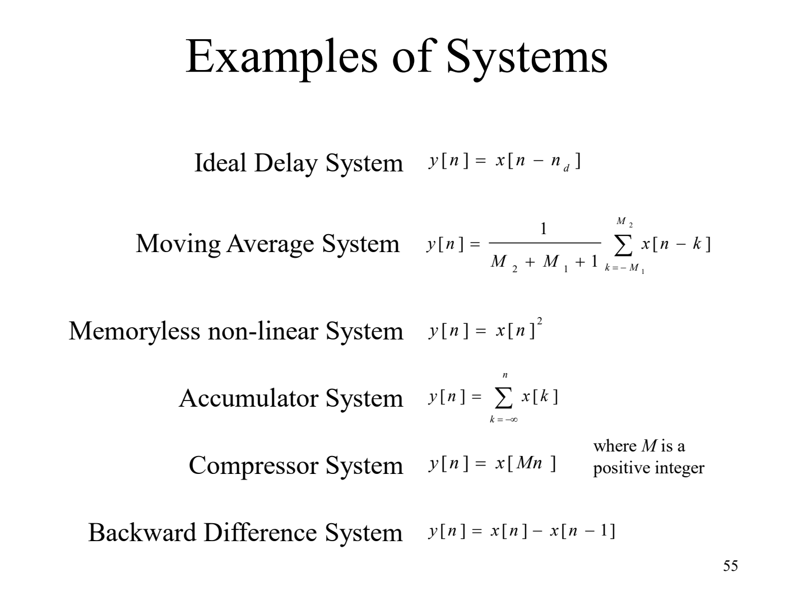

*Original slide, including all figures and annotations: [lecture PDF p. 56](../../03_resources/01_lectures/00_Intro.pdf#page=56).*

### PDF page 57 - FIR and IIR impulse responses

Compute a system's response to $\delta[n]$. An LTI system is FIR if only finitely many values of $h[n]$ are nonzero, and IIR if infinitely many are nonzero. These terms classify duration, not stability or implementation form. Causality is a separate support test: zero response at negative indices.

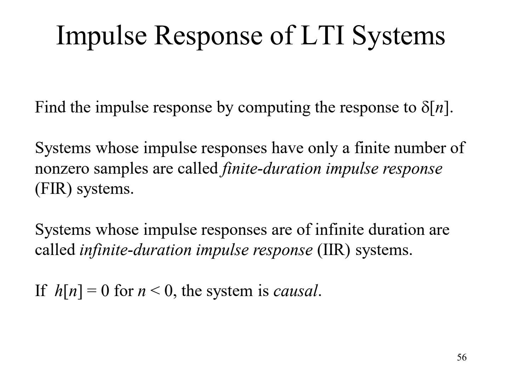

*Original slide, including all figures and annotations: [lecture PDF p. 57](../../03_resources/01_lectures/00_Intro.pdf#page=57).*

### PDF page 58 - Impulse responses of the examples

The delay has $h[n]=\delta[n-n_d]$; the moving average has $h[n]=1/(M_1+M_2+1)$ for $-M_1\le n\le M_2$ and zero otherwise; the backward difference has $h[n]=\delta[n]-\delta[n-1]$. All three are FIR. The initially resting accumulator has $h[n]=u[n]$, hence IIR and non-decaying. The slide labels the responses as $y[n]$; in this impulse-input experiment they are $h[n]$.

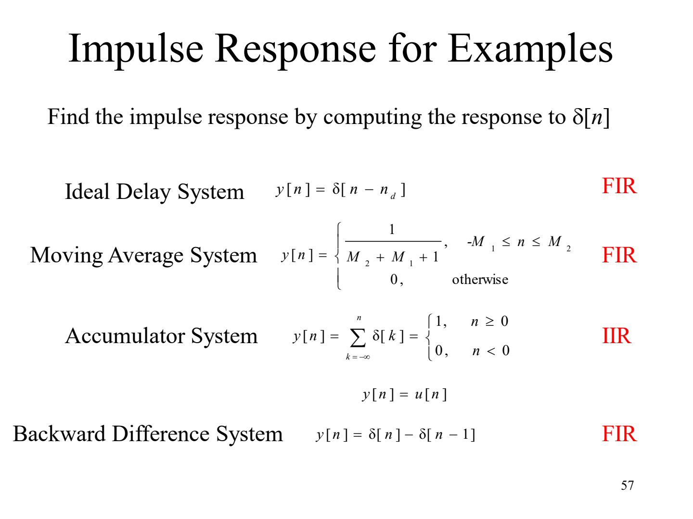

*Original slide, including all figures and annotations: [lecture PDF p. 58](../../03_resources/01_lectures/00_Intro.pdf#page=58).*

### PDF page 59 - Absolute summability

The necessary and sufficient condition for LTI BIBO stability is $S=\sum_{k=-\infty}^{\infty}|h[k]|<\infty$. Every finite-valued FIR response satisfies it. An IIR response $a^nu[n]$ satisfies it if $|a|<1$; the accumulator's step response-as-impulse-response does not.

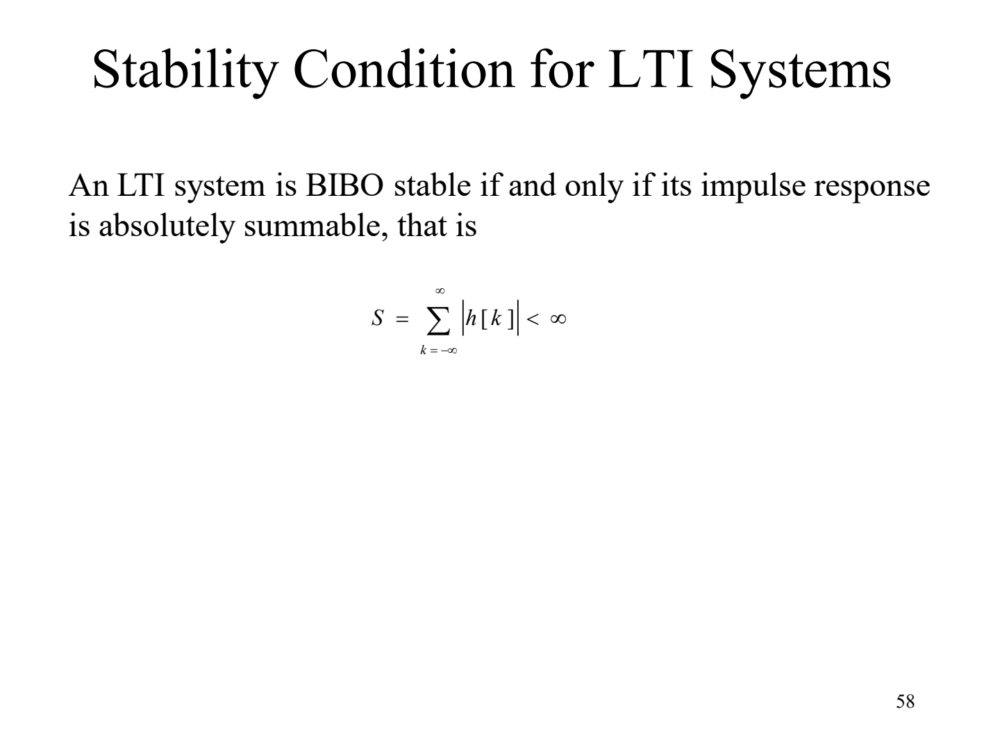

*Original slide, including all figures and annotations: [lecture PDF p. 59](../../03_resources/01_lectures/00_Intro.pdf#page=59).*

### PDF page 60 - Bounding convolution and checking causality

Use the triangle inequality:

$$
|y[n]|\le\sum_k|h[k]|\,|x[n-k]|\le B_x\sum_k|h[k]|.
$$

Absolute summability therefore guarantees bounded output. For necessity one can align bounded input signs/phases with $h$ to expose an unbounded absolute sum. Independently, $h[k]=0$ for $k<0$ ensures convolution never requests a future sample. Stability and causality answer different questions.

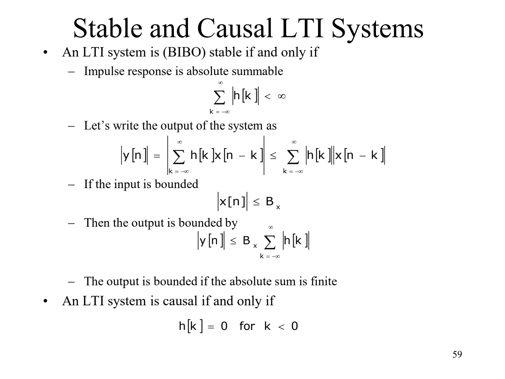

*Original slide, including all figures and annotations: [lecture PDF p. 60](../../03_resources/01_lectures/00_Intro.pdf#page=60).*

## Lyons supplement: identifying an unknown LTI system

Read [§§1.4-1.8, printed pp. 12-21 / PDF pp. 37-46](../../03_resources/03-Understanding-Digital-Signal-Processing.pdf#page=37). Lyons makes the impulse response the bridge between time-domain output prediction and frequency-domain analysis. For an FIR response, its DFT samples the exact DTFT on a frequency grid; for an IIR response, truncating the measured tail introduces an approximation.

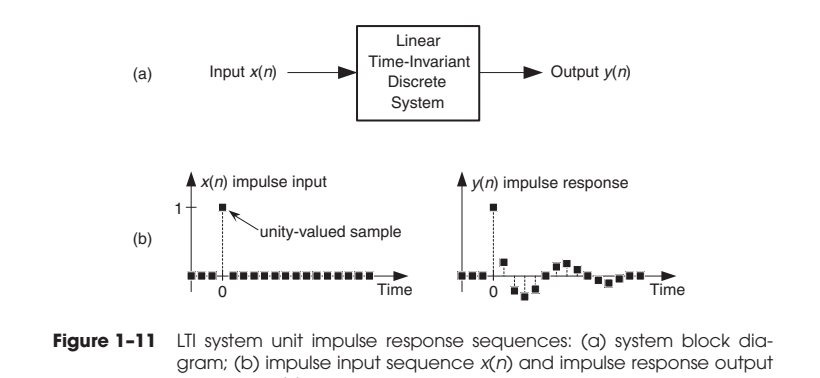

*Extracted figure crop: Figure 1-11, printed p. 19 / PDF p. 44.*

## Worked example: smoothing a position sensor

**Author-created example.** Let $h[n]=\frac12\delta[n]+\frac12\delta[n-1]$, and $x=[2,4,6]$ begin at $n=0$, with zero elsewhere. Then $y=x*h=[1,3,5,3]$. The last sample is the tail after the input ends.

This system is linear, time-invariant, causal, has memory, is FIR, and is BIBO stable because $\sum|h|=1$. A constant input passes unchanged after startup. High-frequency sample-to-sample changes are smoothed, but there is delay; smoothing a sensor can therefore affect a control loop's timing.

## Retrieval practice and answer key

1. Is $y[n]=x^2[n]$ LTI? **No: nonlinear, although time-invariant.**
2. Is $h[n]=\delta[n+1]$ stable? Causal? **Stable; noncausal.**
3. Is $h[n]=(1/2)^nu[n]$ FIR? **No, IIR; it is causal and stable.**
4. What bounded input disproves accumulator stability? **$x[n]=u[n]$**, yielding $(n+1)u[n]$ under initial rest.

## Summary Section

System properties must be tested independently. Linearity and time invariance together turn the impulse response into a complete zero-state description through convolution. Causality concerns negative-index support; BIBO stability concerns the absolute sum of the impulse response; FIR/IIR concerns its duration.
