# Cornell Notes 04: Difference equations, initial conditions, responses and DSP applications

[All topics](./README.md) | [Previous](./03_discrete_time_systems.md) | [Next](./05_frequency_response_and_z_transform.md)

**Lecture:** [PDF pages 61-80](../../03_resources/01_lectures/00_Intro.pdf#page=61) (20 pages). **Updated:** 2026-09-14.

**Source convention:** PDF page numbers are one-based viewer pages. Each original slide is reproduced beneath its written note to preserve the complete source content. “Clarification” marks explanatory additions or corrections; “Lyons supplement” marks textbook enrichment.

## Cue Column

| Cue / retrieval question | Study target |
| --- | --- |
| What information makes a recurrence's output unique? | Input and appropriate initial/auxiliary conditions. |
| How do homogeneous and particular solutions differ? | Natural modes versus a response satisfying the forcing equation. |
| Are homogeneous/particular and zero-input/zero-state identical decompositions? | No; their initial-condition assignments differ. |
| How do you compute an impulse response recursively? | Apply a unit sample with zero prior state. |
| Does digital implementation imply stability? | Check poles or absolute summability. |
| Where is DSP useful in mechatronics? | Sensor analysis, image processing, control and communications. |

## Notes Section: recurrence and solution structure

$$
\sum_{k=0}^{N}a_k y[n-k]=\sum_{m=0}^{M}b_m x[n-m],\qquad a_0\ne0.
$$

Divide by $a_0$ if necessary. With $a_0=1$,

$$
y[n]=-\sum_{k=1}^{N}a_k y[n-k]+\sum_{m=0}^{M}b_m x[n-m].
$$

The sign of each feedback contribution comes from moving denominator terms to the right. Some later lecture sections instead define feedback coefficients with their signs already included; always read the stated equation.

Two valid decompositions are $y=y_h+y_p$ and $y=y_{zi}+y_{zs}$. A particular solution need not satisfy the zero initial conditions, whereas the zero-state response must.

## Notes Section: page-by-page lecture coverage

### PDF page 61 - Constant-coefficient difference equations

The slide defines an $N$th-order recurrence with input coefficients $b_m$ and output coefficients $a_k$, usually normalized to $a_0=1$. It can be evaluated one sample at a time from stored inputs/outputs. **Source correction:** with the slide's coefficient definitions, MATLAB's call is `filter(b,a,x)`, not the displayed `filter(a,b,x)`; numerator coefficients come first. Initial state must also be specified when it is not zero.

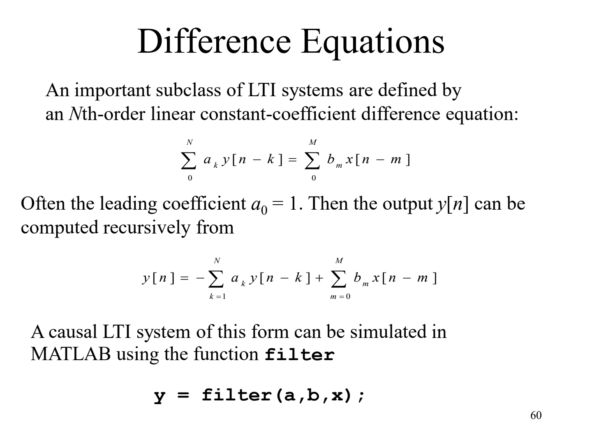

*Original slide, including all figures and annotations: [lecture PDF p. 61](../../03_resources/01_lectures/00_Intro.pdf#page=61).*

### PDF page 62 - Accumulator recurrence

Split the running sum into its latest input and previous sum:

$$
y[n]=\sum_{k=-\infty}^{n}x[k]=x[n]+y[n-1].
$$

The diagram contains an adder and one-sample positive feedback delay. Coefficients in the normalized left-hand convention are $a_0=1$, $a_1=-1$, $b_0=1$. Infinite-history notation assumes convergence; an implementation usually starts from a specified accumulator state.

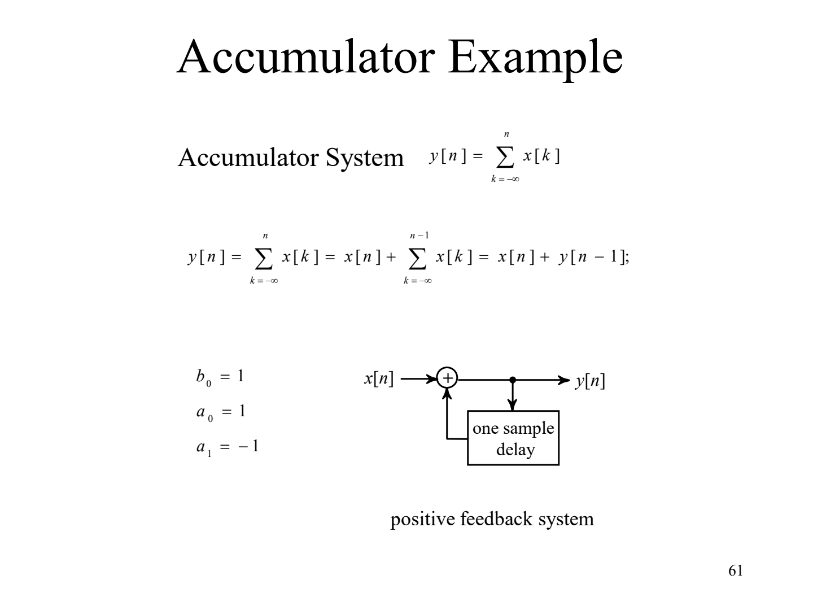

*Original slide, including all figures and annotations: [lecture PDF p. 62](../../03_resources/01_lectures/00_Intro.pdf#page=62).*

### PDF page 63 - Total, homogeneous and particular solutions

The total response is $y[n]=y_h[n]+y_p[n]$. The homogeneous solution satisfies the recurrence with zero right-hand side; a particular solution satisfies the recurrence for the specified forcing input. Initial conditions determine the remaining constants after the two are combined. A recurrence alone need not specify one unique output sequence.

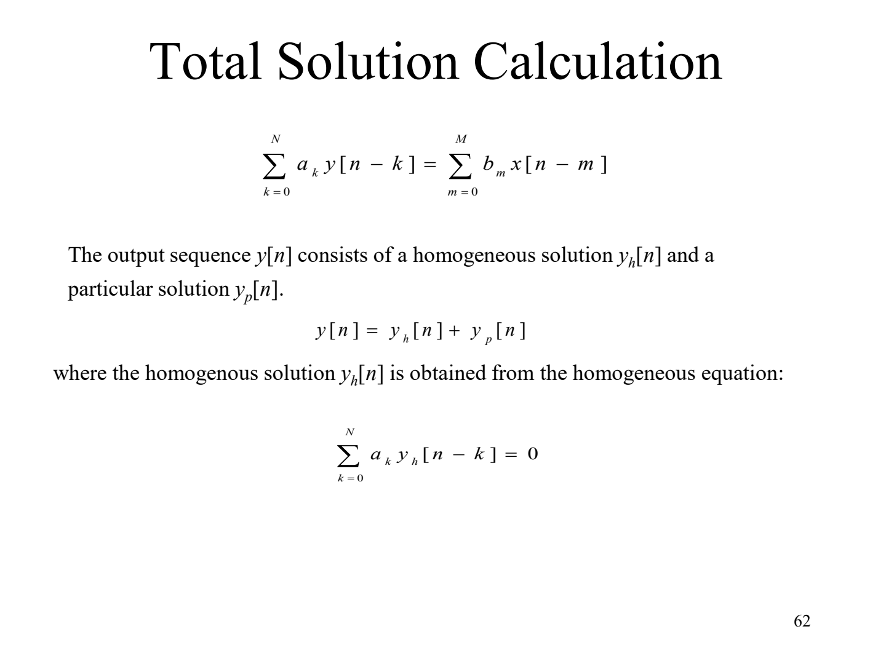

*Original slide, including all figures and annotations: [lecture PDF p. 63](../../03_resources/01_lectures/00_Intro.pdf#page=63).*

### PDF page 64 - Characteristic polynomial

Substitute $y_h[n]=\lambda^n$ into the homogeneous recurrence to obtain $a_0\lambda^N+a_1\lambda^{N-1}+\cdots+a_N=0$. With distinct roots, $y_h[n]=\sum_i A_i\lambda_i^n$. **Extension:** a root of multiplicity $r$ requires terms $\lambda^n,n\lambda^n,\ldots,n^{r-1}\lambda^n$. The slide's summation variable is inconsistent; the index should enumerate roots.

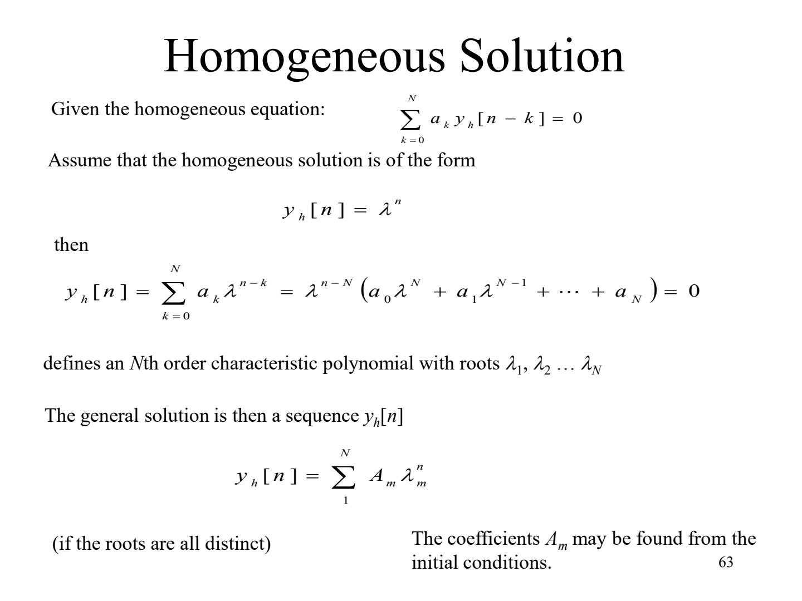

*Original slide, including all figures and annotations: [lecture PDF p. 64](../../03_resources/01_lectures/00_Intro.pdf#page=64).*

### PDF page 65 - Choosing a particular solution

Choose a trial form based on the input and solve for its coefficients by substitution. This is not the entire response until initial conditions have been imposed. The method is applied over the specified interval, here usually $n\ge0$; step-input switching at the starting boundary must be handled by the recurrence.

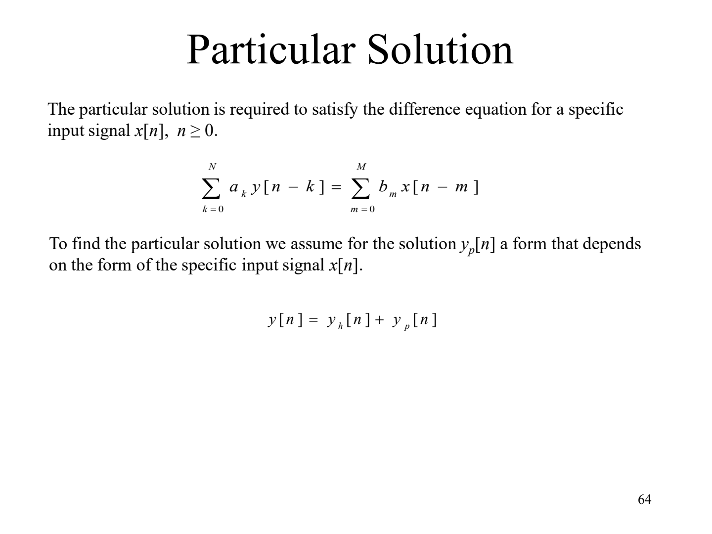

*Original slide, including all figures and annotations: [lecture PDF p. 65](../../03_resources/01_lectures/00_Intro.pdf#page=65).*

### PDF page 66 - Trial-form table

The lecture's table is summarized below. Constants in the trial response are unknown until substitution.

| Input form | Trial particular solution |
| --- | --- |
| Constant $A$ | Constant $K$ |
| Exponential $Ar^n$ | $Kr^n$ |
| Polynomial $An^m$ | General degree-$m$ polynomial |
| $r^n$ times a degree-$m$ polynomial | $r^n$ times a general degree-$m$ polynomial |
| Sine or cosine at $\omega_0$ | $K_1\cos(\omega_0n)+K_2\sin(\omega_0n)$ |

If the trial overlaps a homogeneous mode, multiply it by the necessary power of $n$ before solving. This resonance qualification is an addition to the slide.

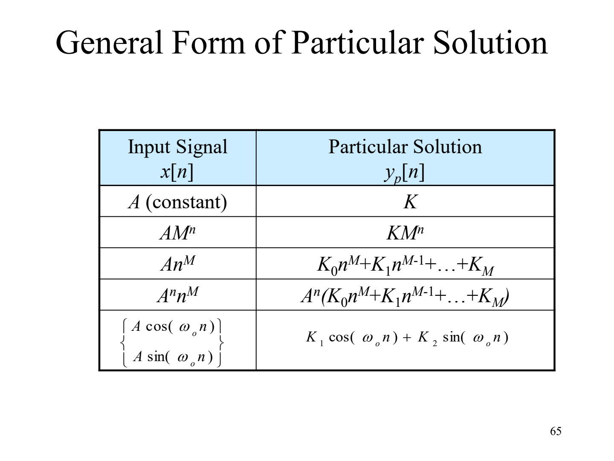

*Original slide, including all figures and annotations: [lecture PDF p. 66](../../03_resources/01_lectures/00_Intro.pdf#page=66).*

### PDF page 67 - Example: natural modes

For $y[n]+y[n-1]-6y[n-2]=x[n]$, the characteristic equation is $\lambda^2+\lambda-6=(\lambda+3)(\lambda-2)=0$. Hence $y_h[n]=A_1(-3)^n+A_2 2^n$. Both modes grow in magnitude, so the causal zero-state system is unstable.

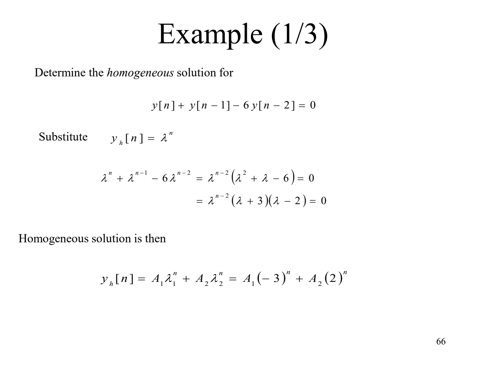

*Original slide, including all figures and annotations: [lecture PDF p. 67](../../03_resources/01_lectures/00_Intro.pdf#page=67).*

### PDF page 68 - Example: constant forcing

Let $x[n]=8u[n]$, $y[-1]=1$, and $y[-2]=-1$. Try $y_p[n]=\beta$ over $n\ge0$. Substitution gives $\beta+\beta-6\beta=8$, hence $\beta=-2$. Initial conditions are used for the total solution, not to change this constant trial result.

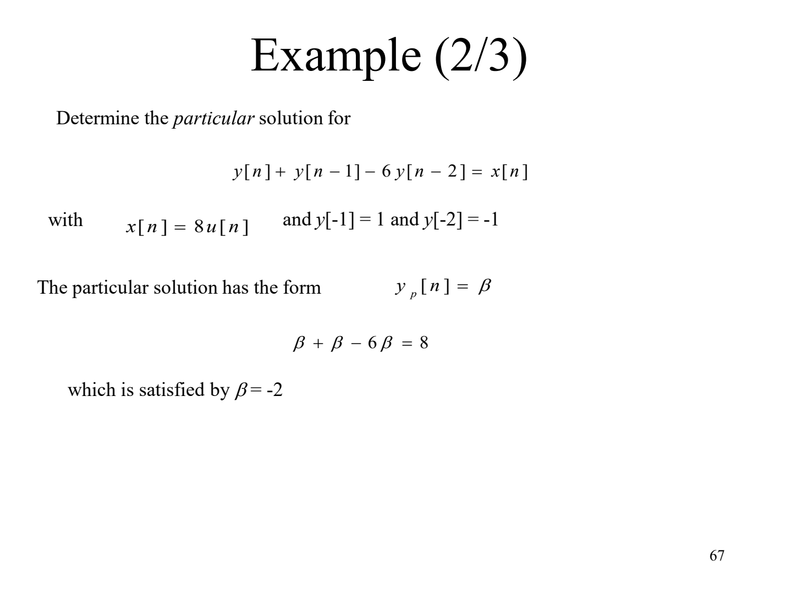

*Original slide, including all figures and annotations: [lecture PDF p. 68](../../03_resources/01_lectures/00_Intro.pdf#page=68).*

### PDF page 69 - Example: total response and corrected boundary index

Using $y[-1]=1$ and $y[-2]=-1$ gives

$$
-A_1/3+A_2/2-2=1,\qquad A_1/9+A_2/4-2=-1.
$$

Thus $A_1=-1.8$, $A_2=4.8$, and $y[n]=-1.8(-3)^n+4.8(2)^n-2$ for $n\ge0$. The second boundary line on the slide is labeled $y[-3]$ but uses the factors for $y[-2]$; the latter is correct. Check the recurrence: $y[0]=1$, $y[1]=13$, $y[2]=1$.

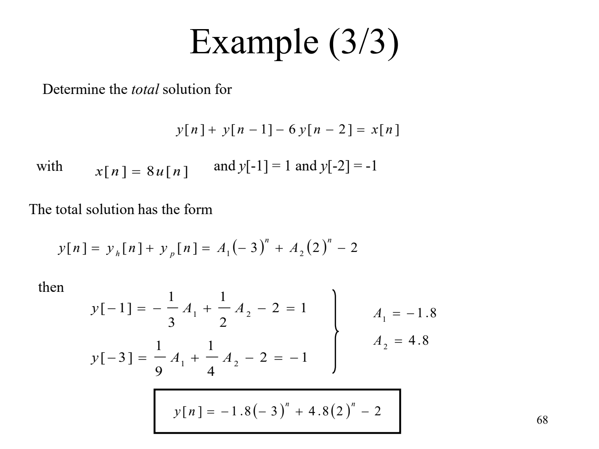

*Original slide, including all figures and annotations: [lecture PDF p. 69](../../03_resources/01_lectures/00_Intro.pdf#page=69).*

### PDF page 70 - Initial-rest conditions

Auxiliary conditions are required to select a response. For the causal recurrence with nonzero present-output coefficient and only present/past input/output terms, initial rest yields its usual causal LTI zero-state mapping. Fixed nonzero initial conditions add a response independent of the input, so the total mapping generally fails the zero-input test for linearity. Initial rest is not a blanket cure for arbitrary equations involving future samples.

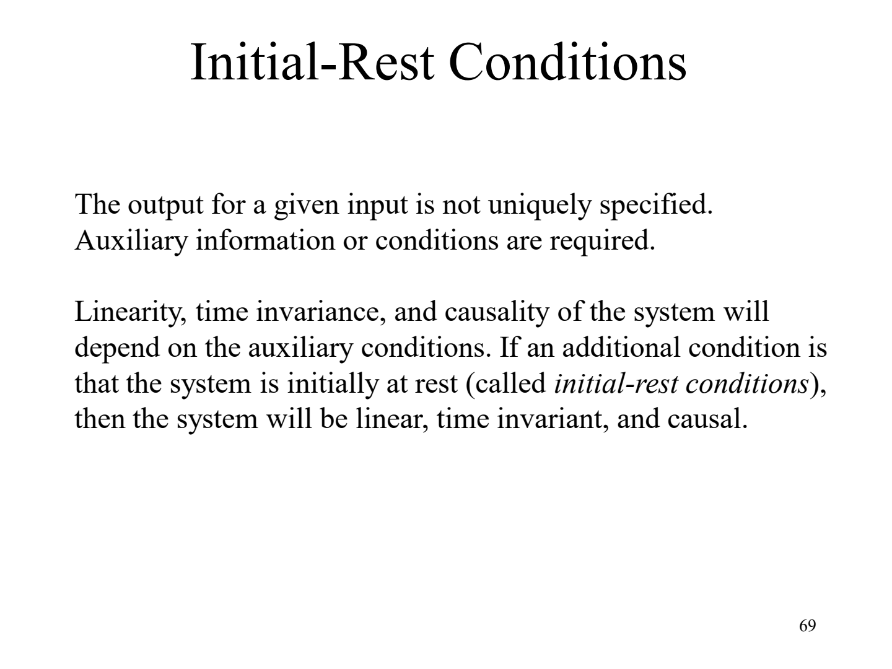

*Original slide, including all figures and annotations: [lecture PDF p. 70](../../03_resources/01_lectures/00_Intro.pdf#page=70).*

### PDF page 71 - Zero-input and zero-state decomposition

The zero-input response $y_{zi}$ uses $x=0$ with the actual initial state. The zero-state response $y_{zs}$ uses the actual input with zero initial state. Superpose them to obtain the total response. This separates stored energy/state from new input forcing, useful when a filter or controller restarts with a nonzero state.

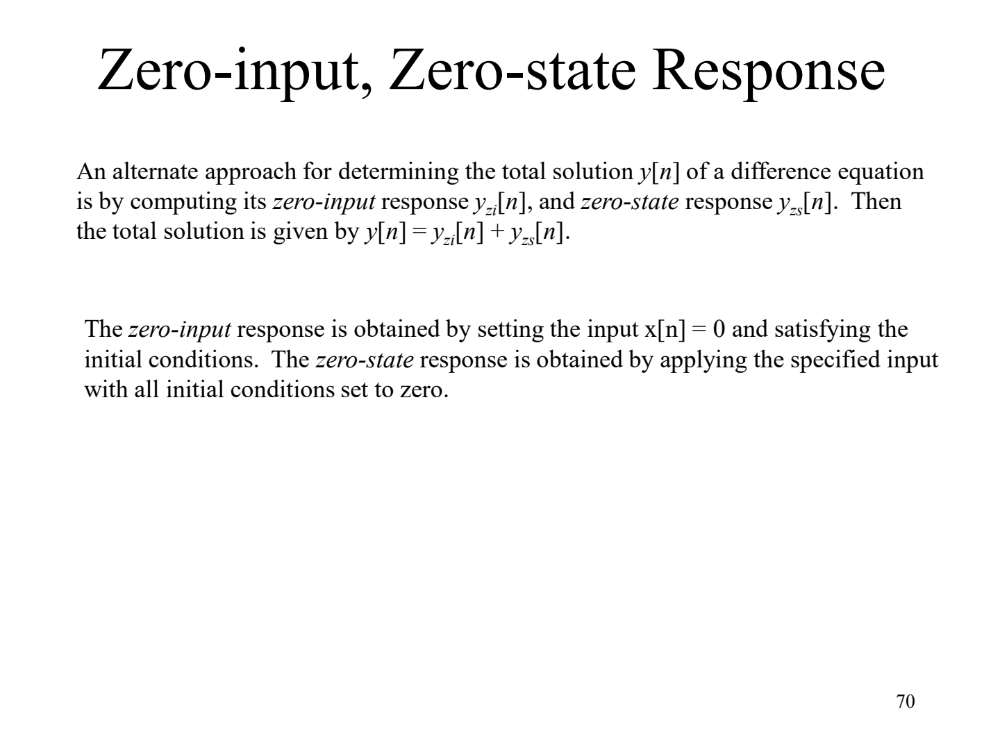

*Original slide, including all figures and annotations: [lecture PDF p. 71](../../03_resources/01_lectures/00_Intro.pdf#page=71).*

### PDF page 72 - Example: the two responses

For the same recurrence and prior state, the zero-input initial outputs are $y_{zi}[0]=-7$ and $y_{zi}[1]=13$. Solving for its modes gives

$$
y_{zi}[n]=-5.4(-3)^n-1.6(2)^n.
$$

For zero state and $8u[n]$, $y_{zs}[0]=8$, $y_{zs}[1]=0$, giving

$$
y_{zs}[n]=3.6(-3)^n+6.4(2)^n-2.
$$

These expressions apply for $n\ge0$; do not extend them to redefine the externally specified prehistory.

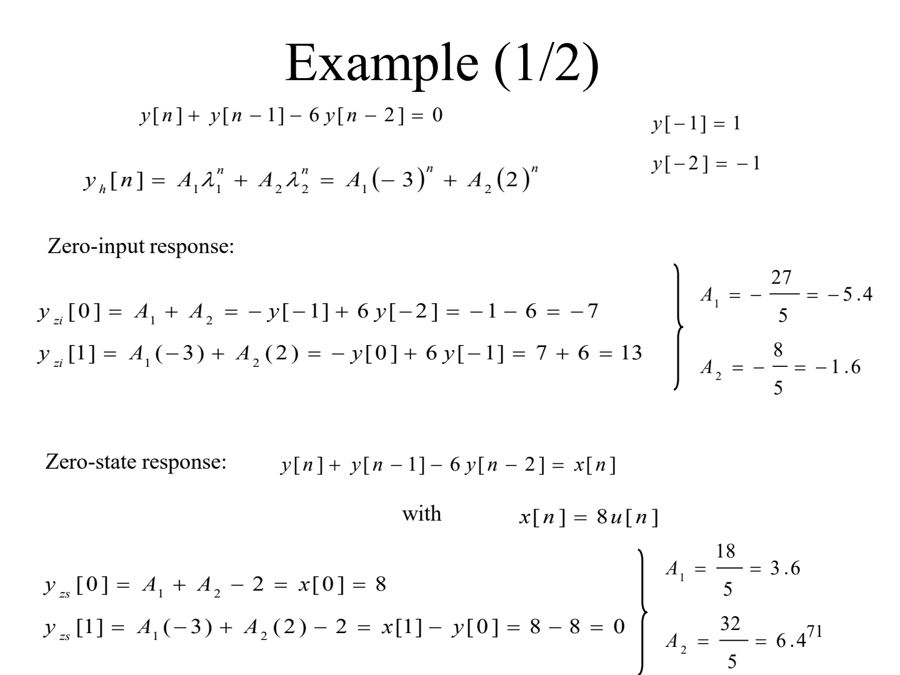

*Original slide, including all figures and annotations: [lecture PDF p. 72](../../03_resources/01_lectures/00_Intro.pdf#page=72).*

### PDF page 73 - Example: add responses and repair the final sign

Adding the previous page's responses yields $y[n]=-1.8(-3)^n+4.8(2)^n-2$. **Source correction:** this slide's final expression prints a positive $1.8$ coefficient, conflicting with its own component responses and page 69. The negative sign is required; at $n=0$ the corrected value is 1, while the positive sign would give 4.6.

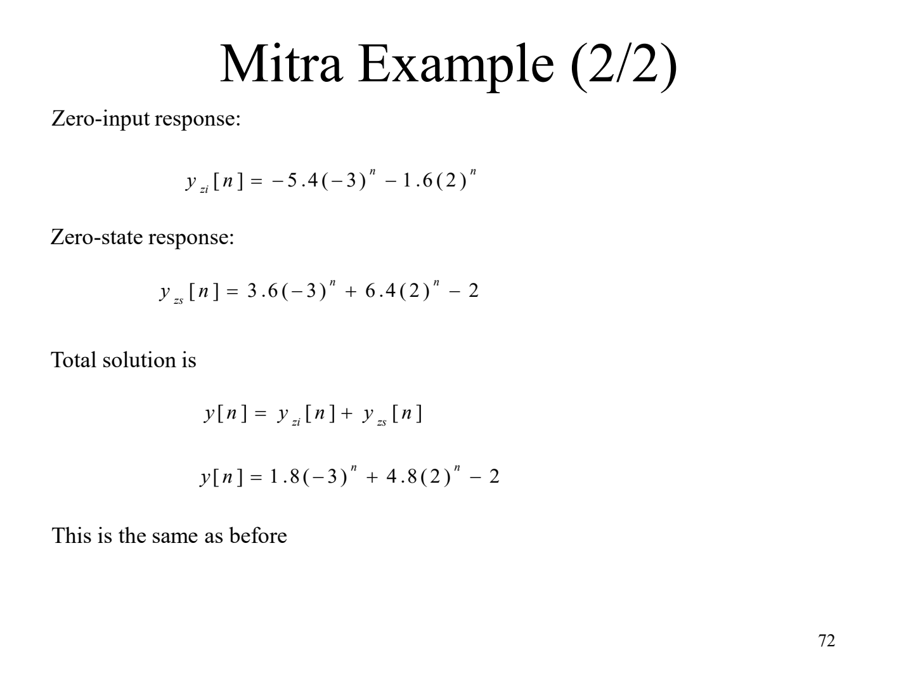

*Original slide, including all figures and annotations: [lecture PDF p. 73](../../03_resources/01_lectures/00_Intro.pdf#page=73).*

### PDF page 74 - Impulse response from initial rest

Set $x[n]=\delta[n]$, with zero prehistory. For this example, the forcing is zero after $n=0$, so subsequent response samples follow the homogeneous recurrence after the first samples have been generated. **Qualification:** for a general recurrence with delayed input terms, the impulse produces forcing through $n=M$; the homogeneous-only argument starts after that support has passed.

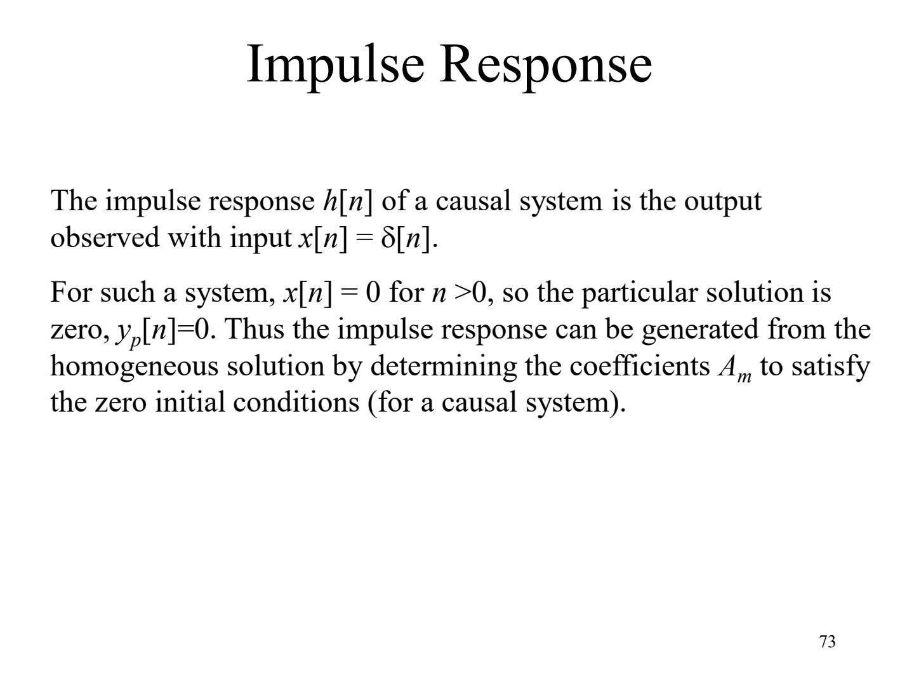

*Original slide, including all figures and annotations: [lecture PDF p. 74](../../03_resources/01_lectures/00_Intro.pdf#page=74).*

### PDF page 75 - Example: impulse response

Initial rest gives $h[0]=1$, $h[1]=-1$. Solve $A_1+A_2=1$ and $-3A_1+2A_2=-1$ to obtain $A_1=3/5$, $A_2=2/5$:

$$
h[n]=\left[\frac35(-3)^n+\frac25 2^n\right]u[n].
$$

The first values are $1,-1,7,-13,55,\ldots$. The response is causal and IIR, but not absolutely summable and therefore not BIBO stable.

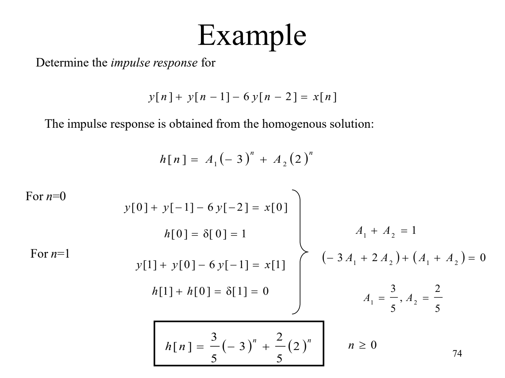

*Original slide, including all figures and annotations: [lecture PDF p. 75](../../03_resources/01_lectures/00_Intro.pdf#page=75).*

### PDF page 76 - DSP application families

The slide lists image processing (pattern recognition, robotic vision, enhancement, facsimile, satellite weather maps, animation); instrumentation/control (spectrum analysis, position/rate control, noise reduction, compression); speech/audio (recognition, synthesis, text-to-speech, digital audio, equalization); military applications (secure communications, radar, sonar, guidance); telecommunications (echo cancellation, adaptive equalization, ADPCM transcoding, spread spectrum, video conferencing, data links); and biomedical applications (patient monitoring, scanners, EEG mapping, ECG analysis, X-ray storage/enhancement).

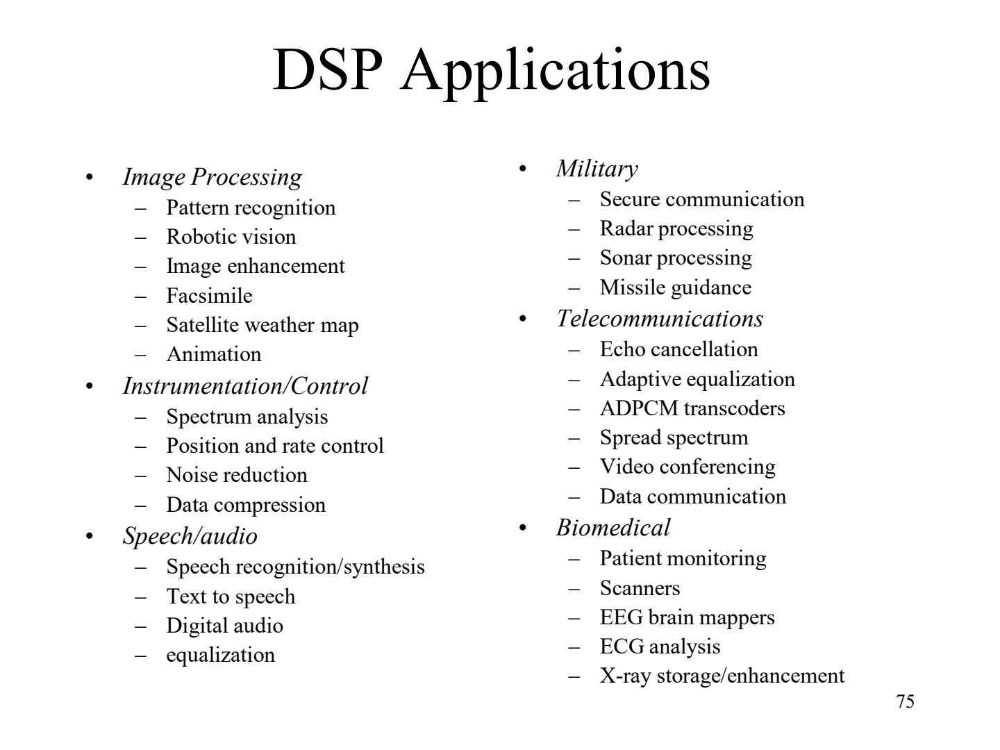

*Original slide, including all figures and annotations: [lecture PDF p. 76](../../03_resources/01_lectures/00_Intro.pdf#page=76).*

### PDF page 77 - Image noise-removal examples

The page contains two before/after comparisons: a noisy circuit-board image and a noisy bird image become cleaner after processing. The slide does not specify the algorithm, parameters or quantitative quality metric; do not infer one from the pictures alone. For inspection robotics, compare noise reduction against loss of defect edges or fine texture.

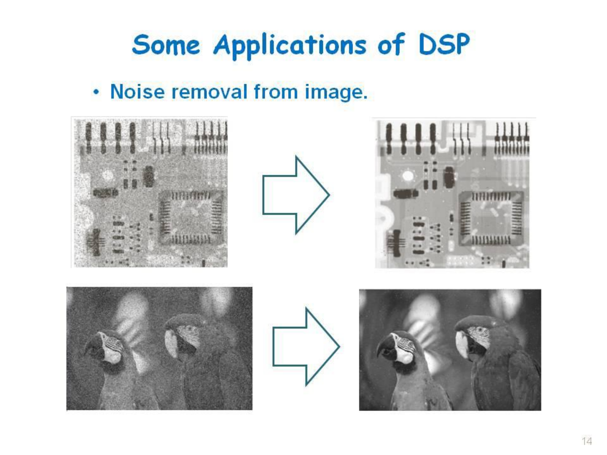

*Original slide, including all figures and annotations: [lecture PDF p. 77](../../03_resources/01_lectures/00_Intro.pdf#page=77).*

### PDF page 78 - Image enhancement example

The room/window image comparison shows dark interior detail becoming more visible. This is an enhancement illustration, not a proof that missing physical information has been recovered. A contrast adjustment can make stored information easier to inspect while also emphasizing noise; evaluate the result against the task.

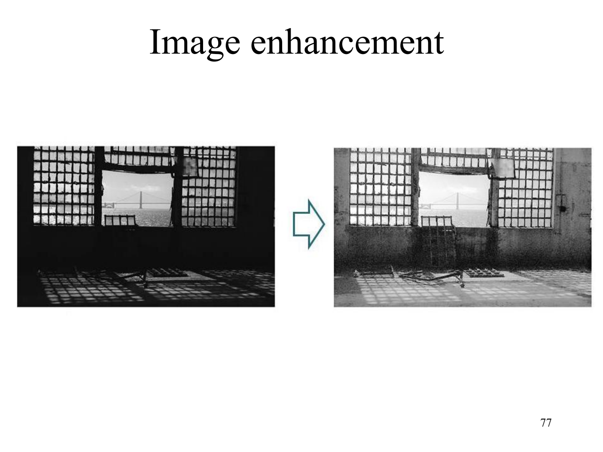

*Original slide, including all figures and annotations: [lecture PDF p. 78](../../03_resources/01_lectures/00_Intro.pdf#page=78).*

### PDF page 79 - Additional audio and communication applications

Sound-recording uses include compressors/limiters, expanders/noise gates, equalizers/filters, noise reduction, delay/reverberation and special effects. Other examples are speech recognition/communication, telephone dialing, FM stereo, subtractive/additive music synthesis, telephone echo cancellation and wireless interference cancellation. An amplitude compressor here is different from the sample-index compressor $x[Mn]$ in topic 03.

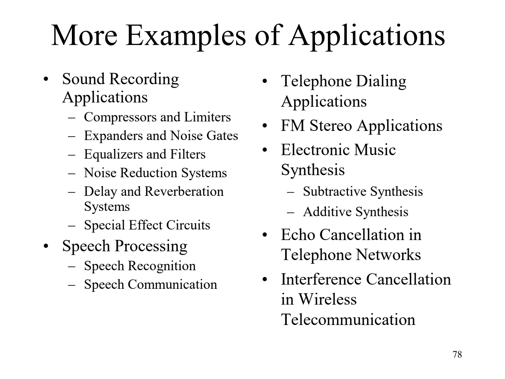

*Original slide, including all figures and annotations: [lecture PDF p. 79](../../03_resources/01_lectures/00_Intro.pdf#page=79).*

### PDF page 80 - Reasons for DSP and practical limits

Digitally stored/transmitted data can be processed in the same representation. The lecture highlights reliability/repeatability, advancing IC capability, reconfiguration, controllable accuracy, portable/offline processing and sometimes lower hardware cost. Interlacing samples from multiple channels is time-division multiplexing (TDM). Limits include processing speed and potentially greater transmission/storage bandwidth. **Clarification:** “inherently stable” here must not be read as BIBO stability; the recurrence just studied is digital and unstable.

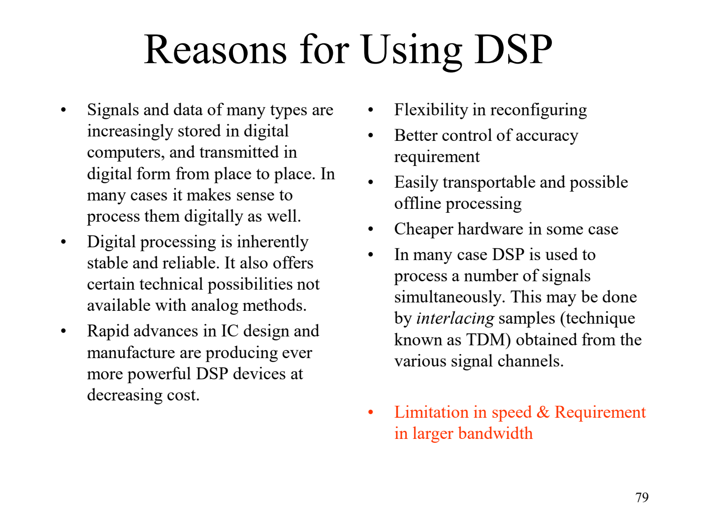

*Original slide, including all figures and annotations: [lecture PDF p. 80](../../03_resources/01_lectures/00_Intro.pdf#page=80).*

## Lyons supplement: equations and realizations

Read [§6.1, printed pp. 254-256 / PDF pp. 279-281](../../03_resources/03-Understanding-Digital-Signal-Processing.pdf#page=279). Lyons develops difference equations by rearranging an FIR structure and then introducing feedback. This connects an algebraic recurrence to stored sample values and arithmetic operations.

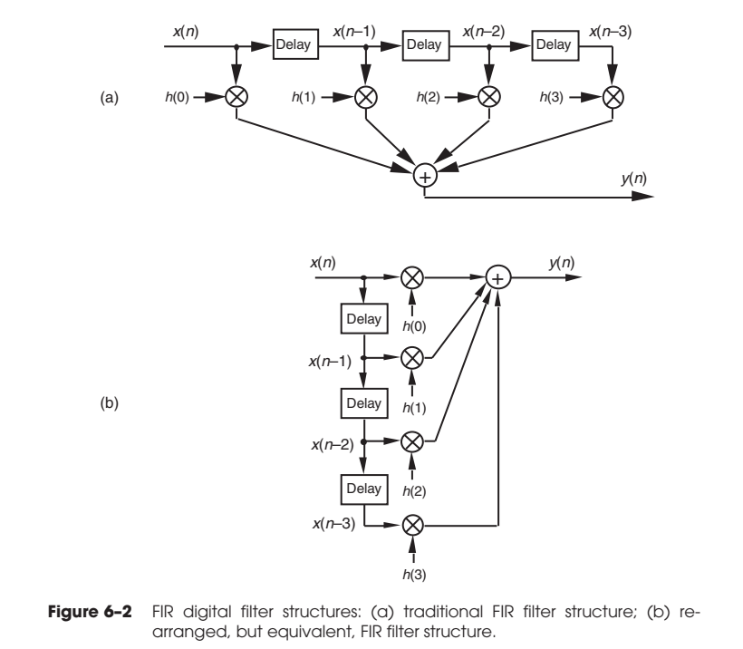

*Extracted figure crop: Figure 6-2, printed p. 255 / PDF p. 280. The two drawings compute the same input/output equation.*

## Worked example: a stable recursive smoother

**Author-created comparison.** For $y[n]=0.5y[n-1]+x[n]$ with $y[-1]=0$, the impulse response is $(0.5)^nu[n]$ and its absolute sum is 2. A unit-step input gives

$$
y[n]=\sum_{k=0}^{n}(0.5)^k=2\bigl(1-(0.5)^{n+1}\bigr),\qquad n\ge0.
$$

Values $1,1.5,1.75,1.875,\ldots$ approach 2. With the same input but $y[-1]=4$, add the zero-input component $4(0.5)^{n+1}$. This changes startup behavior without changing the zero-state transfer function.

## Retrieval practice and answer key

1. Does $y_h+y_p$ automatically meet initial conditions? **No; solve the homogeneous constants using the total response.**
2. What is $h[2]$ in the lecture recurrence? **7**, since $h[2]=-h[1]+6h[0]$.
3. Can a feedback implementation be stable? **Yes**, as the $0.5$-pole example shows.
4. Why retain the old state during continuous filtering? **Resetting it changes the response at every boundary.**

## Summary Section

A difference equation becomes a definite system only with appropriate auxiliary conditions. Natural modes and forcing explain the response; zero-input/zero-state decomposition separates prior state from new input. Recursive processing supports many DSP applications, but causality, stability and finite-precision behavior still require analysis.
