# Cornell Notes 05: Frequency response, phase/group delay and z-transform convergence

[All topics](./README.md) | [Previous](./04_difference_equations_and_applications.md) | [Next](./06_inverse_z_transform_and_system_functions.md)

**Lecture:** [PDF pages 81-100](../../03_resources/01_lectures/00_Intro.pdf#page=81) (20 pages). **Updated:** 2026-09-14.

**Source convention:** PDF page numbers are one-based viewer pages. Each original slide is reproduced beneath its written note to preserve the complete source content. “Clarification” marks explanatory additions or corrections; “Lyons supplement” marks textbook enrichment.

## Cue Column

| Cue / retrieval question | Study target |
| --- | --- |
| How do the time, frequency and z domains describe one LTI system? | $h[n]$, $H(e^{j\omega})$ and $H(z)$ with ROC. |
| Why can an ideal low-pass filter not become causal by finite delay? | Its impulse response extends infinitely in both directions. |
| What are phase delay and group delay? | Negative phase/frequency versus negative phase slope. |
| Why add the radial coordinate to the Fourier transform? | Exponential weighting can create convergence. |
| What information does the ROC add? | Sequence support and existence of unit-circle response. |

## Notes Section: equations and units

$$
y=x*h,\qquad Y(e^{j\omega})=H(e^{j\omega})X(e^{j\omega}),\qquad Y(z)=H(z)X(z).
$$

For a well-defined frequency response, write $H=|H|e^{j\phi(\omega)}$. Then

$$
\tau_p(\omega)=-\frac{\phi(\omega)}{\omega},\qquad
\tau_g(\omega)=-\frac{d\phi(\omega)}{d\omega}.
$$

These delays are in **samples** when $\omega$ is rad/sample and $\phi$ is radians. Multiply by $T$ for seconds. Unwrap phase before differentiating, avoiding points where $H=0$ and phase is undefined.

$$
X(z)=\sum_{n=-\infty}^{\infty}x[n]z^{-n},\qquad z=re^{j\omega}.
$$

The ROC is the set of $z$ for which this sum converges absolutely. A rational expression without an ROC need not identify a unique sequence.

## Notes Section: page-by-page lecture coverage

### PDF page 81 - Applications map

The diagram links DSP to telephone voice/data compression, echo cancellation, multiplexing and filtering; space photograph enhancement, compression and remote-probe analysis; medical CT/MRI/ultrasound imaging, ECG and image storage/retrieval; radar, sonar, guidance and secure communications; scientific earthquake analysis, acquisition, spectra and modeling; and industrial prospecting, process monitoring/control, nondestructive testing and CAD/design tools. It completes the applications section begun in topic 04.

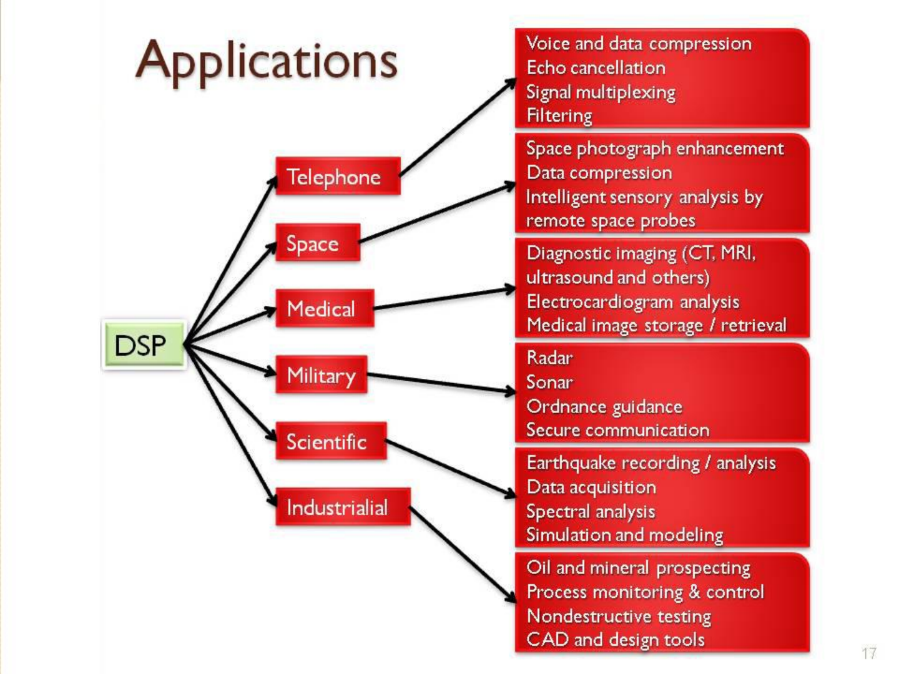

*Original slide, including all figures and annotations: [lecture PDF p. 81](../../03_resources/01_lectures/00_Intro.pdf#page=81).*

### PDF page 82 - Three domains of system analysis

The same LTI input/output rule can be described by the time-domain convolution sum, frequency-domain multiplication, or z-domain multiplication. The impulse response completely characterizes the zero-state LTI system. Frequency-domain representation requires suitable convergence; the system function must include its ROC to remove ambiguity.

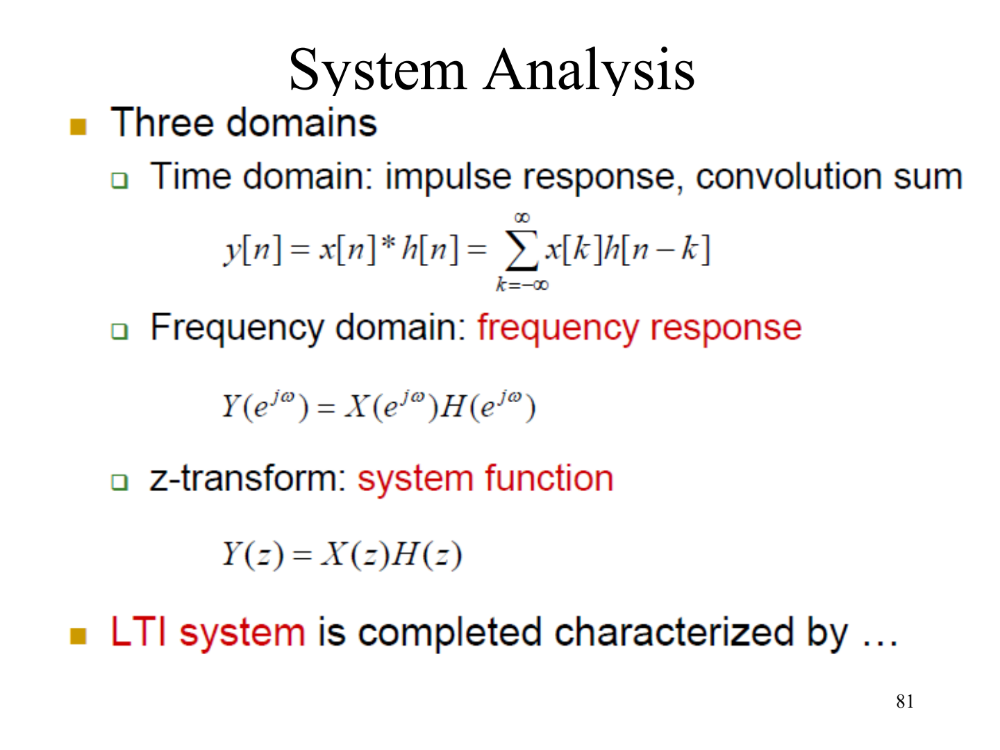

*Original slide, including all figures and annotations: [lecture PDF p. 82](../../03_resources/01_lectures/00_Intro.pdf#page=82).*

### PDF page 83 - Magnitude and phase response

From $Y=HX$, magnitudes multiply and phases add: $|Y|=|X||H|$, $\arg Y=\arg X+\arg H$ modulo $2\pi$ where defined. Magnitude controls gain/attenuation; phase controls relative timing of sinusoidal components. A filter can distort a waveform through either mechanism.

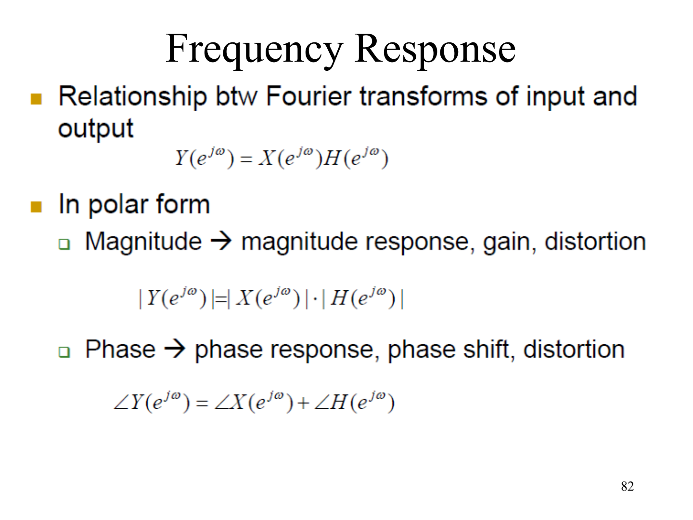

*Original slide, including all figures and annotations: [lecture PDF p. 83](../../03_resources/01_lectures/00_Intro.pdf#page=83).*

### PDF page 84 - Ideal low-pass filter

The ideal response is 1 for $|\omega|<\omega_c$ and 0 for $\omega_c<|\omega|\le\pi$, repeated every $2\pi$. Its impulse response is $h[n]=\sin(\omega_c n)/(\pi n)$ for $n\ne0$, with $h[0]=\omega_c/\pi$. It is two-sided and noncausal. Exact brick-wall selectivity cannot be realized by a finite causal filter.

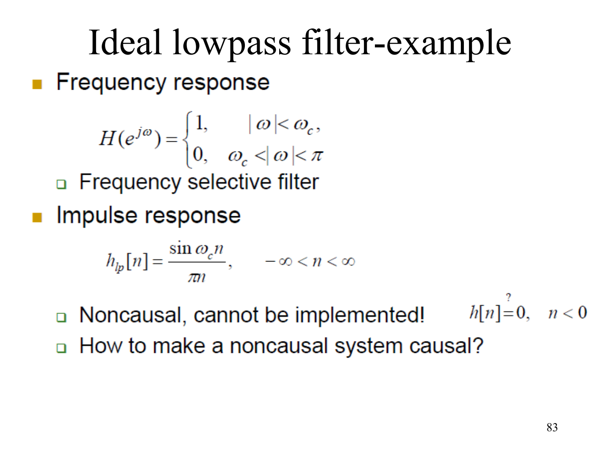

*Original slide, including all figures and annotations: [lecture PDF p. 84](../../03_resources/01_lectures/00_Intro.pdf#page=84).*

### PDF page 85 - Making a finite noncausal filter causal

Cascade the forward difference $h_1[n]=\delta[n+1]-\delta[n]$ with a one-sample delay $h_2[n]=\delta[n-1]$. The result is the causal backward difference $\delta[n]-\delta[n-1]$. A sufficiently long delay can shift a finite left extent into $n\ge0$. It cannot remove the infinite negative tail of an ideal sinc low-pass response.

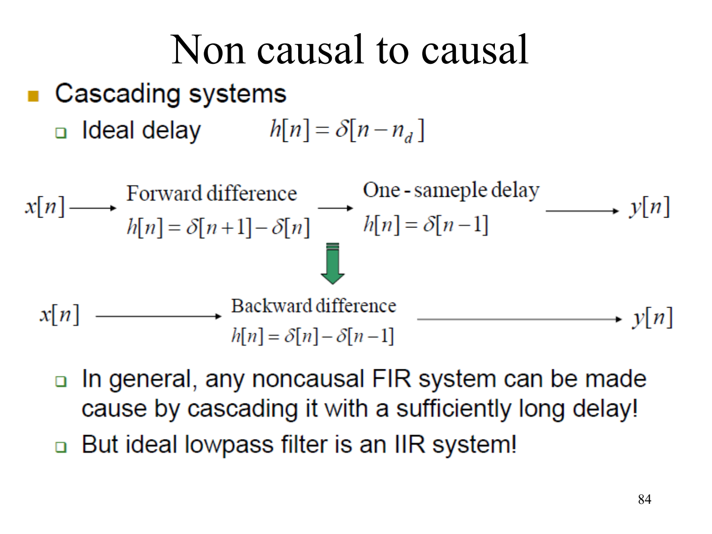

*Original slide, including all figures and annotations: [lecture PDF p. 85](../../03_resources/01_lectures/00_Intro.pdf#page=85).*

### PDF page 86 - Ideal delay and delayed low-pass response

For $h_d[n]=\delta[n-n_d]$, $H_d(e^{j\omega})=e^{-j\omega n_d}$: magnitude 1 and linear phase $-\omega n_d$. The waveform is shifted without changing shape. A delayed ideal low-pass has response $e^{-j\omega n_d}$ in its passband and impulse response $\sin[\omega_c(n-n_d)]/[\pi(n-n_d)]$ with the limiting center value; it is still noncausal for every finite $n_d$.

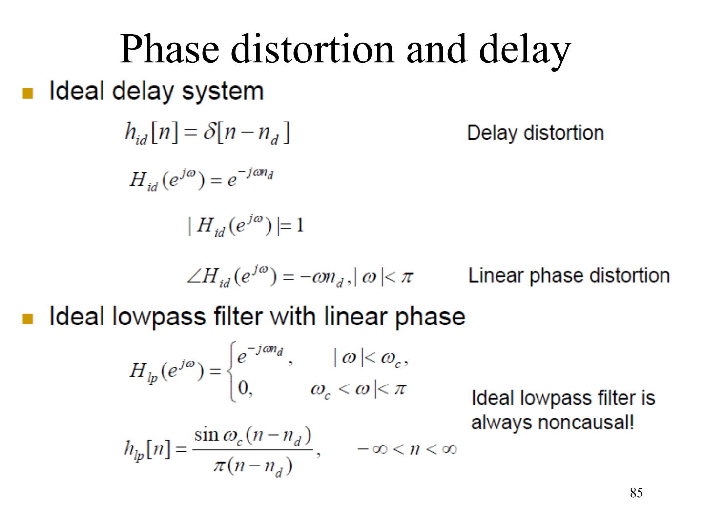

*Original slide, including all figures and annotations: [lecture PDF p. 86](../../03_resources/01_lectures/00_Intro.pdf#page=86).*

### PDF page 87 - Phase delay of a sinusoid

For a real LTI system and input $A\cos(\omega n+\phi_x)$, the steady-state output is $A|H|\cos(\omega n+\phi_x+\phi)$. Writing the added phase as a time shift gives $\tau_p=-\phi/\omega$. Phase delay depends on the selected unwrapped branch and is undefined by direct division at DC; use an appropriate limit. Nonlinear phase can change relative harmonic delays and alter waveform shape.

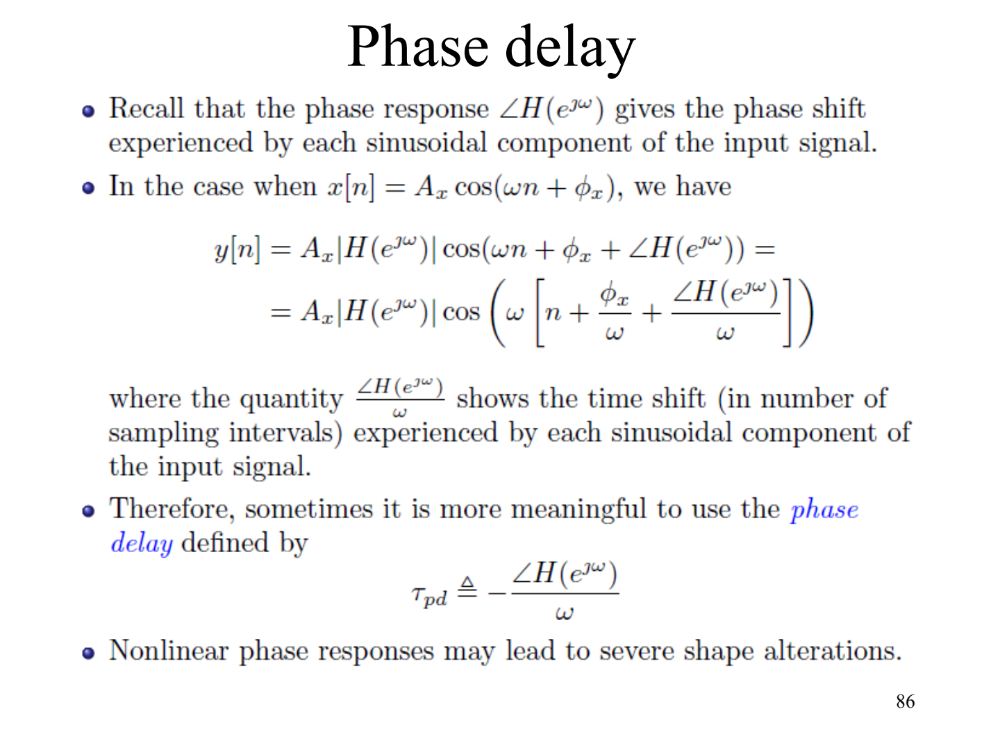

*Original slide, including all figures and annotations: [lecture PDF p. 87](../../03_resources/01_lectures/00_Intro.pdf#page=87).*

### PDF page 88 - Illustrated amplitude and phase distortion

The six plots compare the original waveform with low-frequency attenuation, high-frequency attenuation, constant phase shift, linear phase shift and nonlinear phase shift. Frequency-selective amplitude changes modify the harmonic balance. A pure linear phase through the origin gives a common delay. A constant nonzero phase generally produces different phase delays at different frequencies, changing a multicomponent real waveform.

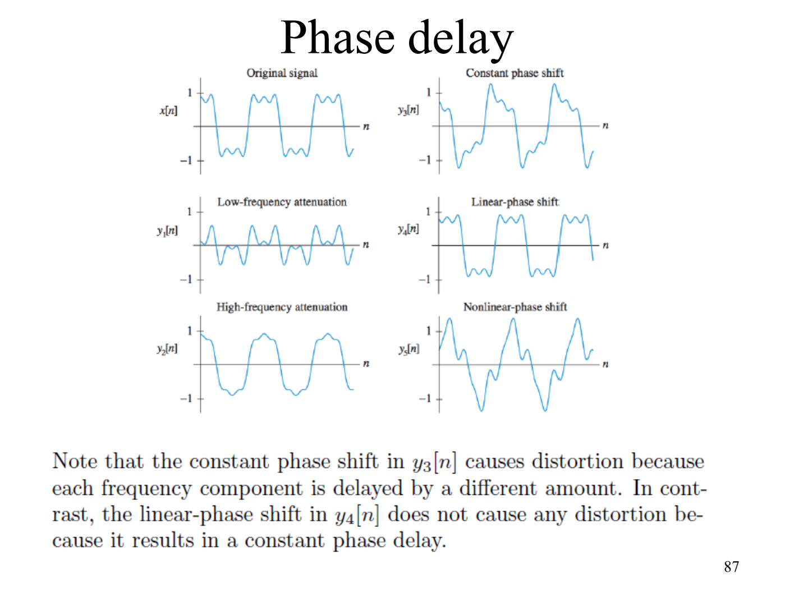

*Original slide, including all figures and annotations: [lecture PDF p. 88](../../03_resources/01_lectures/00_Intro.pdf#page=88).*

### PDF page 89 - Narrowband group delay

For $x[n]=s[n]\cos(\omega_0n)$ with a slowly varying/narrowband envelope, approximate phase locally by a line near $\omega_0$ and magnitude by a constant. The envelope is approximately delayed by $\tau_g(\omega_0)$, while the carrier also acquires its phase shift. This approximation needs a sufficiently narrow occupied band and a smooth filter response there.

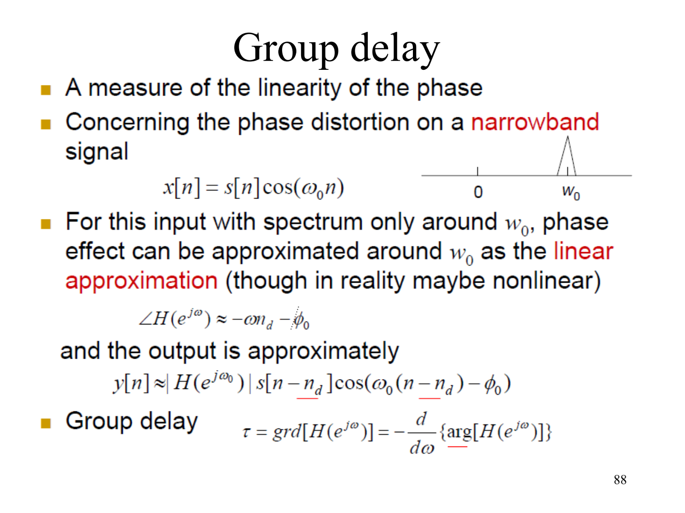

*Original slide, including all figures and annotations: [lecture PDF p. 89](../../03_resources/01_lectures/00_Intro.pdf#page=89).*

### PDF page 90 - Unwrapped phase and a qualification

Group delay is the negative derivative of unwrapped phase. A generalized linear phase $\phi(\omega)=\theta_0-\omega n_d$ has constant group delay $n_d$. **Source clarification:** its phase delay is $n_d-\theta_0/\omega$, so phase delay and group delay are identical only when the phase offset is zero on the chosen branch. Constant group delay alone does not make every broadband waveform an exact delayed copy.

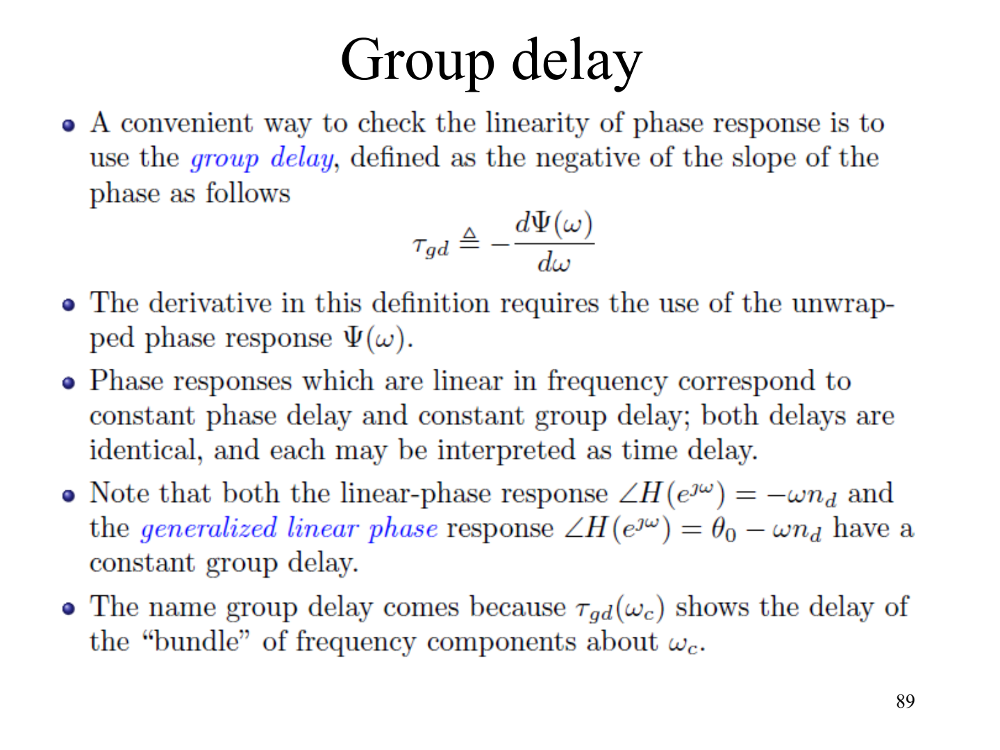

*Original slide, including all figures and annotations: [lecture PDF p. 90](../../03_resources/01_lectures/00_Intro.pdf#page=90).*

### PDF page 91 - Transition to the z-transform

The divider introduces a generalization of the Fourier representation that can analyze exponentially growing/decaying sequences and recursive systems. It prepares the transition from a frequency angle alone to a complex variable with angle and radius.

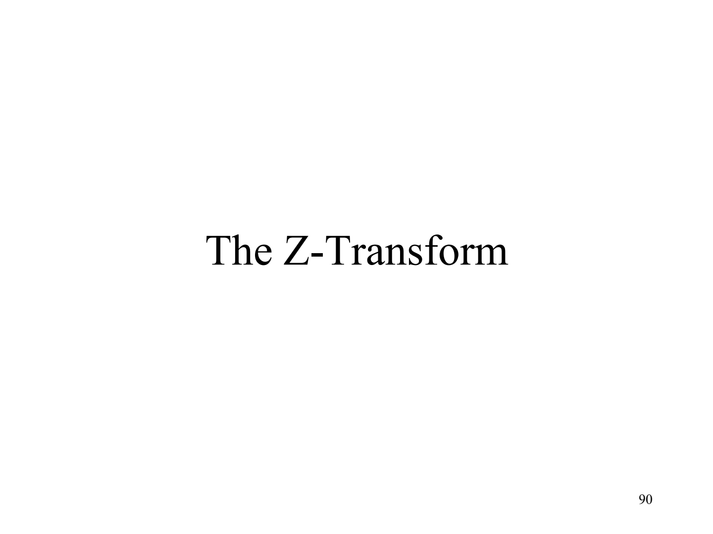

*Original slide, including all figures and annotations: [lecture PDF p. 91](../../03_resources/01_lectures/00_Intro.pdf#page=91).*

### PDF page 92 - Forward and inverse z-transform

The bilateral transform is $X(z)=\sum_nx[n]z^{-n}$. Its inverse is

$$
x[n]=\frac1{2\pi j}\oint_C X(z)z^{n-1}\,dz.
$$

The contour is counterclockwise around the origin and lies in the ROC. The lecture compares this transform to the continuous-time Laplace transform and notes that ordinary Fourier transforms are not available for every sequence. The cited Oppenheim/Proakis mentions are lecture attributions, not additional locally verified books.

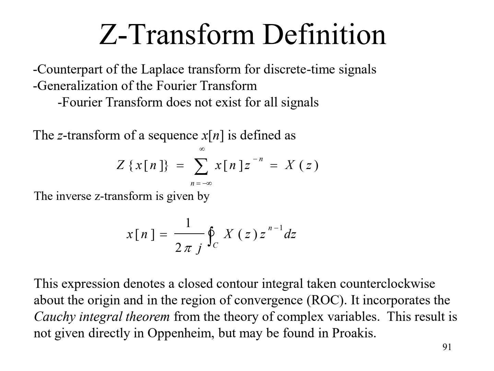

*Original slide, including all figures and annotations: [lecture PDF p. 92](../../03_resources/01_lectures/00_Intro.pdf#page=92).*

### PDF page 93 - Fourier transform on the unit circle

Setting $z=e^{j\omega}$ gives the DTFT $X(e^{j\omega})=\sum_nx[n]e^{-j\omega n}$. This is valid as an absolutely convergent transform when the unit circle lies in the ROC. Do not substitute into a rational expression and assume it is the DTFT of a sequence whose ROC excludes the unit circle.

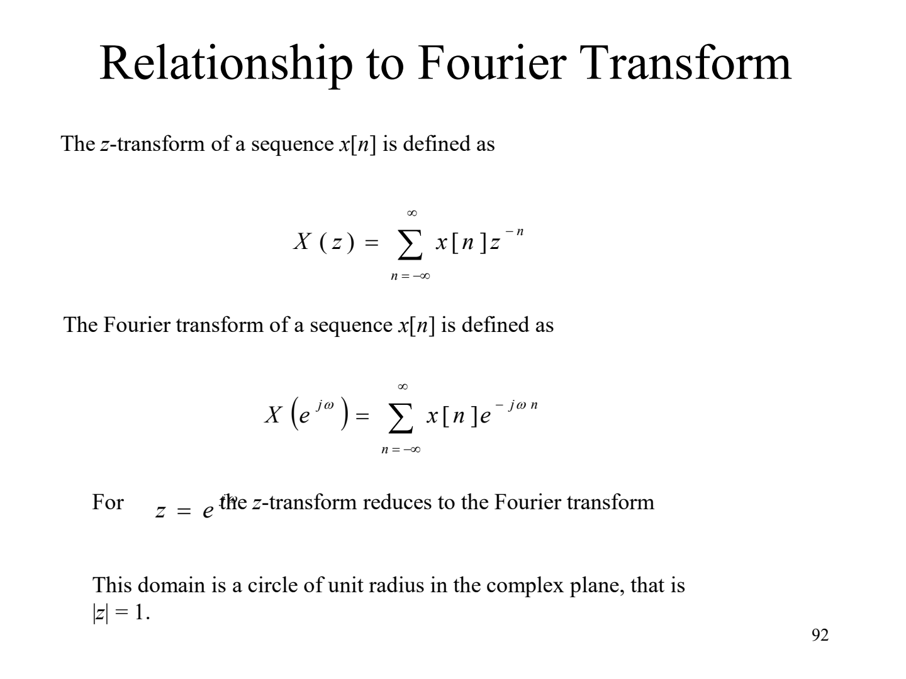

*Original slide, including all figures and annotations: [lecture PDF p. 93](../../03_resources/01_lectures/00_Intro.pdf#page=93).*

### PDF page 94 - Exponential weighting and convergence

For $z=re^{j\omega}$, $X(re^{j\omega})$ is the DTFT of $x[n]r^{-n}$. The radial factor can turn a growing right-sided exponential into a summable sequence. For $x[n]=a^nu[n]$ with $|a|>1$, there is no ordinary absolutely convergent DTFT, but the z-transform converges for $r>|a|$.

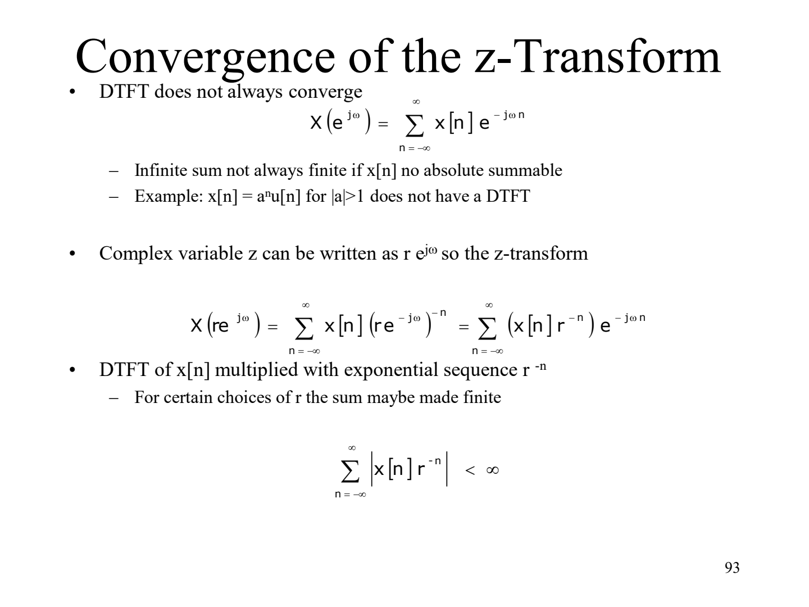

*Original slide, including all figures and annotations: [lecture PDF p. 94](../../03_resources/01_lectures/00_Intro.pdf#page=94).*

### PDF page 95 - The complex z-plane

Plot real and imaginary coordinates of $z$. The trajectory $z=e^{j\omega}$ is the unit circle; increasing positive $\omega$ traverses it counterclockwise. **Source correction:** the figure's isolated $e^{-j\omega}$ label conflicts with the positive-angle convention in the text. The transform kernel is $z^{-n}=e^{-j\omega n}$, whereas the evaluation point is $z=e^{j\omega}$.

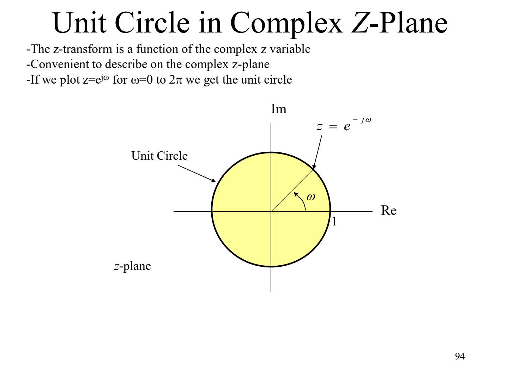

*Original slide, including all figures and annotations: [lecture PDF p. 95](../../03_resources/01_lectures/00_Intro.pdf#page=95).*

### PDF page 96 - Definition and radial symmetry of the ROC

Absolute convergence requires $\sum_n|x[n]|\,|z|^{-n}<\infty$. It depends on radius, not angle. Thus if a point of radius $r$ is inside the ROC, the full circle of that radius is included. Typical ROCs are disks, exterior regions or annuli centered at zero.

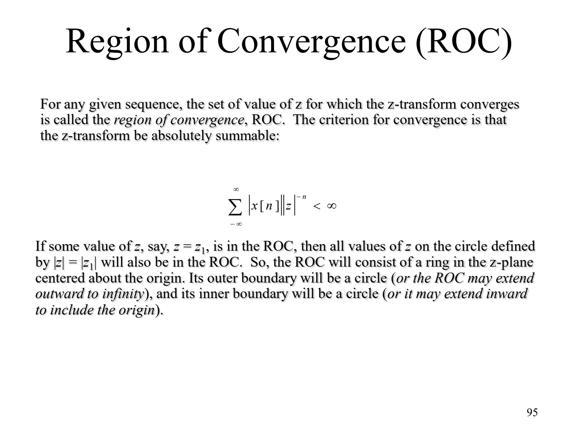

*Original slide, including all figures and annotations: [lecture PDF p. 96](../../03_resources/01_lectures/00_Intro.pdf#page=96).*

### PDF page 97 - Annular ROC picture

The diagram shades the region between inner and outer radii. A left-sided sequence may give an interior disk; a right-sided sequence may give an exterior region; a two-sided sequence may require both bounds. Boundary inclusion must be checked rather than inferred merely from a shaded sketch; for rational transforms, poles are excluded.

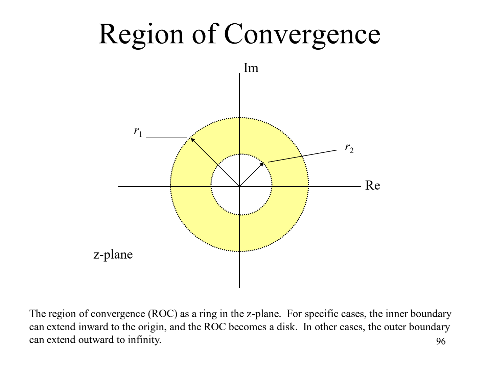

*Original slide, including all figures and annotations: [lecture PDF p. 97](../../03_resources/01_lectures/00_Intro.pdf#page=97).*

### PDF page 98 - Laurent series, rational functions, poles and zeros

The z-transform is a Laurent series and is analytic in the interior of its ROC. For rational $X(z)=P(z)/Q(z)$, zeros are roots of the reduced numerator and poles roots of the reduced denominator. Cancel common factors before calling a point a genuine pole. Analyticity and derivatives hold inside the ROC, not at its excluded singularities.

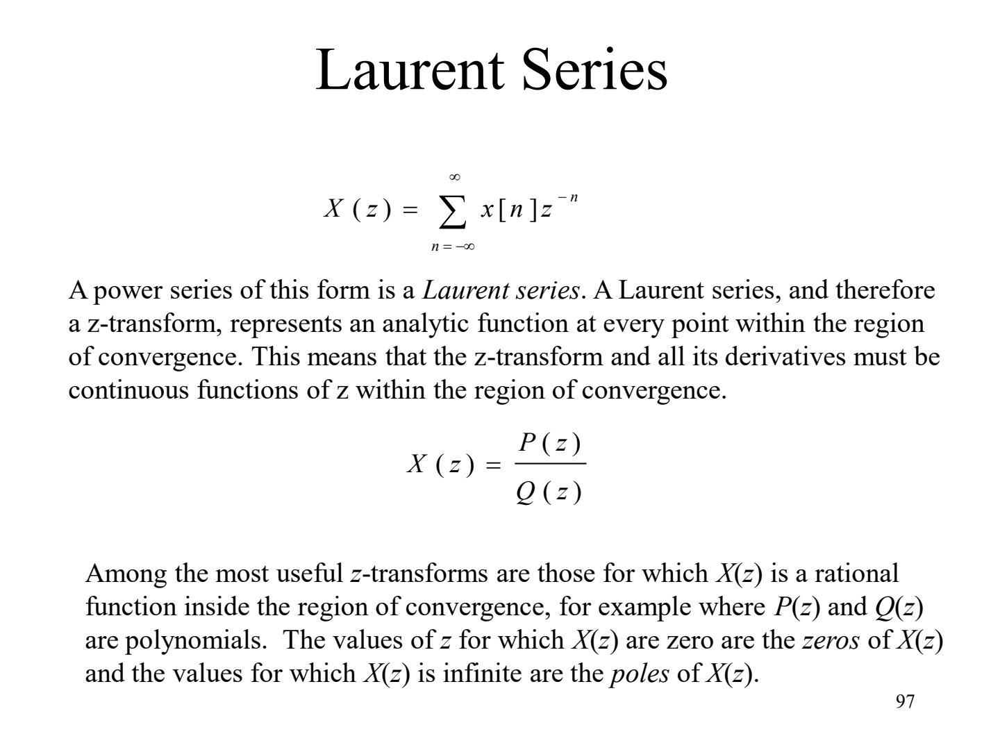

*Original slide, including all figures and annotations: [lecture PDF p. 98](../../03_resources/01_lectures/00_Intro.pdf#page=98).*

### PDF page 99 - Eight ROC properties

The slide states: radial disk/annulus structure; unit-circle inclusion for absolute DTFT convergence; exclusion of poles; finite sequences have the entire plane except possibly 0/infinity; right-sided rational sequences converge outside the outermost pole; left-sided rational sequences converge inside the innermost nonzero pole; two-sided sequences can have an annular ROC; and the ROC is connected. The pole-boundary rules here concern rational transforms with the stated support; retain origin/infinity exceptions and possible cancellations.

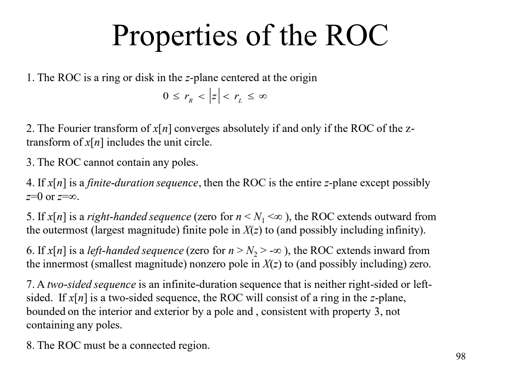

*Original slide, including all figures and annotations: [lecture PDF p. 99](../../03_resources/01_lectures/00_Intro.pdf#page=99).*

### PDF page 100 - Support and ROC gallery

The six sketches pair causal, anticausal and two-sided support with finite/infinite duration. Finite positive-index support may exclude zero; finite negative-index support may exclude infinity; both may be excluded for two-sided finite support. Infinite right-sided, left-sided and two-sided rational sequences typically correspond to an exterior, interior and annulus respectively. Read the radius ordering in each individual sketch rather than assuming the labels have one global order.

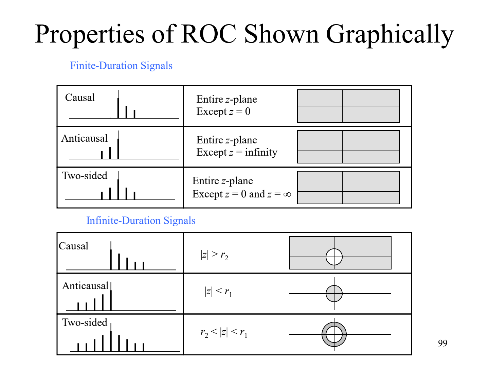

*Original slide, including all figures and annotations: [lecture PDF p. 100](../../03_resources/01_lectures/00_Intro.pdf#page=100).*

## Lyons supplement: phase plots need interpretation

Read [§5.8, printed pp. 209-213 / PDF pp. 234-238](../../03_resources/03-Understanding-Digital-Signal-Processing.pdf#page=234). Lyons contrasts calculated wrapped phase with its unwrapped interpretation. Phase jumps from the argument calculation are different from phase changes at a response zero. When calculating delay, convert degrees to radians and use an angular-frequency axis; otherwise scale factors are wrong.

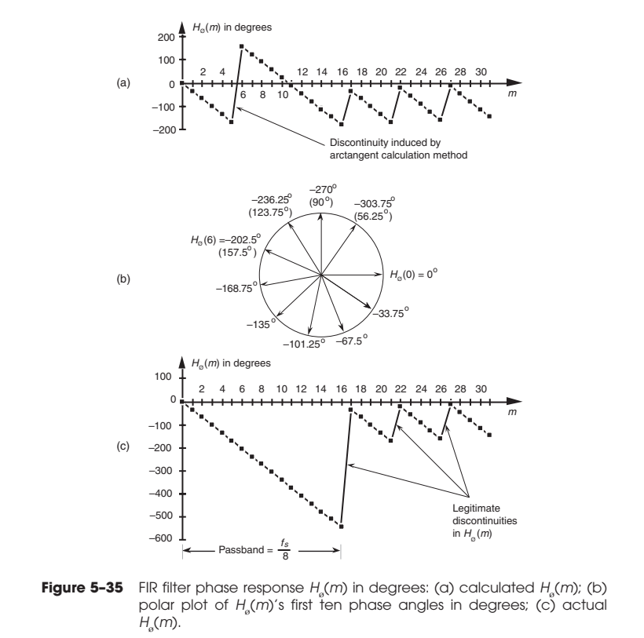

*Extracted figure crop: Figure 5-35, printed p. 211 / PDF p. 236.*

For the z-plane viewpoint, read [§6.3, printed pp. 270-273 / PDF pp. 295-298](../../03_resources/03-Understanding-Digital-Signal-Processing.pdf#page=295). The lecture supplies the more extensive bilateral ROC treatment used here.

## Worked example: delay and convergent weighting

**Author-created example.** At $f_s=2000$ samples/s, a five-sample delay has $\phi=-5\omega$, $\tau_p=\tau_g=5$ samples and a physical delay of 2.5 ms. A constant phase of $-\pi/2$ instead has phase delay $\pi/(2\omega)$ and zero slope within that branch; it is not the same operation.

For $x[n]=2^nu[n]$, choose $r=3$. Then $x[n]r^{-n}=(2/3)^nu[n]$ has absolute sum 3. The resulting z-transform is $1/(1-2z^{-1})$ with ROC $|z|>2$, excluding the unit circle.

## Retrieval practice and answer key

1. What is the ideal low-pass $h[0]$? **$\omega_c/\pi$**, from the limit.
2. Can a pole lie inside the ROC? **No.**
3. Is a rational $H(e^{j\omega})$ formula enough to establish stability? **No; the ROC of the system must contain the unit circle.**
4. What is group delay for $\phi=0.4-3\omega$? **3 samples**, although phase delay is $3-0.4/\omega$.

## Summary Section

Frequency response describes how an LTI system changes sinusoidal amplitude and phase. Phase delay and group delay answer different timing questions. The z-transform adds exponential weighting, and its ROC is essential for interpreting the sequence, causality and stable frequency-domain behavior.
