# Cornell Notes 09: Discrete sinusoids, Fourier series, DTFT, DFT and properties

[All topics](./README.md) | [Previous](./08_fir_transposed_and_lattice_structures.md) | [Next](./10_circular_and_linear_convolution.md)

**Lecture:** [PDF pages 166-183](../../03_resources/01_lectures/00_Intro.pdf#page=166) (18 pages). **Updated:** 2026-09-14.

**Source convention:** PDF page numbers are one-based viewer pages. Each original slide is reproduced beneath its written note to preserve the complete source content. “Clarification” marks explanatory additions or corrections; “Lyons supplement” marks textbook enrichment.

## Cue Column

| Cue / retrieval question | Study target |
| --- | --- |
| Why are discrete-time frequencies equivalent modulo $2\pi$? | Integer samples eliminate factors $e^{j2\pi mn}$. |
| When is a sampled sinusoid periodic? | Rational cycles/sample. |
| How do DFS, DTFT and DFT differ? | Periodic sequence coefficients, continuous frequency function, finite block coefficients. |
| Where is the factor $1/N$? | Track the selected analysis/synthesis convention. |
| What does orthogonality accomplish? | Separate basis components and prove inversion. |
| What do shifting, multiplication and convolution become? | Phase ramps, circular convolution and spectral products. |

## Notes Section: transform conventions

Use $W_N=e^{-j2\pi/N}$ and the unnormalized-forward, normalized-inverse DFT:

$$
X[k]=\sum_{n=0}^{N-1}x[n]W_N^{kn},\qquad
x[n]=\frac1N\sum_{k=0}^{N-1}X[k]W_N^{-kn}.
$$

The DTFS coefficients with normalized analysis are $c_k=X[k]/N$, so $x[n]=\sum_{k=0}^{N-1}c_ke^{j2\pi kn/N}$ for the periodic extension. A DFT operates on a length-$N$ vector; periodic extension is its mathematical interpretation, not a measurement of unobserved samples.

| Transform | Time description | Frequency description |
| --- | --- | --- |
| DTFS / DFS | Discrete, periodic | $N$ distinct coefficients, periodically indexed |
| DTFT | Discrete sequence, possibly aperiodic | Continuous $\omega$, $2\pi$-periodic |
| DFT | $N$ samples | $N$ bins at $\omega_k=2\pi k/N$ |

## Notes Section: page-by-page lecture coverage

### PDF page 166 - Unit 2: DFS, DFT and FFT

The divider introduces Fourier representations and computation. This topic establishes the Fourier series, DTFT and DFT; convolution is topic 10, and FFT algorithms are planned for topic 12. An FFT is an algorithm for calculating the DFT, not another transform with different mathematical information.

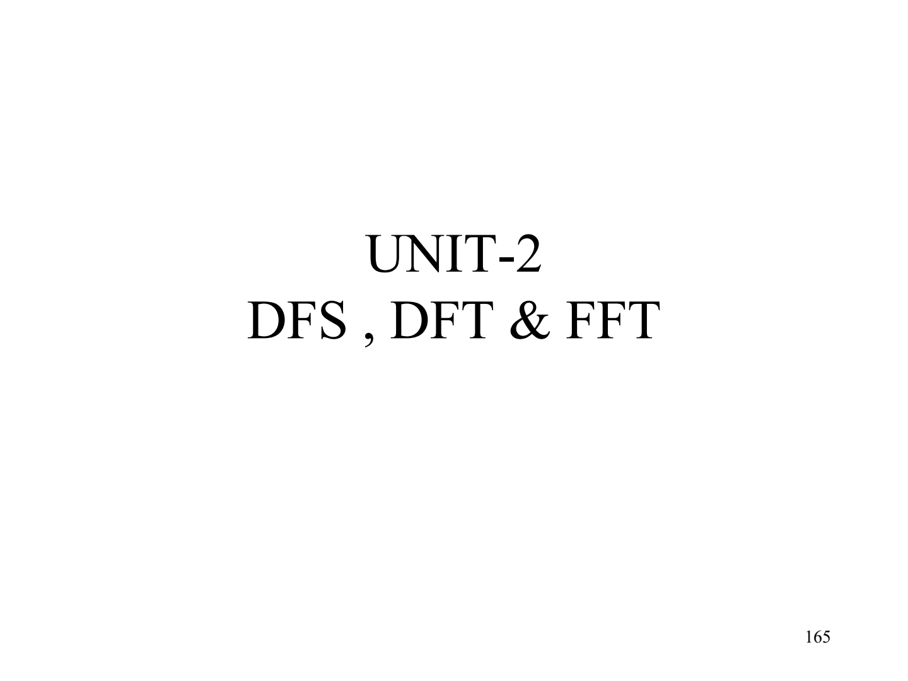

*Original slide, including all figures and annotations: [lecture PDF p. 166](../../03_resources/01_lectures/00_Intro.pdf#page=166).*

### PDF page 167 - Analog and normalized frequency

Sampling $A\cos(2\pi F_0t+\theta)$ at $t=nT$ gives $A\cos(2\pi F_0n/F_s+\theta)$. Define cycles/sample $f=F/F_s=FT$ and rad/sample $\omega=2\pi f=\Omega T$. The symbol $F$ here denotes physical Hz. Keep it distinct from $f$, which the lecture uses for normalized frequency on this page.

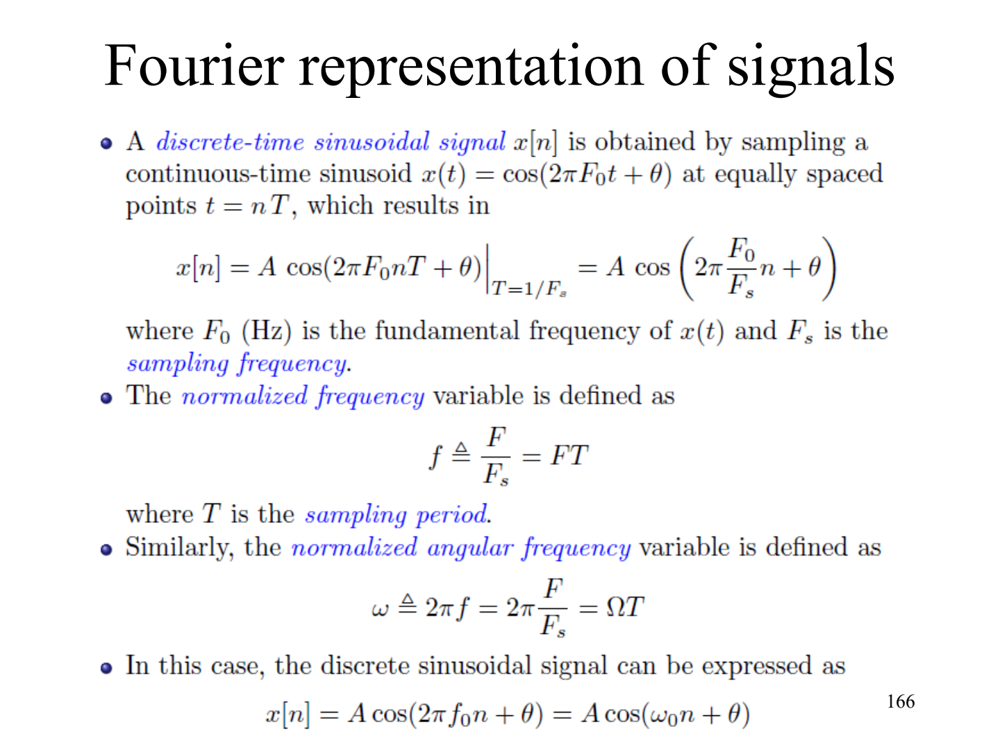

*Original slide, including all figures and annotations: [lecture PDF p. 167](../../03_resources/01_lectures/00_Intro.pdf#page=167).*

### PDF page 168 - Periodicity in time and frequency

A nondegenerate sinusoidal sequence is periodic if $f_0=k/N$ is rational; in lowest terms, $N$ is the fundamental period. The condition follows from $2\pi f_0N=2\pi k$. Independently, adding any integer multiple of $2\pi$ to $\omega_0$ leaves all samples unchanged. Time periodicity and frequency equivalence are different statements.

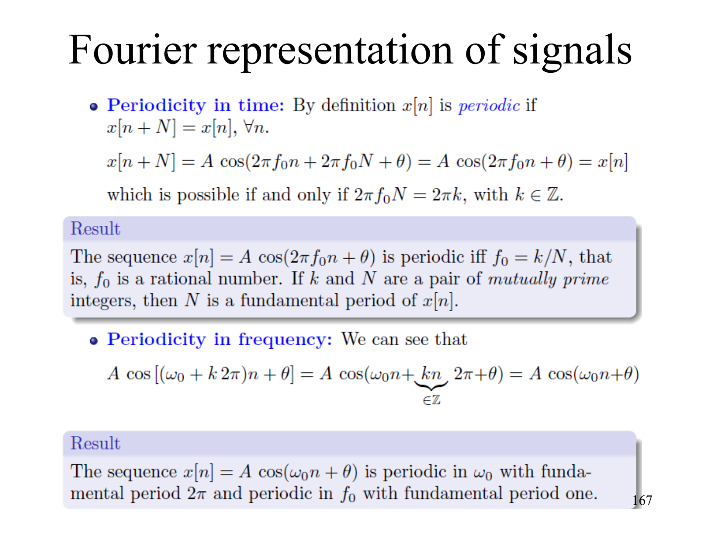

*Original slide, including all figures and annotations: [lecture PDF p. 168](../../03_resources/01_lectures/00_Intro.pdf#page=168).*

### PDF page 169 - Fundamental frequency interval and apparent oscillation rate

Choose one interval such as $-\pi\le\omega<\pi$ or $0\le\omega<2\pi$. Frequencies differing by $2\pi m$ are identical at integer indices. A shift in time changes sinusoidal phase. Oscillation is slow near multiples of $2\pi$ and fastest near odd multiples of $\pi$; a frequency approaching $2\pi$ can therefore produce slowly varying samples.

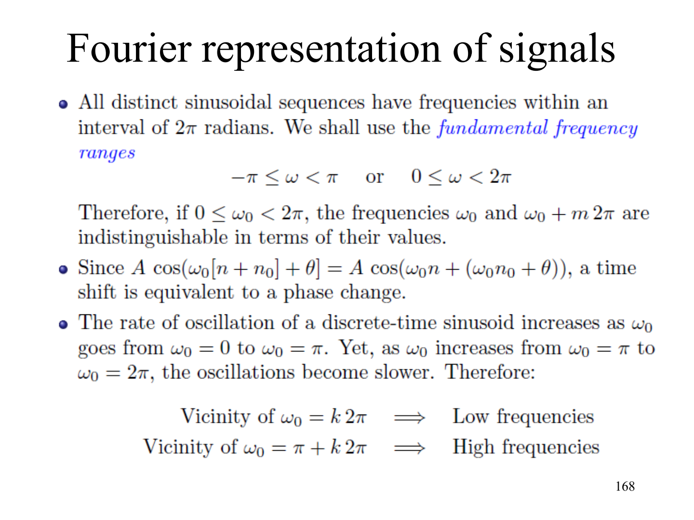

*Original slide, including all figures and annotations: [lecture PDF p. 169](../../03_resources/01_lectures/00_Intro.pdf#page=169).*

### PDF page 170 - Complex exponentials and orthogonality

The basis sequences are $s_k[n]=e^{j2\pi kn/N}$, periodic in both $n$ and $k$. Over one period,

$$
\sum_{n=0}^{N-1}s_k[n]s_m^*[n]=\begin{cases}N&k\equiv m\pmod N\\0&\text{otherwise}.\end{cases}
$$

**Source clarification:** the page also writes arbitrary amplitudes $A_k$; the displayed inner-product value $N$ assumes unit-amplitude basis functions. A particular basis harmonic can have a smaller fundamental period $N/\gcd(k,N)$, although it is always $N$-periodic.

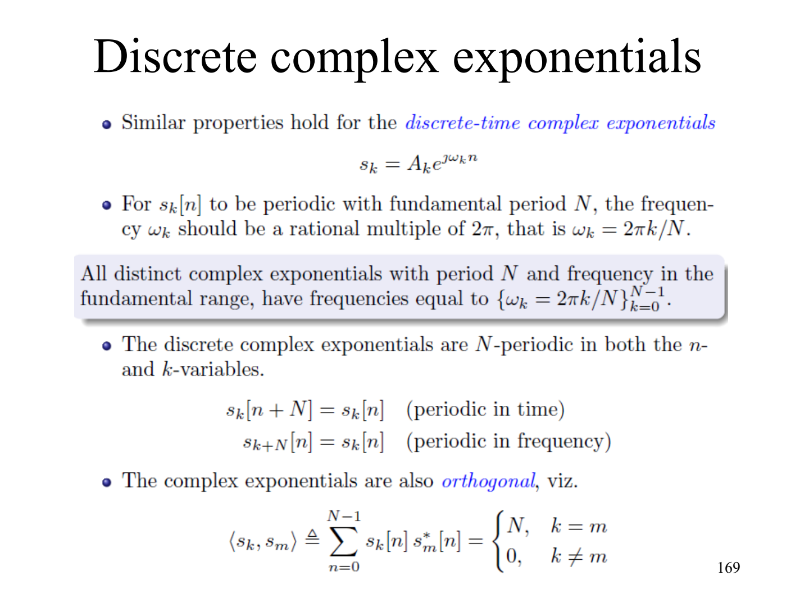

*Original slide, including all figures and annotations: [lecture PDF p. 170](../../03_resources/01_lectures/00_Intro.pdf#page=170).*

### PDF page 171 - Why only N Fourier-series basis functions are needed

For a discrete periodic sequence, frequency indices $k$ and $k+N$ give the same basis sequence. Only $N$ distinct exponentials are required. By contrast, a general continuous-time periodic waveform can require infinitely many harmonics. The slide uses an unnormalized analysis coefficient $\widetilde X[k]$ and a synthesis factor $1/N$.

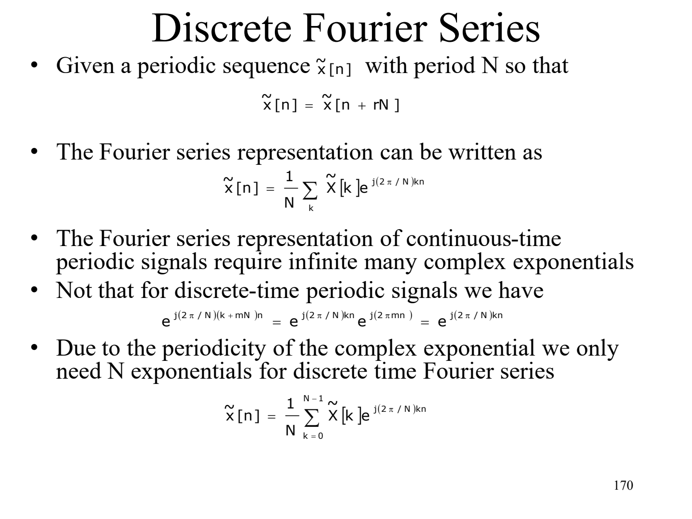

*Original slide, including all figures and annotations: [lecture PDF p. 171](../../03_resources/01_lectures/00_Intro.pdf#page=171).*

### PDF page 172 - DFS analysis and synthesis pair

With $W_N=e^{-j2\pi/N}$, analyze one period using $\widetilde X[k]=\sum_{n=0}^{N-1}\widetilde x[n]W_N^{kn}$ and reconstruct using $\widetilde x[n]=(1/N)\sum_{k=0}^{N-1}\widetilde X[k]W_N^{-kn}$. Both sequences are periodically indexed. The factor belongs in the inverse for this convention.

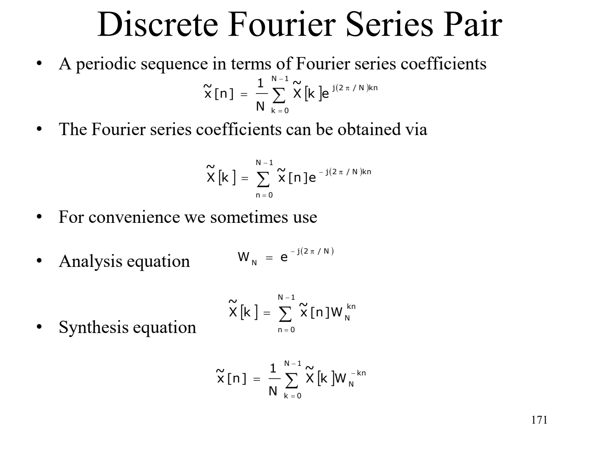

*Original slide, including all figures and annotations: [lecture PDF p. 172](../../03_resources/01_lectures/00_Intro.pdf#page=172).*

### PDF page 173 - Orthogonality gives normalized series coefficients

For $x[n]=\sum_kc_ks_k[n]$, take the inner product with $s_m[n]$. Orthogonality removes all other harmonics and gives $Nc_m$, hence $c_m=(1/N)\sum_nx[n]e^{-j2\pi mn/N}$. These $c_m$ differ by $1/N$ from the previous page's $\widetilde X[m]$. **Clarification:** an $N$-periodic sum need not have fundamental period exactly $N$ if some harmonics vanish.

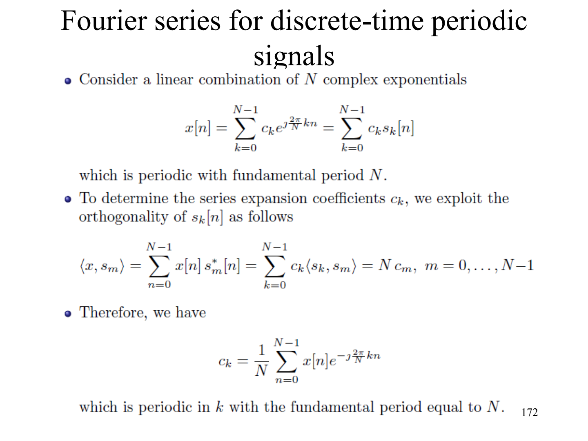

*Original slide, including all figures and annotations: [lecture PDF p. 173](../../03_resources/01_lectures/00_Intro.pdf#page=173).*

### PDF page 174 - DTFS and average power

The page states the normalized-analysis DTFS pair and Parseval's relation:

$$
P_{av}=\frac1N\sum_{n=0}^{N-1}|x[n]|^2=\sum_{k=0}^{N-1}|c_k|^2.
$$

Each $|c_k|^2$ is that harmonic's contribution to average signal power. The graph of these values is the discrete line power spectrum under this convention. It is not automatically a physical-unit power spectral density per Hz.

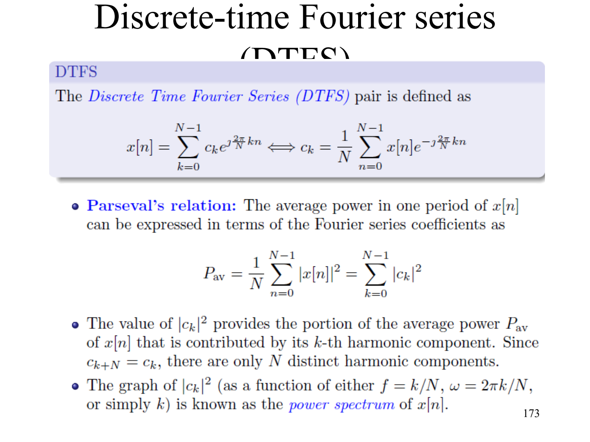

*Original slide, including all figures and annotations: [lecture PDF p. 174](../../03_resources/01_lectures/00_Intro.pdf#page=174).*

### PDF page 175 - From finite support to the DTFT

Periodize a finite sequence supported on $-L_1\le n\le L_2$ using $x_p[n]=\sum_\ell x[n-\ell N]$, with sufficiently large $N$ to avoid overlap. Define $X(e^{j\omega})=\sum_nx[n]e^{-j\omega n}$. The series coefficients are samples of this continuous-frequency function divided by $N$. The DTFT provides an envelope through the sampled spectral coefficients.

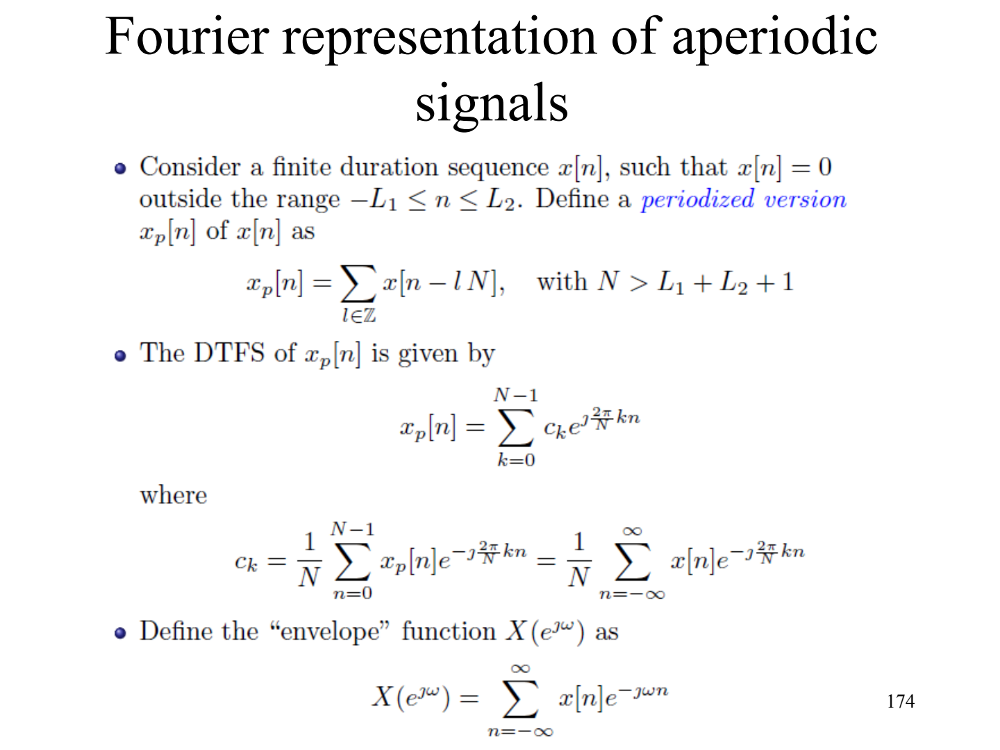

*Original slide, including all figures and annotations: [lecture PDF p. 175](../../03_resources/01_lectures/00_Intro.pdf#page=175).*

### PDF page 176 - DTFT pair and energy Parseval relation

Let $N\to\infty$ so $\Delta\omega=2\pi/N\to0$; the Fourier-series sum becomes an integral:

$$
x[n]=\frac1{2\pi}\int_{-\pi}^{\pi}X(e^{j\omega})e^{j\omega n}\,d\omega,
\qquad X(e^{j\omega})=\sum_nx[n]e^{-j\omega n}.
$$

For finite-energy sequences, $\sum_n|x[n]|^2=(1/2\pi)\int_{-\pi}^{\pi}|X(e^{j\omega})|^2d\omega$. The spectrum has magnitude and phase. Energy here replaces the average-per-period power of the preceding DTFS discussion.

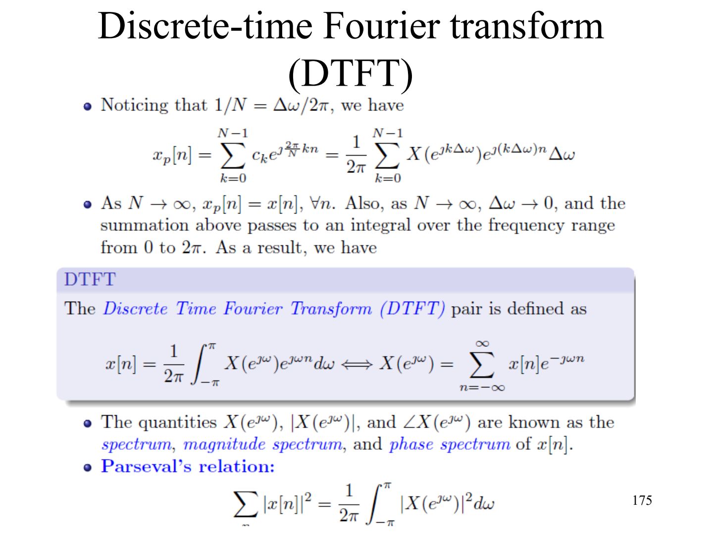

*Original slide, including all figures and annotations: [lecture PDF p. 176](../../03_resources/01_lectures/00_Intro.pdf#page=176).*

### PDF page 177 - DFT as one finite period

Restrict time and frequency arrays to indices $0,\ldots,N-1$ to obtain the DFT/IDFT formulas. The slide writes zero outside that finite stored range as a bookkeeping convention. Their periodic DFS extensions are different objects, even though the values in one chosen block agree.

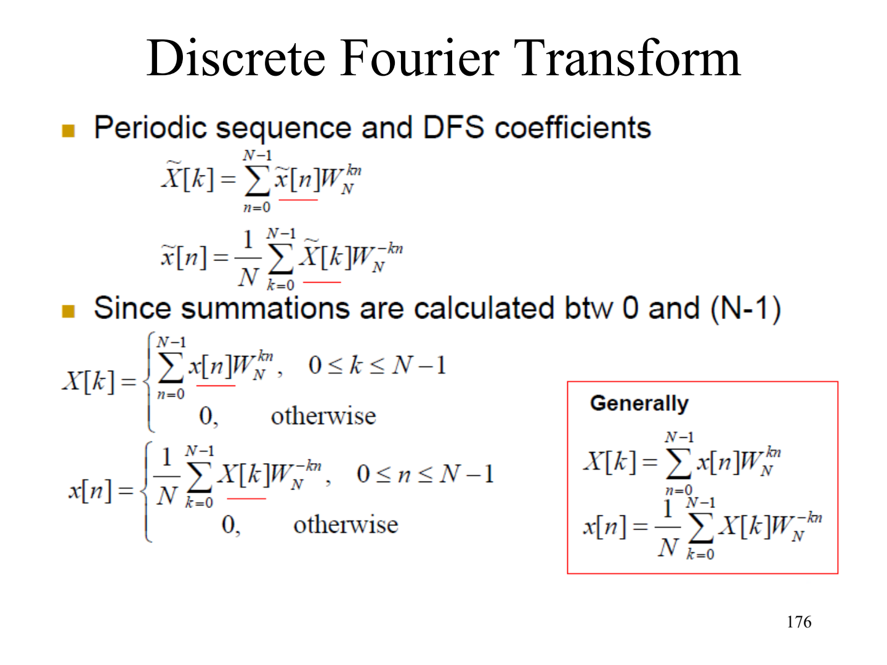

*Original slide, including all figures and annotations: [lecture PDF p. 177](../../03_resources/01_lectures/00_Intro.pdf#page=177).*

### PDF page 178 - DFT definition and physical bin frequencies

The forward DFT has a negative exponential and the inverse a positive exponential plus $1/N$. Bin $k$ corresponds to $\omega_k=2\pi k/N$ and physical $F_k=kF_s/N$ before wrapping to negative frequencies. For real inputs, upper bins represent the conjugate negative-frequency half, not extra independent high-frequency measurements.

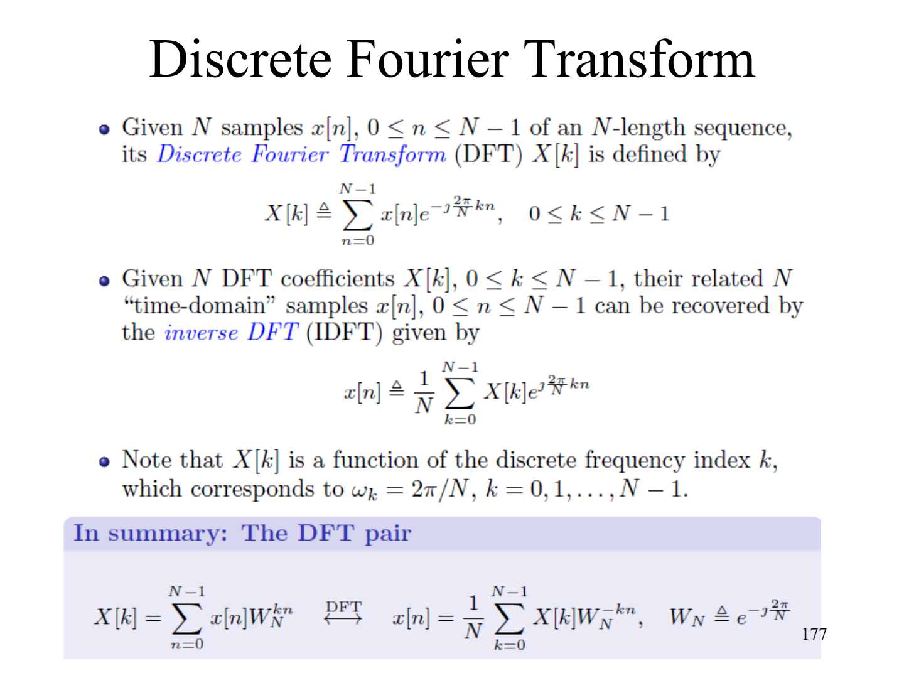

*Original slide, including all figures and annotations: [lecture PDF p. 178](../../03_resources/01_lectures/00_Intro.pdf#page=178).*

### PDF page 179 - Proof of inversion and roots of unity

Substitute the inverse into the forward expression. The inner sum of $W_N^{(k-m)n}/N$ is 1 for $k=m\pmod N$ and 0 otherwise. The basis points are the $N$ roots of unity, equally spaced around the unit circle by $2\pi/N$. This proves exact inversion in exact arithmetic.

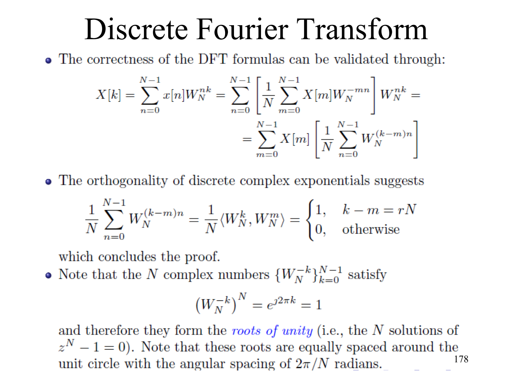

*Original slide, including all figures and annotations: [lecture PDF p. 179](../../03_resources/01_lectures/00_Intro.pdf#page=179).*

### PDF page 180 - Matrix form

Let $\mathbf F_{k,n}=e^{-j2\pi kn/N}$. Then $\mathbf X=\mathbf F\mathbf x$, $\mathbf F^H\mathbf F=N\mathbf I$, and $\mathbf x=(1/N)\mathbf F^H\mathbf X$. The matrix is symmetric under transpose, but not generally real. **Terminology clarification:** its normalized version $\mathbf F/\sqrt N$ is unitary; “orthogonal” on the slide refers to complex-column orthogonality, not a real orthogonal matrix.

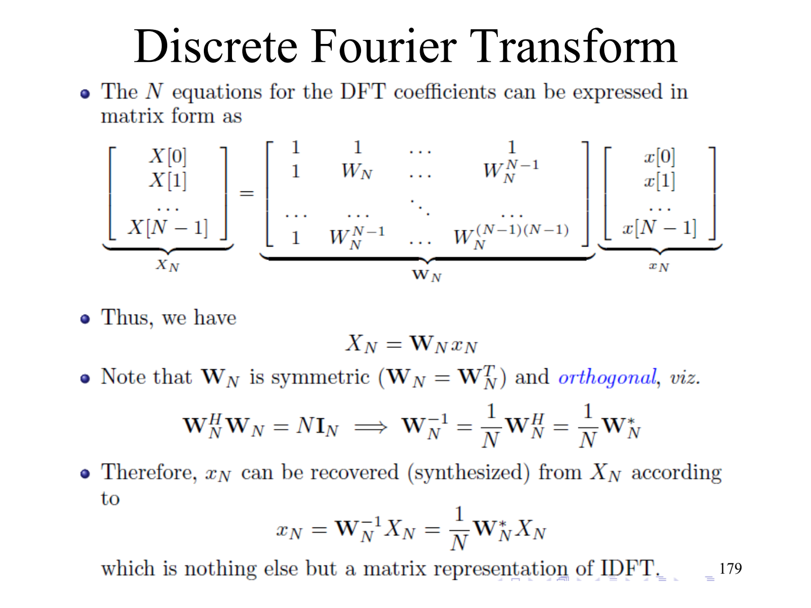

*Original slide, including all figures and annotations: [lecture PDF p. 180](../../03_resources/01_lectures/00_Intro.pdf#page=180).*

### PDF page 181 - Twiddle periodicity and periodic extensions

$W_N^{(k+N)n}=W_N^{kn}$ and $W_N^{k(n+N)}=W_N^{kn}$. Extending $k$ repeats the Fourier coefficients; extending $n$ repeats the synthesized sequence. These periodicities follow from discrete indices and the basis. They lead directly to circular shifting and convolution.

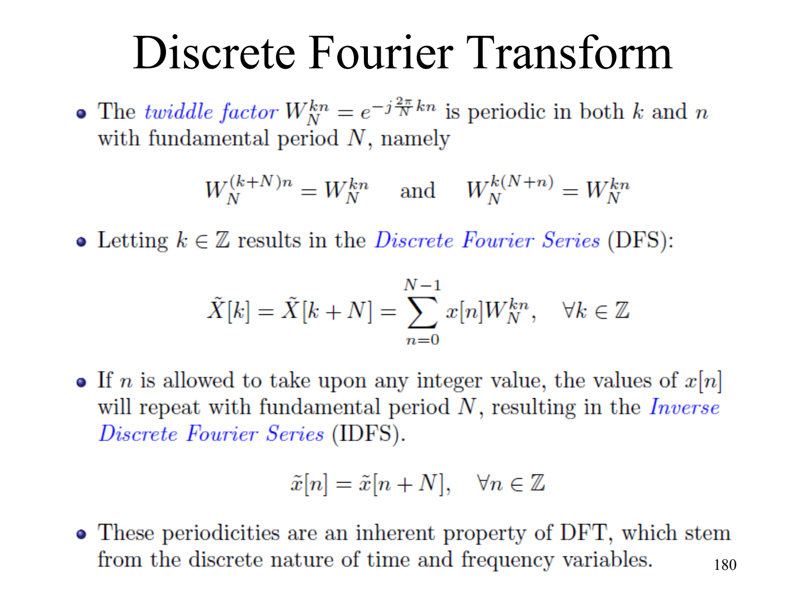

*Original slide, including all figures and annotations: [lecture PDF p. 181](../../03_resources/01_lectures/00_Intro.pdf#page=181).*

### PDF page 182 - Twelve DFT properties

All indices in this table are modulo $N$, and every transform uses the convention stated above. Let $r_{xy}[\ell]=\sum_nx[n]y^*[(n-\ell)\bmod N]$.

| Property | Time-domain expression | DFT expression |
| --- | --- | --- |
| Linearity | $ax_1+bx_2$ | $aX_1+bX_2$ |
| Circular shift | $x[(n-m)\bmod N]$ | $W_N^{km}X[k]$ |
| Frequency shift | $e^{j2\pi mn/N}x[n]$ | $X[(k-m)\bmod N]$ |
| Cosine modulation | $x[n]\cos(2\pi k_0n/N)$ | $(X[k-k_0]+X[k+k_0])/2$ |
| Circular reversal | $x[(-n)\bmod N]$ | $X[(-k)\bmod N]$ |
| Conjugation | $x^*[n]$ | $X^*[(-k)\bmod N]$ |
| Duality | $X[n]$ | $N x[(-k)\bmod N]$ |
| Circular convolution | $h\circledast_Nx$ | $HX$ |
| Circular correlation | $r_{xy}[\ell]$ | $XY^*$ |
| Pointwise windowing | $v[n]x[n]$ | $(V\circledast_NX)/N$ |
| Inner-product Parseval | $\sum_nx[n]y^*[n]$ | $(1/N)\sum_kX[k]Y^*[k]$ |
| Energy Parseval | $\sum_n\vert x[n]\vert ^2$ | $(1/N)\sum_k\vert X[k]\vert ^2$ |

**Source correction:** the slide's reversal row uses $X^*[k]$, which is equivalent only when $x[n]$ is real. The general complex-valued reversal rule is the one above.

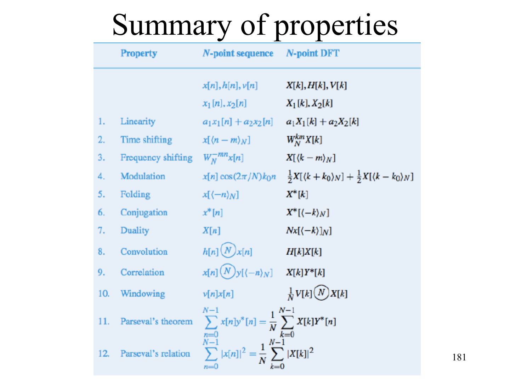

*Original slide, including all figures and annotations: [lecture PDF p. 182](../../03_resources/01_lectures/00_Intro.pdf#page=182).*

### PDF page 183 - DFT pair, correlation and notation boundaries

The page repeats the DFT pair but its lower property table mixes continuous-frequency notation with sequence transforms. Under a DTFT, linear convolution becomes a product; under an $N$-DFT, the unpadded product corresponds to circular convolution. With the circular correlation definition on page 182, autocorrelation transforms to $|X[k]|^2$. For complex inputs retain conjugation. General stochastic Wiener-Khinchin/PSD results require the appropriate statistical definitions; the finite deterministic correlation identity here is sufficient for this topic.

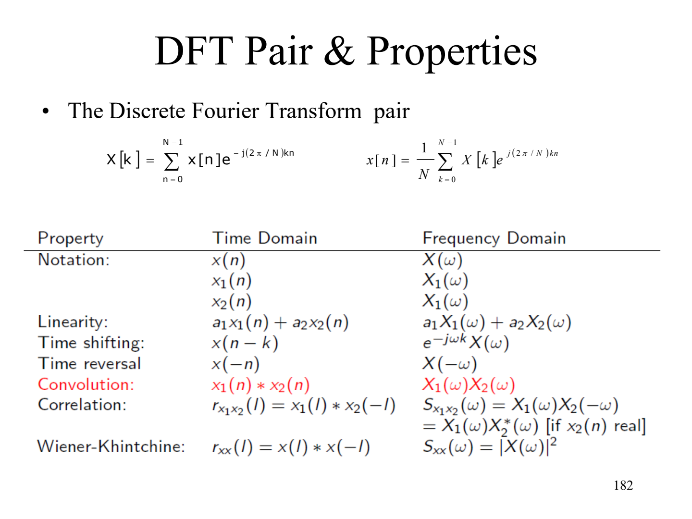

*Original slide, including all figures and annotations: [lecture PDF p. 183](../../03_resources/01_lectures/00_Intro.pdf#page=183).*

## Lyons supplement: the DFT compares a block with basis sinusoids

Read [§3.1, printed pp. 60-72 / PDF pp. 85-97](../../03_resources/03-Understanding-Digital-Signal-Processing.pdf#page=85), [§§3.4-3.7, printed pp. 75-80 / PDF pp. 100-105](../../03_resources/03-Understanding-Digital-Signal-Processing.pdf#page=100), and [§3.14, printed pp. 120-123 / PDF pp. 145-148](../../03_resources/03-Understanding-Digital-Signal-Processing.pdf#page=145). Lyons interprets the DFT as weighted comparisons against cosine/sine basis sequences. His example uses 1 kHz and 2 kHz components to illustrate what different bins detect.

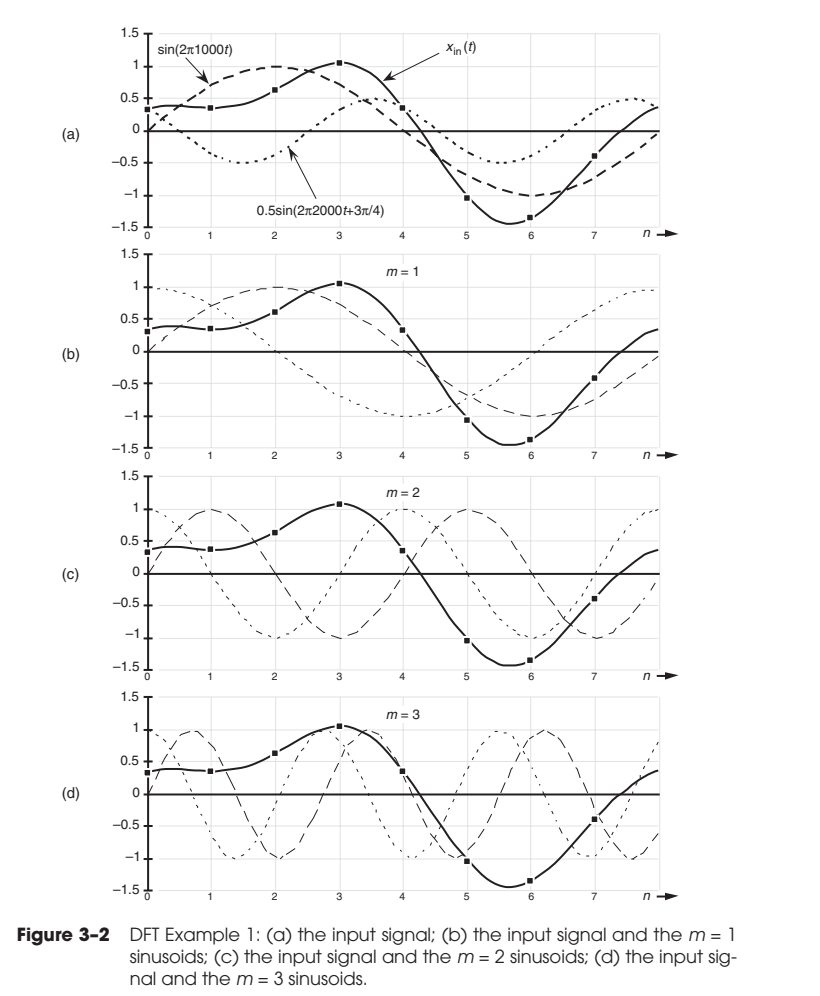

*Extracted figure crop: Figure 3-2, printed p. 65 / PDF p. 90.*

For a bin-centered real sinusoid with peak amplitude $A$, the two non-DC/non-Nyquist conjugate bins each have magnitude $NA/2$ under this DFT convention. Therefore raw DFT magnitude is not yet the original sinusoid amplitude. Windowing, leakage and off-bin frequencies need additional treatment in later study.

## Worked example: four-point transform

**Author-created example.** Let $x=[1,0,-1,0]$, one period of $\cos(\pi n/2)$. Its DFT is $X=[0,2,0,2]$. The inverse uses a factor $1/4$ and reproduces $x$. Time-domain energy is 2; frequency-domain energy divided by $N$ is $(4+4)/4=2$.

At $F_s=800$ samples/s and $N=4$, bins are spaced by 200 Hz. Bin 1 is +200 Hz; bin 3 is -200 Hz after wrapping. The two bins describe one real cosine, not two independent oscillations.

## Retrieval practice and answer key

1. What is the period of $e^{j2\pi(3/8)n}$? **8 samples.**
2. What is the DFT of $\delta[n]$ within an $N$-sample block? **All ones.**
3. What is the DFT of a block of $N$ ones? **$X[0]=N$, all other bins zero.**
4. Does increasing only zero-padding length add new measured information? **No; it samples the same finite-record DTFT more densely.**

## Summary Section

Discrete-time frequency is periodic. Orthogonal complex exponentials decompose a periodic sequence into Fourier coefficients and a finite block into DFT bins. Track normalization, bin units, conjugation and periodic indexing carefully; they determine the correct amplitude, power, shift and convolution formulas.
