# Cornell Notes

## Topic: Introduction to Computer Architecture

## Date: 16/09/2026

---

### Cue Column (Questions, Keywords, or Prompts)

- First question or keyword
- Second question or keyword
- Third question or keyword

---

### Notes Section (Main Notes)

#### The Moore's Law (Empirical Law)

Moore's Law states that the number of transistors on a microchip doubles approximately every two years, though the cost of computers is halved. This empirical observation has driven the exponential growth of computing power over the past several decades.

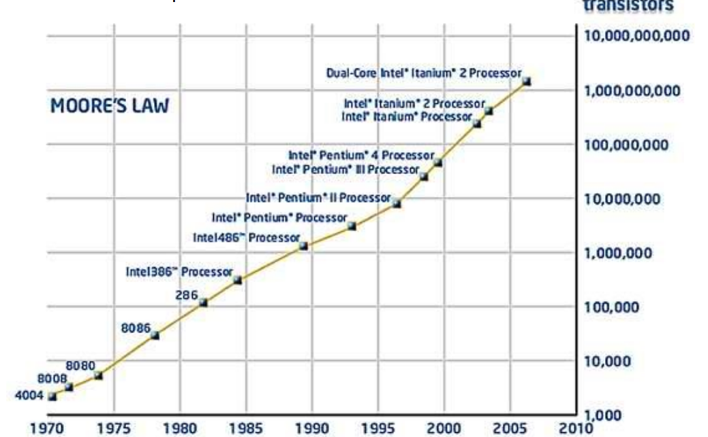

#### Computer Revolution

The first generation:
- Vaccuum tubes were used as the main electronic component.
- 1946 - 1955

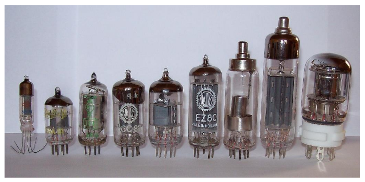

The second generation:
- Transistors replaced vacuum tubes, leading to smaller, faster, and more reliable computers.
- 1955 - 1965

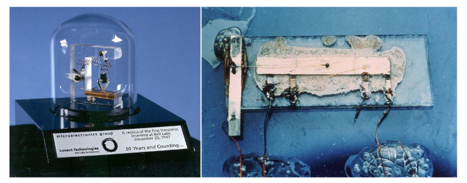

Examples:

**ENIAC - 1946**

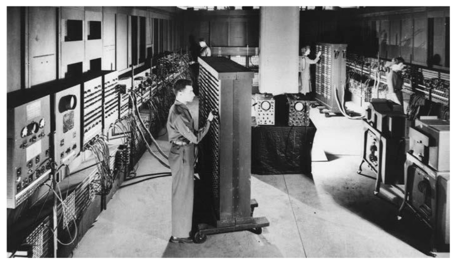

**UNIVAC I - 1952**

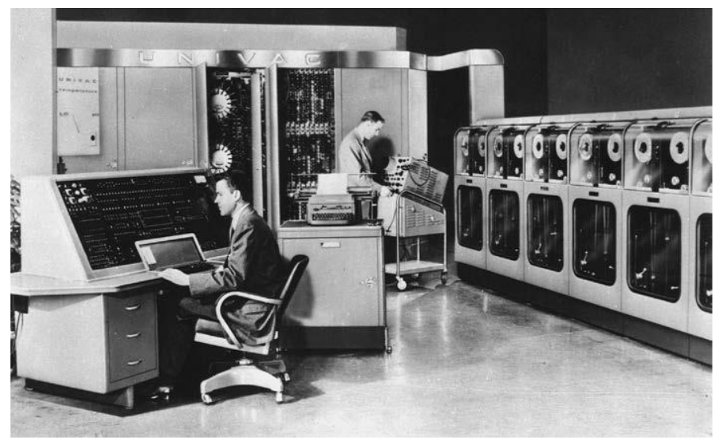

As the generations progressed, computers became more powerful, efficient, and accessible to a wider range of users. The transition from vacuum tubes to transistors marked a significant milestone in the evolution of computer architecture, paving the way for the development of integrated circuits and modern computing systems.

With the development of transistors, Moore's Law is reaching its limits.

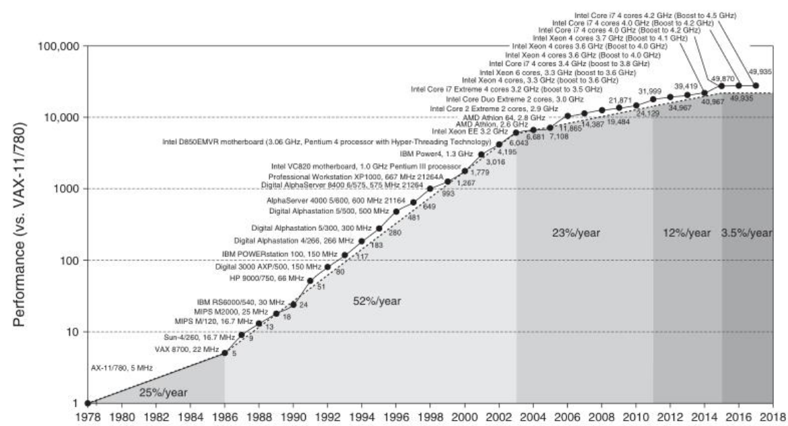

As the number of transistors on a chip increases, the physical limitations of miniaturization and heat dissipation become more pronounced.

#### What's Next?

**Supercomputer**: the development of supercomputers has pushed the boundaries of computational power, enabling complex simulations, scientific research, and data analysis at unprecedented scales.


**Quantum Computing**: Quantum computing represents a paradigm shift in computation, leveraging the principles of quantum mechanics to perform calculations that are infeasible for classical computers. This emerging field holds the potential to revolutionize areas such as cryptography, optimization, and drug discovery.

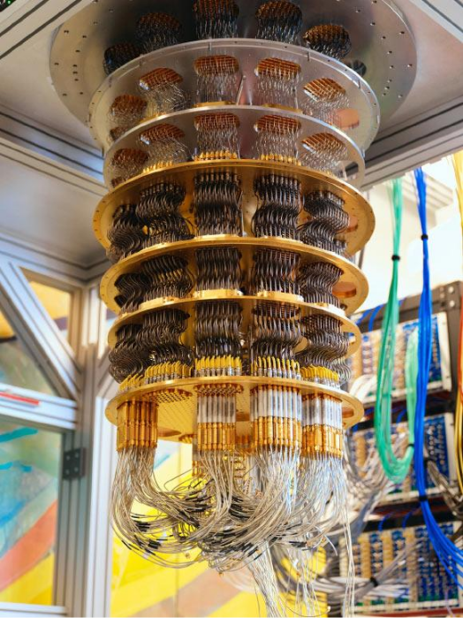

Referenced from: [sci.news](https://www.sci.news/othersciences/computerscience/qubit-copies-14467.html)

**Parallel and Tensor/ Neural computing**: Parallel computing involves the simultaneous execution of multiple tasks, improving computational efficiency and performance. Tensor and neural computing focus on specialized hardware and algorithms for deep learning and artificial intelligence applications, enabling faster training and inference of neural networks.

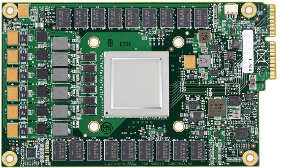

*TPU Printed Circuit Board. It can be inserted in the slot for an SATA disk in a server, but the card uses PCIe Gen3 x16.*

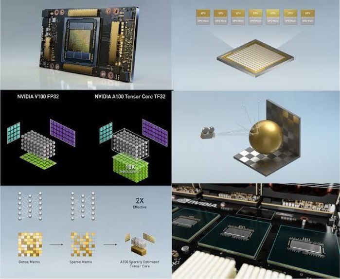

Referenced from: [Cuda-2](https://blogs.nvidia.com/blog/what-is-cuda-2/)

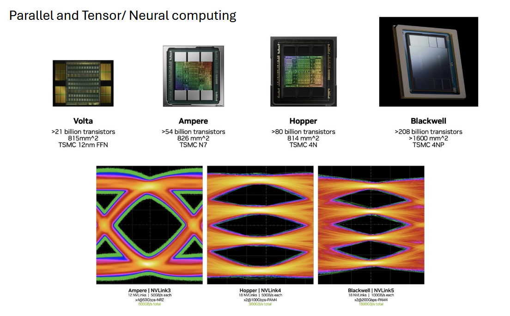

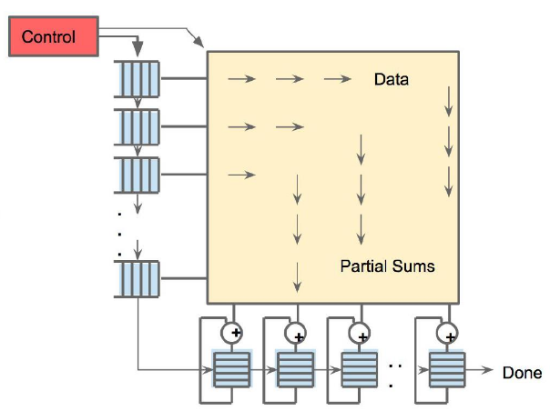

*Systolic data flow of the Matrix Multiply Unit. Software has the illusion that each 256B input is read at once, and they instantly update one location of each of 256 accumulator RAMs.*

**Cloud and Edge**

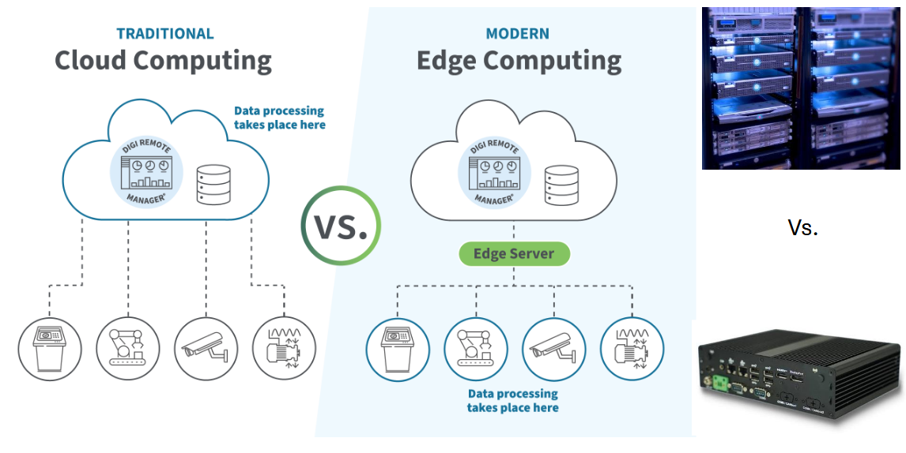

- **Traditional Cloud Computing**: Centralized data centers that provide computing resources and services over the internet. Users can access and utilize these resources without the need for local infrastructure.
- **Modern Edge Computing**: Distributed computing paradigm that brings computation and data storage closer to the location where it is needed, reducing latency and improving performance for applications such as IoT, autonomous vehicles, and real-time analytics.


#### Computer Architecture

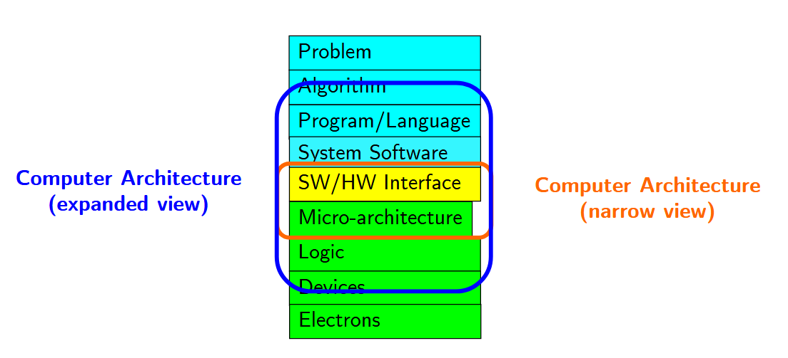

**Algorithm:** Step-by-step procedure that is guaranteed to terminate where each step is precisely stated and can be carried out by a computer.
- Finiteness.
- Definiteness.
- Effective computability.

**Microarchitecture:** The way a given instruction set architecture (ISA) is implemented in a particular processor. It includes the datapath, control unit, and memory hierarchy.

**Digital logic circuits:** Buidling blocks of micro-arch (e.g., gates)

**ISA (Instruction Set Architecture)**: Interface between software and hardware. It defines the set of instructions that a processor can execute, along with the associated data types, registers, and memory addressing modes.

#### Basic Structure of a Computer

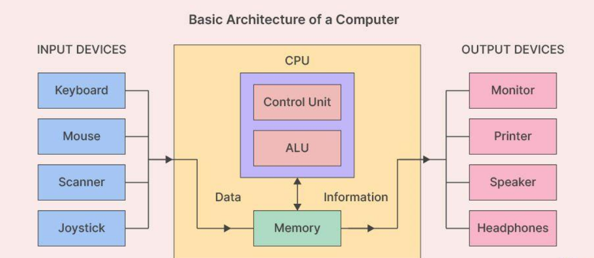

**Devices**

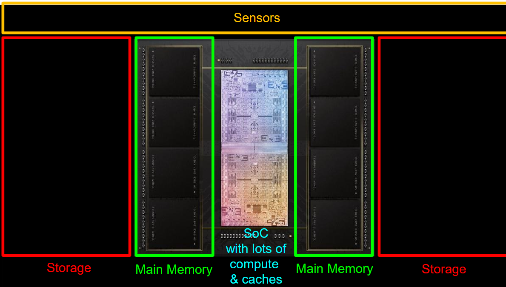

*Apple M1 Ultra System (2022)*

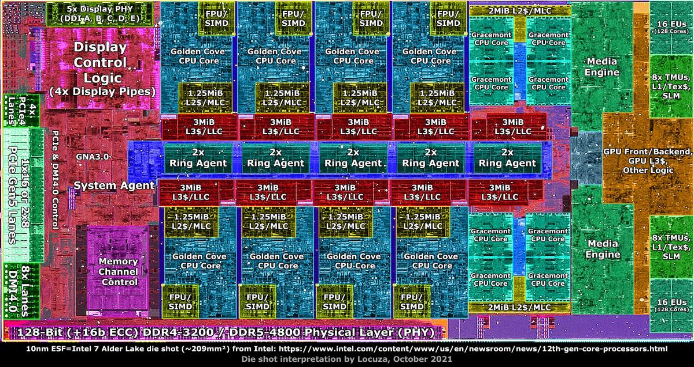

*Intel Alder Lake (2021)*

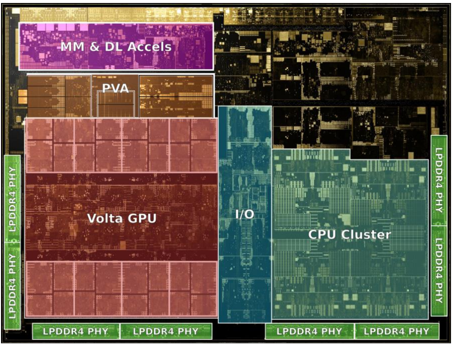

#### Architecture

**Princeton (Von Neumann) Architecture**: A computer architecture model that describes a system where the CPU, memory, and input/output devices share a single communication pathway. It is characterized by the use of a single memory space for both instructions and data.

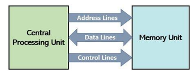

**Harvard Architecture**: A computer architecture model that describes a system where the CPU, memory, and input/output devices have separate communication pathways. It is characterized by the use of separate memory spaces for instructions and data.

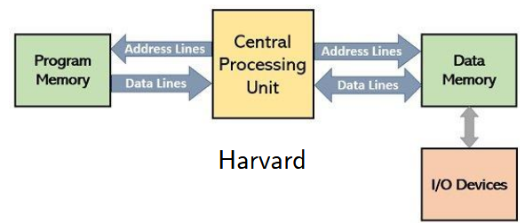

#### ISA - Instruction Set Architecture

**MIPS** (Microprocessor without Interlocked Pipeline Stages) is a RISC (Reduced Instruction Set Computer) architecture that emphasizes simplicity and efficiency in instruction execution. It features a load/store architecture, fixed-length instructions, and a small set of general-purpose registers.

**RISC** (Reduced Instruction Set Computer) is a computer architecture that focuses on a small, highly optimized set of instructions, allowing for faster execution and simpler hardware design. RISC architectures typically use fixed-length instructions and a load/store model for memory access.

**RISC-V** (RISC-V) is an open standard instruction set architecture based on the principles of RISC. It is designed to be extensible, allowing for custom instructions and features while maintaining compatibility with existing RISC-V implementations.

**ARM** (Advanced RISC Machine) is a family of RISC-based architectures widely used in embedded systems, mobile devices, and other low-power applications. **ARM** processors are known for their energy efficiency and performance.

...

#### Abstraction Layers

**Abstraction Layers:** Different levels of abstraction in computer architecture, ranging from high-level programming languages down to digital logic circuits. Each layer provides a simplified view of the underlying hardware, allowing designers and programmers to focus on specific aspects of the system.

- **Application**: Software applications that run on a computer system, utilizing the underlying layers of abstraction.
- High-level Languages: Programming languages that provide a higher level of abstraction, allowing developers to write code that is more human-readable and easier to understand. Examples include Python, Java, and C++.
- **Assembly Language**: Low-level programming language that provides a symbolic representation of machine code instructions. Assembly language allows programmers to write code that is closely tied to the underlying hardware architecture.
- **Instruction Set Architecture (ISA)**: The interface between software and hardware, defining the set of instructions that a processor can execute, along with the associated data types, registers, and memory addressing modes. Many processors can implement the same ISA.
  - What does **Processor** do?
  - What does **Software** see?
    - E.g: `add x5, x6, x7`
- **Microarchitecture**: The implementation of a specific ISA in a processor, including the datapath, control unit, and memory hierarchy. Microarchitecture determines how instructions are executed and how data is processed within the CPU.
  - How does Processor do?
  - What is inside a processor?
  - Single-cycle, pipeline, superscalar
- **Digital Logic**: The fundamental building blocks of computer architecture, consisting of logic gates and circuits that perform basic operations such as AND, OR, and NOT. Digital logic circuits are used to implement the microarchitecture and execute instructions.
- **Devices / Transistors**: The physical components of a computer system, including transistors, which are the basic building blocks of digital circuits. Transistors are used to create logic gates and other electronic components that enable computation and data processing.

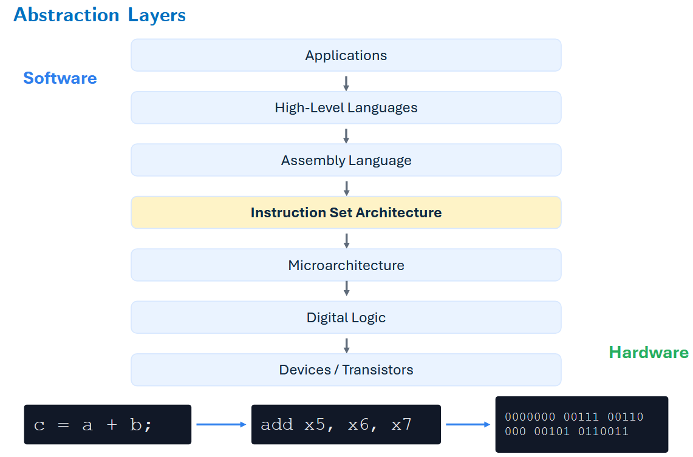

#### ISA and Computer workflow

**A simple C++ program**

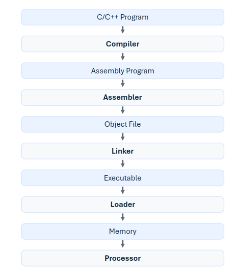

**Compiler**

- Translates the code into low-level code.
- Optimize the code.
- Generate the instruction according to ISA
- The same source code can generate different machine code for RISC-V, ARM, x86...

```cpp
int add(int a, int b) {
    return a + b;
}
```

can become:

```assembly
add a0, a0, a1
```

#### Assembler, Linker, Loader

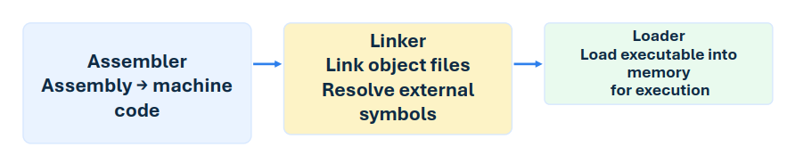

CPU only starts when the executable is loaded into memory.

#### Performance of a Computer

**Abstraction Layers**

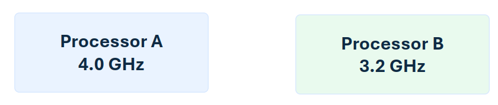

Is A **faster** than B?

**Common Perspectives**

- **Response Time / Latency:** Time required to complete one task.
- **Throughput:** Number of tasks completed per unit time.
- Example:
  - Laptop application -> latency matters.
  - Web server -> throughput often matters.

| Criteria                 | Response Time (Latency / Execution Time)                                                                            | Throughput (Bandwidth)                                                                                                               |
| ------------------------ | ------------------------------------------------------------------------------------------------------------------- | ------------------------------------------------------------------------------------------------------------------------------------ |
| **Definition**           | The total time required to complete a single task from start to finish.                                             | The total amount of work (number of tasks) the system completes in a given unit of time.                                             |
| **Units of Measurement** | Seconds (s), milliseconds (ms), clock cycles.                                                                       | Tasks/second, Instructions/second (MIPS, FLOPS), Bytes/second (GB/s).                                                                |
| **Optimization Goal**    | Finishing a specific job as fast as possible.                                                                       | Packing and processing as many jobs as possible simultaneously.                                                                      |
| **Hardware Techniques**  | Increasing clock frequency ($F_{max}$), using high-speed Caches, optimizing the critical path.                      | Pipelining, multi-core processors, parallel execution units.                                                                         |
| **Prioritized Systems**  | Personal computers, real-time embedded systems running closed-loop control algorithms (e.g., Sliding Mode Control). | Cloud servers, data centers, AI hardware accelerators processing batch workloads.                                                    |
| **Practical Example**    | Upgrading to a CPU with a higher clock speed compiles a C/C++ file faster.                                          | Adding more cores to a server allows it to serve thousands of users concurrently, even if the processing time per user is unchanged. |

**Response Time (Latency)**

- Example: Consider 2 computer, the execution time for a Task by using 2 computers are:
  - Computer A: 8s
  - Computer B: 12s

> **Which one is faster in terms of response time?**

> **Answer:** Performance is inversely proportional to execution time:

$$
Performance = \frac{1}{Execution\ Time}
$$

Therefore:

$$
\frac{Performance_A}{Performance_B}
=
\frac{Time_B}{Time_A}
=
\frac{12}{8}
=
1.5
$$

Computer A is **1.5× faster** than Computer B.

**Throughput (Bandwidth)**

**Example:** Consider the performance of 2 systems:
- System A
  - 1 request: 20ms
  - 100 requests/s
- System B
  - 1 request: 25ms
  - 150 requests/s

> **Question:**
> - Which has better latency?
> - Which has better throughput

> **Answer:**
> - A has better latency.
> - B has better throughput.

```
Faster must be defined using a metric.
```

**CPU execution time**
- CPU execution time is determined by three major factors:
  - Instruction Count (IC)
  - Cycles Per Instruction (CPI)
  - Clock Cycle Time

CPU Time is calculated as:

$$
CPU\ Time = Instruction\ Count \times CPI \times Clock\ Cycle\ Time
$$

Since:

$$
Clock\ Cycle\ Time = \frac{1}{Clock\ Rate}
$$

Then:

$$
CPU\ Time
=
\frac{Instruction\ Count \times CPI}{Clock\ Rate}
$$

- Performance depends on the interaction between software, ISA, and processor implementation.

**IC, CPI, and Clock**

- **Instruction Count (IC)**
  - Number of instructions executed by a program
  - Influenced by:
    - Algorithm
    - Compiler
    - ISA
- **Cycles Per Instruction (CPI)**
  - Average number of clock cycles required per instruction
  - Influenced mainly by:
    - Processort implementation
    - Instruction mix
    - Pipeline stalls
    - Memory behavior
- **Clock rate**
  - Number of clock cycles per second
  - Usually measured in Hz, MHz, or GHz
- **Important**
    - Higher clock rate does not automatically mean higher perfomance.

**Clock Cycle vs Clock Rate**

- **Clock cycle**
  - One timing interval of the processor

- **Clock cycle time**

$$
T_{clock} = \frac{1}{Clock\ Rate}
$$

- **Example**
  - For a 2 GHz processor:

$$
T_{clock}
=
\frac{1}{2 \times 10^9}
=
0.5\ ns
$$

  - For a 4 GHz processor:

$$
T_{clock}
=
0.25\ ns
$$

- **Key distinction**
  - Clock rate -> cycles per second
  - Clock cycle time -> seconds per cycle
  - Total clock cycles -> number of cycles required by the program

**Total Clock Cycles**
- The total number of processor cycles is:

$$
CPU\ Clock\ Cycles = Instruction\ Count \times CPI
$$

- Therefore:

$$
CPU\ Time = CPU\ Clock\ Cycles \times Clock\ Cycle\ Time
$$

- **Example**: Given:
  - IC = 1000000 instructions
  - CPI = 2
  - Clock rate = 2 GHz

Then:

$$
Clock\ Cycles = 1000000 \times 2 = 2000000
$$

$$
CPU\ Time = \frac{2000000}{2 \times 10^9} = 1\ ms
$$

**Average CPI**

- Different instruction types may require different numbers of cycles.

$$
CPI_{avg}
=
\frac{\sum_i (CPI_i \times IC_i)}
{\sum_i IC_i}
$$

- **Example**

| Instruction Type | Instruction Count | CPI |
|---|---:|---:|
| *ALU* | 500 | 1 |
| *Load/Store* | 300 | 2 |
| *Branch* | 200 | 3 |

- **Total cycles:**

$$
500(1) + 300(2) + 200(3) = 1700
$$

- **Total instructions:**

$$
500 + 300 + 200 = 1000
$$

- **Average CPI:**

$$
CPI_{avg}
=
\frac{1700}{1000}
=
1.7
$$

- **CPI depends on the instruction mix.**

**Performance Comparison Example**
- Processor A:
  - $$IC = 1.0 \times 10^9$$
  - CPI = 1.5
  - Clock rate = 3 GHz
- Processor B:
  - $$IC = 1.2 \times 10^9$$
  - CPI = 1.0
  - Clock rate = 2.5 GHz
- **For A:**

$$
CPU\ Time_A
=
\frac{1.0 \times 10^9 \times 1.5}
{3 \times 10^9}
=
0.5s
$$

- **For B:**

$$
CPU\ Time_B
=
\frac{1.2 \times 10^9 \times 1.0}
{2.5 \times 10^9}
=
0.48s
$$

- **Conclusion**
  - B has a lower clock rate.
  - But B executes the program faster.

- **Clock frequency alone is not a valid performance metric.**

**What Can Change Performance?**

$$
CPU\ Time = IC \times CPI \times Clock\ Cycle\ Time
$$

- **Algorithm**
  - May affect IC

- **Programming language / compiler**
  - May affect IC
  - May affect instruction mix

- **ISA**
  - May affect IC and CPI

- **Microarchitecture**
  - Mainly affects CPI and clock cycle time

- **Memory system**
  - Can strongly affect CPI

> **Computer performance is a system-level property.**

#### Benchmarking

**Benchmarking**
- A benchmark is a program or workload used to measure computer performance.
- Why not simply compare clock rate?
- Because performance depends on:
  - Application behavior
  - Instruction Count
  - CPI
  - Memory access
  - Compiler
  - Processor implementation
- **Therefore:** Performance should be measured using representative workloads.

**Types of Benchmarks**
- **Real applications**
  - Compilers
  - Web servers
  - Scientific applications
  - Media processing
- **Kernels**
  - Small portions of real application
  - Focus on one important operations
- **Synthetic benchmarks**
  - Artificial programs designed to reproduce certain workload characteristics.
- **Benchmark suites**
  - Collections of programs
  - Used to provide a broader view of system performance
- **Examples:**
  - **SPEC CPU:** processor and memory-intensive workloads, widely used for CPU performance elvaluation.
  - **TPC:** database and transaction-processing workloads
  - **MLPerf:** machine-learning workloads
  - **CoreMark:** commonly used in embedded systems

**Good Benchmarks**

- A good benchmark should be:
  - Representative
  - Repeatable
  - Relevant to the target application
  - Measurable
  - Difficult to manipulate unfairly

- **Questions to ask**
  - Does the benchmark resemble the real workload?
  - Is one benchmark enough?
  - Are the systems compiled using comparable settings?
  - Are we measuring latency or throughput?

**Benchmark Pitfalls**

- Be careful when comparing systems using:
  - only one application
  - only clock frequency
  - peak theoretical performance
  - different compiler optimizations
  - different workloads
  - vendor-specific benchmark settings

#### Amdahl's Law

**Amdahl's Law**

- Suppose only part of a program can be improved. Let:
  - $f$ = fraction of execution time affected
  - $S$ = speedup of the improved part

- Then the overall speedup is:

$$
Speedup_{overall}
=
\frac{1}
{(1-f)+\frac{f}{S}}
$$

This is **Amdahl's Law**.

- **$f$: Fraction of the original execution time that can be improved**
  - It represents the portion of the program affected by the optimization.
  - $0 \leq f \leq 1$
  - It is measured using the original execution time, before optimization.
  - It is **not** the percentage of source-code lines or instructions.

- **$S$: Speedup of the improved portion**
  - It represents how many times faster the improved part becomes.
  - If $S = 2$, that part takes half of its original time.
  - If $S = 4$, that part takes one quarter of its original time.
  - $S$ applies only to the portion represented by $f$, not to the entire program.

- **Example:**
  - Suppose a program originally takes **100 seconds**. 40 seconds can be optimized:

$$
f = \frac{40}{100} = 0.4
$$

  - The optimized part becomes 4 times faster:

$$
S = 4
$$

- Therefore, the optimized 40-second portion now takes:

$$
\frac{40}{4} = 10\ \text{seconds}
$$

- The remaining 60 seconds are unchanged.

- So the new execution time is:

$$
T_{new} = 60 + 10 = 70\ \text{seconds}
$$

and the overall speedup is:

$$
Speedup_{overall}
=
\frac{100}{70}
\approx 1.43
$$

- $f$ tells us **how much** of the original execution time can benefit from the optimization, while $S$ tells us **how much faster** that particular portion becomes.

**The Limit of Optimization**

- Even if one part of a program is made infinitely fast, the overall program can only be accelerated up to a certain limit because the rest of the program is unchanged.

- If the improved part becomes infinitely fast:

$$
S \rightarrow \infty
$$

So the maximum possible speedup becomes:

$$
Speedup_{max}
=
\frac{1}{1-f}
$$

This is the **optimization limit**.

- **Example:** Suppose a program originally takes **100 s**:
  - 40 s can be improved
  - 60 s cannot be improved

So:

$$
f = 0.4
$$

- Even if the 40 s part becomes infinitely fast, its execution time approaches:

$$
\frac{40}{\infty} \approx 0
$$

- But the other 60 s still remains. Therefore:

$$
T_{new,min} = 60\ s
$$

- Hence:

$$
Speedup_{max}
=
\frac{100}{60}
=
1.67
$$

- So no matter how powerful the optimization is, the entire program can never become more than **1.67× faster**.

- The important idea is that the **unoptimized portion becomes the bottleneck**.

---

### Summary Section (Summary of Notes)

Brief summary of key ideas and takeaways