# Cornell Notes

## Topic: Combinational Logic

## Date: 22/09/2026

---

### Cue Column (Questions, Keywords, or Prompts)

- First question or keyword
- Second question or keyword
- Third question or keyword

---

### Notes Section (Main Notes)

#### Logic Gates and Truth Tables

- **BUF Gate**: Output is the same as the input.

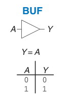

- **AND Gate**: Output is true if all inputs are true.

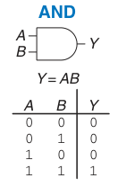

- **OR Gate**: Output is true if at least one input is true.

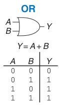

- **NOT Gate**: Output is the inverse of the input.

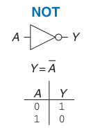

- **NAND Gate**: Output is true if at least one input is false.

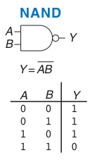

- **NOR Gate**: Output is true if all inputs are false.

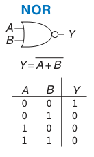

- **XOR Gate**: Output is true if an odd number of inputs are true.

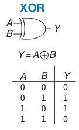

- **XNOR Gate**: Output is true if an even number of inputs are true.

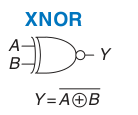

- There are two types of MOS transistors: n-type and p-type.

- They both operate `logically`, very similar to the way wall switches work.

  - **N-type MOS transistor**: The circuit is closed when the gate is supplied with 3V.

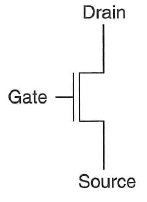

  - **P-type MOS transistor**: The circuit is closed when the gate is supplied with 0V.

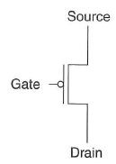

- The general form used to construct any inverting logic gate, such as: NOT, NAND, or NOR.
  - The networks may consist of transistors in series or in parallel.
  - When transistors are in parallel, the network is **ON** if one of the transistors is **ON**.

> pMOS transistors are used for pull-up
> nMOS transistors are used for pull-down

- Exactly one network should be **ON**, and the other network should be **OFF** at any given time
  - If both networks are **ON** at the same time, there is a **short circuit** -> likely incorrect operation.
  - If both networks are **OFF** at the same time, the output is **floating** -> undefined

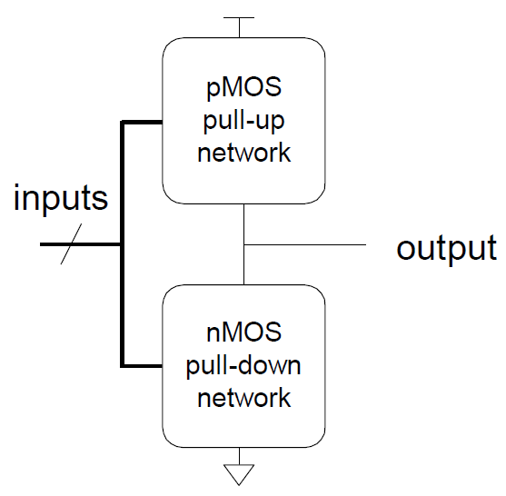

- MOS transistors are imperfect switches.
- pMOS transistors pass 1's well but 0's poorly. (holes carry charge)
- nMOS transistors pass 0's well but 1's poorly. (electrons carry charge)

- pMOS transistors are good at `pulling up` the output
- nMOS transistors are good at `pulling down` the output

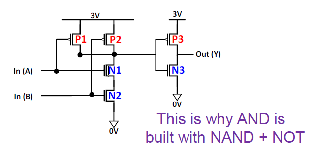

#### 

**Digital Circuits**

- A circuit is a network that processes discrete-valued variables:
  - One or more discrete-valued input terminals.
  - One or more discrete-valued output terminals.
  - A functional specification describing the relationship between the inputs and outputs.
  - A timing specification describing the delay between inputs changing and outputs responding.

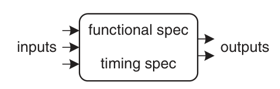

- Inside a circuit:

  - Element: is itself a circuit with inputs and outputs, specification.
  - Node: Wire, whose voltage conveys a discrete-valued variable.

- A digital circuit can be:
  - Combinational logic circuit: Memoryless (without information of the previous states)
  - Sequential logic circuit: with Memory (with information of the previous states).
- Example: A combinatory

$$
Y = F(A,B) = A + B
$$

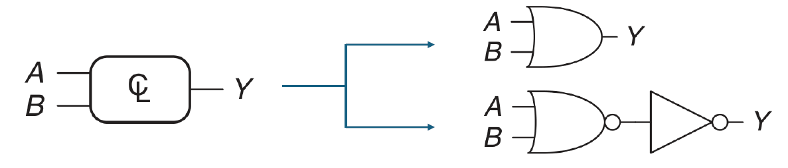

- A function can have different implementation forms

- Example: Full Adder circuit

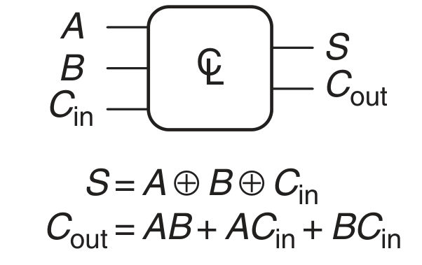

- 2 Output with 3 Input

$$
S = F(A,B,C_{in})
C_{out} = G(A,B,C_{in})
$$

- Bus: Bundle of multiple signals

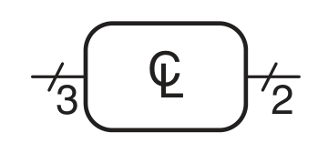

3 input and 2 output

- Combination Composition: build a large combinational circuit from the smaller ones.

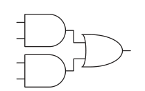

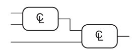

#### Boolean Algebra

**Simple Equations**

- **NOT** — $\overline{A}$ (reads "not A") is `1` if `A` is `0`.
  - Complement of `A`:
    - $A$: true form
    - $\overline{A}$: complement form

  |  $A$  | $\overline{A}$ |
  | :---: | :------------: |
  |   0   |       1        |
  |   1   |       0        |

- **AND** — $A \cdot B$ (reads "A and B") is `1` if `A` and `B` are both `1`.
  - $A, B, \overline{A}, \overline{B}, \dots$ — **literal**
  - **Product**: AND of literals
  - **Implicant**: product of literals

  |  $A$  |  $B$  | $A \cdot B$ |
  | :---: | :---: | :---------: |
  |   0   |   0   |      0      |
  |   0   |   1   |      0      |
  |   1   |   0   |      0      |
  |   1   |   1   |      1      |

- **OR** — $A + B$ (reads "A or B") is `1` if either `A` or `B` is `1`.
  - **Sum**: OR of literals

  |  $A$  |  $B$  | $A + B$ |
  | :---: | :---: | :-----: |
  |   0   |   0   |    0    |
  |   0   |   1   |    1    |
  |   1   |   0   |    1    |
  |   1   |   1   |    1    |

**Boolean Equations**

- Complex equations are built from the 3 basic equations.
- Order of operations (basic equations):
  - **NOT** has the highest precedence.
  - **AND** is second, then **OR**.
- Sample Boolean equation:

  $$
  F(A, B, C) = \overline{A}B + BC\overline{D}
  $$

- **Minterms** ($m_i$):
  - A **product** involving **all** the inputs.
  - Example, for $F(A, B, C)$:
    - $ABC,\ \overline{A}BC,\ A\overline{B}C,\ \dots$ are minterms.
    - $AB,\ AC,\ B\overline{C}$ are **not** minterms.

- **Maxterms** ($M_i$):
  - A **sum** involving **all** the inputs.
  - Example, for $F(A, B, C)$:
    - $A + B + C,\ \overline{A} + B + C,\ A + \overline{B} + C,\ \dots$ are maxterms.
    - $AB,\ AC,\ B\overline{C}$ are **not** maxterms.

- $i$ in $m_i$ and $M_i$ is the decimal number represented by the binary inputs.
- Example for $F(A,B,C)$:
  - Let $ABC=(b_3b_2b_1)_2$.
  - $A$ is the most significant bit; $C$ is the least significant bit.
  - Therefore:

    $$
    i=4A+2B+C
    $$

|  $A$  |  $B$  |  $C$  | Binary  |  $i$  |
| :---: | :---: | :---: | :-----: | :---: |
|   0   |   0   |   0   | $000_2$ |   0   |
|   0   |   0   |   1   | $001_2$ |   1   |
|   0   |   1   |   0   | $010_2$ |   2   |
|   0   |   1   |   1   | $011_2$ |   3   |
|   1   |   0   |   0   | $100_2$ |   4   |
|   1   |   0   |   1   | $101_2$ |   5   |
|   1   |   1   |   0   | $110_2$ |   6   |
|   1   |   1   |   1   | $111_2$ |   7   |

**Sum-of-Products form (SOP) and Product-of-Sums form (POS)**

- A function can be represented by sum of minterms (SOP) or product of maxterms (POS).

A Boolean function can be represented as:

- A **sum of minterms**: include rows where $F=1$.
- A **product of maxterms**: include rows where $F=0$.

**Sum of Minterms**

For:

$$
F(A,B)=\overline{A}B+AB
$$

The output is `1` at indices $1$ and $3$:

$$
F(A,B)=m_1+m_3=\sum m(1,3)=\sum(1,3)
$$

|  $i$  |  $A$  |  $B$  |  $F$  |          Minterm           | Name  |
| :---: | :---: | :---: | :---: | :------------------------: | :---: |
|   0   |   0   |   0   |   0   | $\overline{A}\overline{B}$ | $m_0$ |
|   1   |   0   |   1   |   1   |      $\overline{A}B$       | $m_1$ |
|   2   |   1   |   0   |   0   |      $A\overline{B}$       | $m_2$ |
|   3   |   1   |   1   |   1   |            $AB$            | $m_3$ |

Therefore:

$$
\boxed{F(A,B)=\sum m(1,3)}
$$

**Product of Maxterms**

The same function is `0` at indices $0$ and $2$:

$$
F(A,B)=(A+B)(\overline{A}+B)
$$

$$
F(A,B)=M_0M_2=\prod M(0,2)=\prod(0,2)
$$

|  $i$  |  $A$  |  $B$  |  $F$  |           Maxterm           | Name  |
| :---: | :---: | :---: | :---: | :-------------------------: | :---: |
|   0   |   0   |   0   |   0   |            $A+B$            | $M_0$ |
|   1   |   0   |   1   |   1   |      $A+\overline{B}$       | $M_1$ |
|   2   |   1   |   0   |   0   |      $\overline{A}+B$       | $M_2$ |
|   3   |   1   |   1   |   1   | $\overline{A}+\overline{B}$ | $M_3$ |

Therefore:

$$
\boxed{F(A,B)=\prod M(0,2)}
$$

Both canonical forms describe the same function:

$$
\boxed{F(A,B)=\sum m(1,3)=\prod M(0,2)}
$$

> Minterm rule: use complemented variable for input `0` and uncomplemented variable for input `1`.
>
> Maxterm rule: use uncomplemented variable for input `0` and complemented variable for input `1`.

- Example:

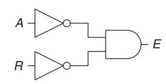

$$
E=\Pi(1,2,3)
$$

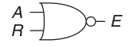
$$
E=\Sigma(0)
$$

- **SOP** produces a shorter equation when the output is TRUE on only a few rows of the truth table.
- **POS** produces a shorter equation when the output is FALSE on only a few rows of the truth table.

For $n$ inputs, all row indices belong to:

$$
U=\{0,1,\dots,2^n-1\}
$$

- $\sum m(\dots)$ lists rows where $F=1$.
- $\prod M(\dots)$ lists rows where $F=0$.

**1. Minterm-to-maxterm conversion**

Rewrite minterm notation as maxterm notation. Replace listed indices with their complement relative to $U$.

For example:

$$
F(A,B,C)
=\sum m(3,4,5,6,7)
=\prod M(0,1,2)
$$

**2. Maxterm-to-minterm conversion**

Rewrite maxterm notation as minterm notation. Replace listed indices with their complement relative to $U$.

For example:

$$
F(A,B,C)
=\prod M(0,1,2)
=\sum m(3,4,5,6,7)
$$

**3. Expansion of $F$ to expansion of $\overline{F}$**

Complementing $F$ swaps its `1` rows and `0` rows. Use the unused indices:

$$
F(A,B,C)=\sum m(3,4,5,6,7)
\quad\Longrightarrow\quad
\overline{F}(A,B,C)=\sum m(0,1,2)
$$

$$
F(A,B,C)=\prod M(0,1,2)
\quad\Longrightarrow\quad
\overline{F}(A,B,C)=\prod M(3,4,5,6,7)
$$

**4. Minterm expansion of $F$ to maxterm expansion of $\overline{F}$**

When changing both function and notation, retain the same indices:

$$
F(A,B,C)=\sum m(3,4,5,6,7)
\quad\Longrightarrow\quad
\overline{F}(A,B,C)=\prod M(3,4,5,6,7)
$$

$$
F(A,B,C)=\prod M(0,1,2)
\quad\Longrightarrow\quad
\overline{F}(A,B,C)=\sum m(0,1,2)
$$

**Conversion summary**

| Conversion                                                                       | Indices                     |
| -------------------------------------------------------------------------------- | --------------------------- |
| $\sum m \leftrightarrow \prod M$ for same $F$                                    | Use complementary index set |
| $F \leftrightarrow \overline F$ with same notation                               | Use complementary index set |
| Change both $F \leftrightarrow \overline F$ and $\sum m \leftrightarrow \prod M$ | Keep same indices           |

---

### Summary Section (Summary of Notes)

Brief summary of key ideas and takeaways