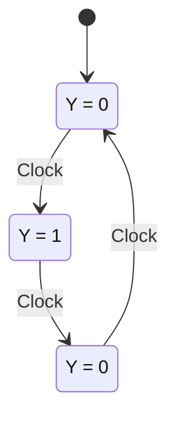

# Thiết kế máy Moore điều khiển đèn giao thông

## 1. Đề bài

Đèn giao thông tuần tự qua ba màu:

```text
Đỏ → Xanh → Vàng → Đỏ → ...
```

Yêu cầu:

- `Y = 1`: được đi.
- `Y = 0`: không được đi.
- Thiết kế theo mô hình **máy Moore**.

Trong máy Moore, đầu ra chỉ phụ thuộc vào **trạng thái hiện tại**, không phụ thuộc trực tiếp vào đầu vào.

$$Y = f(STATE)$$

---

## 2. Xác định trạng thái

Mỗi màu đèn tương ứng với một trạng thái:

| Tên trạng thái | Màu đèn | Ý nghĩa | Y |
|---|---|---|---:|
| $S_R$ | Đỏ | Dừng | 0 |
| $S_G$ | Xanh | Được đi | 1 |
| $S_Y$ | Vàng | Chuẩn bị dừng | 0 |

Trình tự hoạt động:

$$S_R \rightarrow S_G \rightarrow S_Y \rightarrow S_R$$

---

## 3. Sơ đồ chuyển trạng thái



Mỗi cạnh chuyển trạng thái xảy ra tại một cạnh tác động của xung clock.

---

## 4. Bảng chuyển trạng thái và đầu ra

Chọn trạng thái kế tiếp theo chu kỳ đèn:

| Trạng thái hiện tại | Trạng thái kế tiếp | Đèn hiện tại | Y |
|---|---|---|---:|
| $S_R$ | $S_G$ | Đỏ | 0 |
| $S_G$ | $S_Y$ | Xanh | 1 |
| $S_Y$ | $S_R$ | Vàng | 0 |

Đây là máy Moore vì cột `Y` được xác định chỉ bởi trạng thái hiện tại.

---

## 5. Mã hóa trạng thái

Có 3 trạng thái nên cần số bit nhớ $n$ thỏa mãn:

$$2^n \geq 3$$

Suy ra:

$$n = 2$$

Dùng hai bit trạng thái $Q_1Q_0$:

| Trạng thái | Mã $Q_1Q_0$ | Đèn | Y |
|---|---|---|---:|
| $S_R$ | `00` | Đỏ | 0 |
| $S_G$ | `01` | Xanh | 1 |
| $S_Y$ | `10` | Vàng | 0 |
| Không dùng | `11` | — | 0 |

Mã `11` là trạng thái không sử dụng. Nếu mạch rơi vào `11`, thiết kế đưa nó về `00` ở clock kế tiếp để tự phục hồi về trạng thái Đỏ.

---

## 6. Bảng trạng thái đầy đủ

Gọi $D_1D_0$ là trạng thái kế tiếp của hai D flip-flop.

| $Q_1$ | $Q_0$ | Trạng thái hiện tại | $D_1$ | $D_0$ | Trạng thái kế tiếp | Y |
|---:|---:|---|---:|---:|---|---:|
| 0 | 0 | Đỏ | 0 | 1 | Xanh | 0 |
| 0 | 1 | Xanh | 1 | 0 | Vàng | 1 |
| 1 | 0 | Vàng | 0 | 0 | Đỏ | 0 |
| 1 | 1 | Không dùng | 0 | 0 | Đỏ | 0 |

---

## 7. Suy ra phương trình logic

### 7.1. Phương trình $D_1$

$D_1 = 1$ chỉ khi trạng thái hiện tại là `01`:

$$D_1 = \overline{Q_1}Q_0$$

### 7.2. Phương trình $D_0$

$D_0 = 1$ chỉ khi trạng thái hiện tại là `00`:

$$D_0 = \overline{Q_1}\,\overline{Q_0}$$

### 7.3. Phương trình đầu ra

Y chỉ bằng 1 tại trạng thái Xanh (`01`):

$$Y = \overline{Q_1}Q_0$$

Vì vậy, trong thiết kế này:

$$Y = D_1$$

nhưng nên triển khai đầu ra từ **trạng thái hiện tại** theo đúng nguyên tắc Moore:

$$Y = \overline{Q_1}Q_0$$

---

## 8. Sơ đồ khối phần cứng

```text
                         ┌─────────────────────┐
              D1 ───────▶│                     │
                         │   D flip-flop Q1    │──── Q1 ──┐
              CLK ──────▶│                     │          │
                         └─────────────────────┘          │
                                                          │
                         ┌─────────────────────┐          │
              D0 ───────▶│                     │          │
                         │   D flip-flop Q0    │──── Q0 ──┼──▶ Logic Y
              CLK ──────▶│                     │          │
                         └─────────────────────┘          │
                                  ▲                       │
                                  │                       │
                    ┌─────────────┴─────────────┐         │
                    │ Combinational next-state │◀────────┘
                    │ D1 = Q̅1 Q0              │
                    │ D0 = Q̅1 Q̅0             │
                    └───────────────────────────┘
```

Đầu ra điều khiển đèn:

```text
RED    = Q̅1 Q̅0
GREEN  = Q̅1 Q0
YELLOW = Q1 Q̅0
Y       = GREEN = Q̅1 Q0
```

---

## 9. Kiểm tra từng chu kỳ clock

Giả sử reset đưa mạch về trạng thái Đỏ (`00`):

| Clock | Trạng thái trước cạnh clock | Trạng thái sau cạnh clock | Đèn sáng | Y |
|---:|---|---|---|---:|
| 0 | — | Đỏ (`00`) | Đỏ | 0 |
| 1 | Đỏ (`00`) | Xanh (`01`) | Xanh | 1 |
| 2 | Xanh (`01`) | Vàng (`10`) | Vàng | 0 |
| 3 | Vàng (`10`) | Đỏ (`00`) | Đỏ | 0 |
| 4 | Đỏ (`00`) | Xanh (`01`) | Xanh | 1 |

Chu kỳ lặp lại sau 3 xung clock.

---

## 10. Vai trò của reset

Reset rất quan trọng vì nó xác định trạng thái khởi đầu. Chọn:

$$RESET \Rightarrow Q_1Q_0 = 00$$

Do đó, sau reset:

- Đèn Đỏ sáng.
- Đèn Xanh tắt.
- Đèn Vàng tắt.
- $Y = 0$.

Thiết kế này cũng an toàn khi khởi động: hệ thống bắt đầu ở trạng thái dừng.

---

## 11. Kết luận

Máy Moore điều khiển đèn giao thông cần ba trạng thái:

$$Đỏ \rightarrow Xanh \rightarrow Vàng \rightarrow Đỏ$$

Với mã hóa hai bit:

- Đỏ = `00`
- Xanh = `01`
- Vàng = `10`

Sử dụng hai D flip-flop:

$$D_1 = \overline{Q_1}Q_0$$

$$D_0 = \overline{Q_1}\,\overline{Q_0}$$

Đầu ra cho phép đi:

$$Y = \overline{Q_1}Q_0$$

Kết quả: `Y = 1` chỉ trong trạng thái Xanh; mọi trạng thái khác có `Y = 0`.