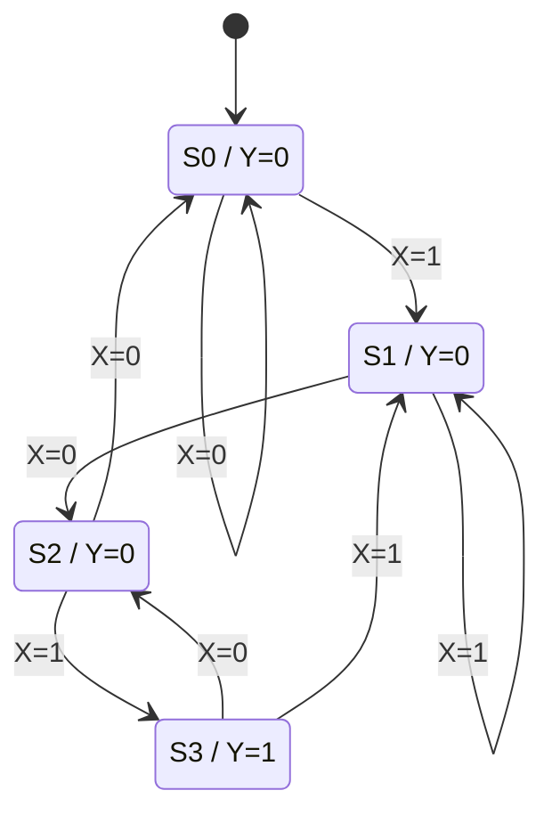
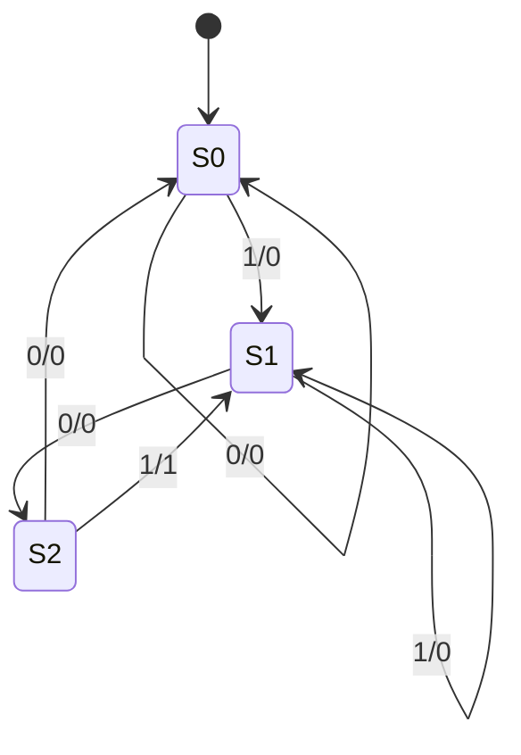
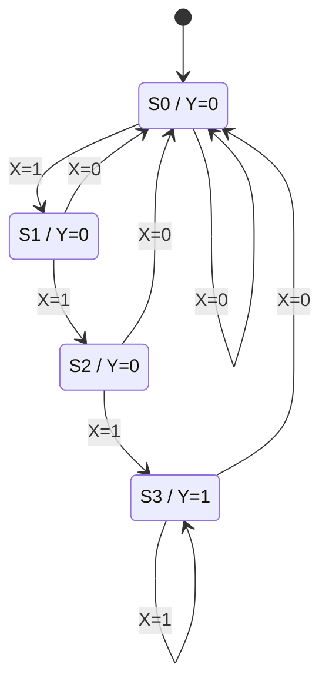
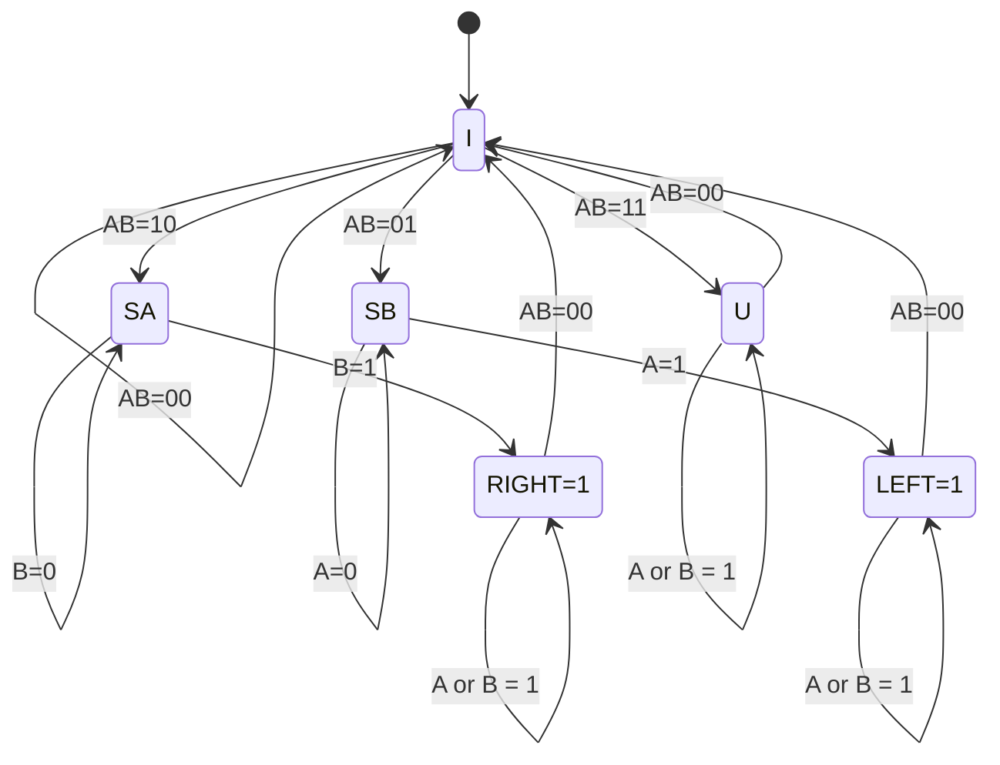
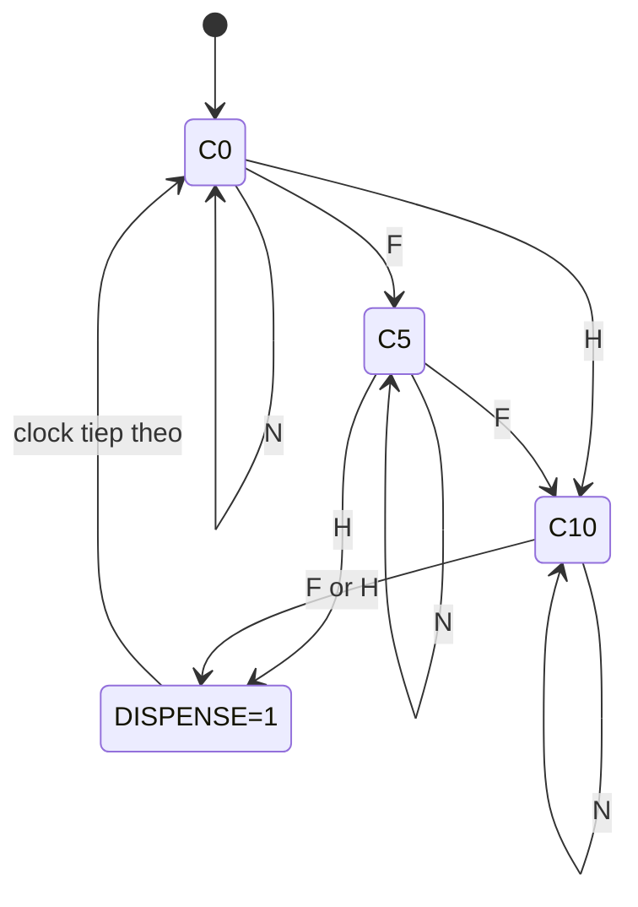
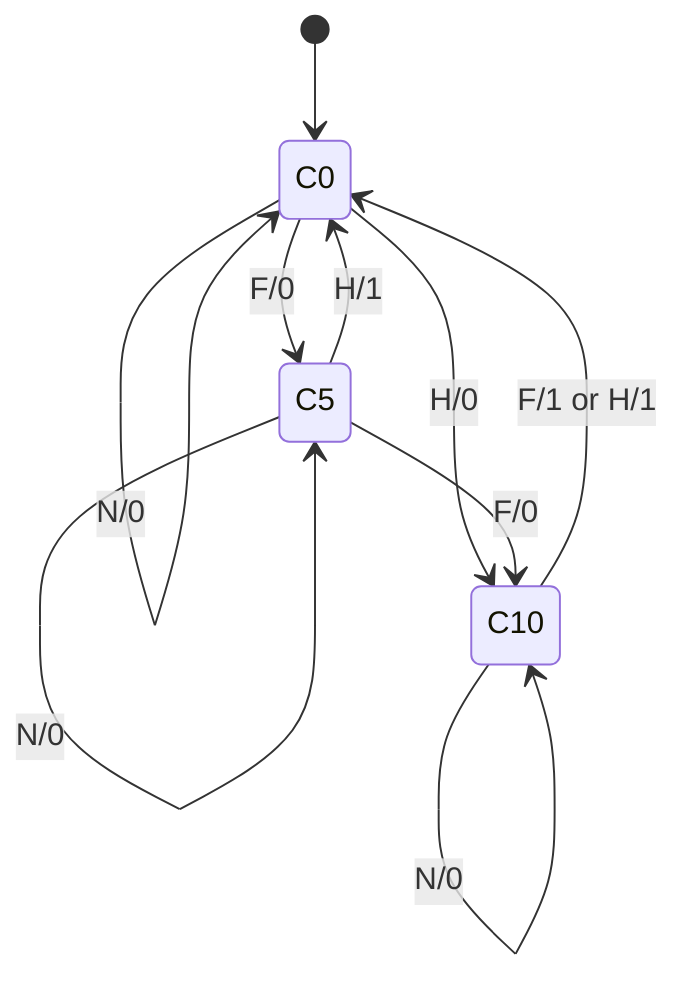
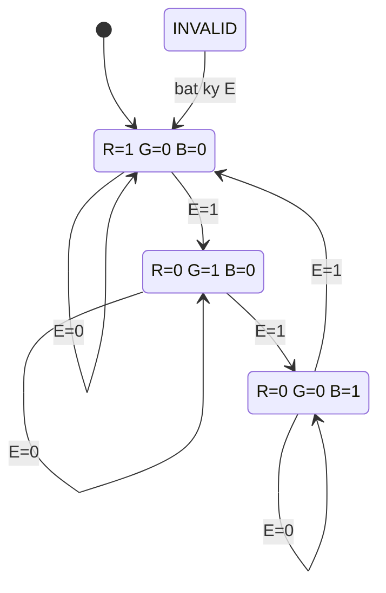
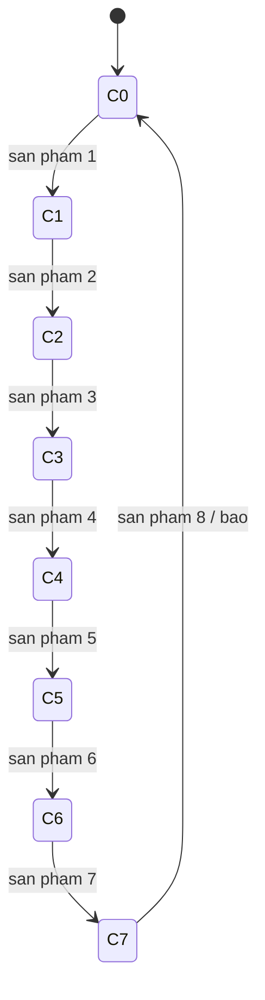

# Lời giải toàn bộ bài tập Logic tuần tự

**Nguồn:** [Bài tập Sequential logic.pdf](Bài%20tập%20Sequential%20logic.pdf), 6 trang, Bài 1–16.

Tài liệu giải tất cả các câu, gồm cách nối flip-flop, phương trình, bảng trạng thái, giản đồ thời gian và thiết kế FSM. Các lựa chọn mà đề chưa quy định được ghi rõ là **quy ước của lời giải**.

## Quy ước chung

- $+$ là OR, viết liền là AND, $\overline X$ là NOT, $\oplus$ là XOR. Dấu cộng trong phép tính số lượng/tiền vẫn là phép cộng số học.
- $Q$ là trạng thái ngay trước cạnh clock; $Q^+$ là trạng thái sau cạnh đó. Các flip-flop đồng bộ cùng cập nhật bằng giá trị **cũ**, không cập nhật lần lượt.
- Dùng cạnh lên và reset về 0/trạng thái khởi đầu, trừ khi ghi khác. Bit bên trái là MSB: $Q_2Q_1Q_0=101$ biểu diễn số 5.
- DFF: $Q^+=D$; TFF: $Q^+=Q\oplus T$; JKFF: $Q^+=J\overline Q+\overline KQ$.
- Moore: $Y=g(Q)$; Mealy: $Y=g(Q,X)$. Bảng diễn tiến ghi trạng thái **sau** cạnh $k$; đầu ra Mealy tại cạnh $k$ được tính từ trạng thái **trước** cạnh và đầu vào đang nhận.
- Sơ đồ lý tưởng bỏ qua trễ lan truyền; ở mạch thật, đầu ra xuất hiện sau trễ clock-to-Q và trễ cổng. Cảm biến/nút nhấn được xử lý thành tín hiệu sạch, mỗi sự kiện tạo đúng một xung. Khi dùng clock chung, tín hiệu ngoài cần được đồng bộ và tạo xung sự kiện trước FSM.

## Bài 1. D flip-flop xác định chiều quay encoder

*Nguồn: trang 1.* Encoder có hai ngõ ra A, B vuông pha. Tại cạnh lên A, mức B phân biệt hai thứ tự pha.

Nối $CLK=A$, $D=B$. Khi A lên:

$$\boxed{Q^+=B\big|_{A\uparrow}}.$$

```text
B ─────────── D ┌─────────┐ Q ── DIR
A ───────── CLK│ DFF ↑   │
RESET ───── CLR└─────────┘
```

Với hai sóng vuông lệch 90°:

| Thứ tự pha | B tại cạnh lên A | Q sau cạnh A | Diễn giải |
|---|---:|---:|---|
| A đi trước B | 0 | 0 | A đã lên, B chưa lên |
| B đi trước A | 1 | 1 | B đã lên trước A |

**Quy ước của lời giải:** gọi A trước B là chiều kim đồng hồ (CW), B trước A là ngược chiều kim đồng hồ (CCW). Khi đó $CW=\overline Q$, $CCW=Q$. Đề không xác định góc nhìn/cách đặt A, B nên CW/CCW có thể đảo ở encoder thực; thứ tự pha trong bảng là kết quả xác định được chắc chắn.

Q giữ chiều đã lấy mẫu cho đến cạnh lên A tiếp theo. Sau reset, Q=0 chỉ là giá trị khởi tạo, chưa chứng minh đã có chuyển động. Mạch này xác định hướng; muốn đo vị trí còn cần bộ đếm tăng/giảm theo sự kiện encoder.

## Bài 2. Chiều quay tại năm cạnh lên A

*Nguồn: trang 1.* Áp dụng $Q^+=B$ và quy ước Bài 1.

| Cạnh lên A | B được lấy mẫu | Q sau cạnh | Thứ tự pha | Chiều theo quy ước |
|---:|---:|---:|---|---|
| 1 | 1 | 1 | B trước A | CCW |
| 2 | 1 | 1 | B trước A | CCW |
| 3 | 0 | 0 | A trước B | CW |
| 4 | 0 | 0 | A trước B | CW |
| 5 | 1 | 1 | B trước A | CCW |

Chuỗi kết quả: **CCW, CCW, CW, CW, CCW**. Nếu dùng quy ước cơ khí ngược lại, đổi tên CW và CCW, giữ nguyên chuỗi Q là **1,1,0,0,1**.

## Bài 3. Chia tần số bằng D flip-flop

*Nguồn: trang 1.* Gọi $T_m=1/f_m$; các FF ban đầu bằng 0.

### (a) Chia 2

Để Q đảo mỗi cạnh clock, nối $D=\overline Q$:

$$Q^+=\overline Q,\qquad \boxed{f_Q=f_m/2}.$$

```text
                 ┌──────────┐
       ┌──────── D│ DFF0 ↑   │Q ── f_m/2
       │          └────┬─────┘│
       └────[NOT]─────────────┘
CLK=f_m ───────────── CLK
RESET ─────────────── CLR
```

Hai cạnh lên CLK tạo một chu kỳ Q: $0\to1\to0$. Có thể nối chân $\overline Q$ về D để bỏ cổng NOT nếu FF có chân đó.

### (b) Chia 4 với clock chung

Dùng hai DFF lưu bộ đếm nhị phân $Q_1Q_0$:

$$\boxed{D_0=\overline Q_0,\qquad D_1=Q_1\oplus Q_0}.$$

```text
Q0 ──[NOT]────────── D0 [DFF0 ↑] ── Q0 ── f_m/2
Q1 ──┐
     [XOR]────────── D1 [DFF1 ↑] ── Q1 ── f_m/4
Q0 ──┘
CLK ─────────────────── CLK0, CLK1
RESET ───────────────── CLR0, CLR1
```

Q0 đảo mỗi cạnh; Q1 chỉ đảo khi Q0 **trước cạnh** bằng 1. Chuỗi $00\to01\to10\to11\to00$ có bốn cạnh, nên $f_{Q_1}=f_m/4$. Hai đầu ra có duty cycle lý tưởng 50%.

Nếu mắc kiểu ripple, mỗi DFF nối $D_i=\overline Q_i$ và CLK1 lấy từ $\overline Q_0$ thì DFF1 cạnh lên sẽ đổi ở cạnh xuống Q0, tương ứng thứ tự đếm trên nhưng có thêm trễ ripple. Lấy CLK1 từ Q0 sẽ đổi pha Q1 so với sơ đồ đồng bộ này.

### (c) Giản đồ thời gian của cả hai mạch

Mỗi khoảng giữa hai dấu $\uparrow$ dài $T_m$. Cạnh đầu ở cột 1; đoạn trước đó là reset. Giản đồ biểu diễn mức logic lý tưởng, đường đứng là lúc đổi mức.

```text
Cạnh CLK:      1       2       3       4       5       6       7       8
               ↑       ↑       ↑       ↑       ↑       ↑       ↑       ↑
CLK       _____|‾‾‾|___|‾‾‾|___|‾‾‾|___|‾‾‾|___|‾‾‾|___|‾‾‾|___|‾‾‾|___|‾‾‾|___
Q (÷2)    _____|‾‾‾‾‾‾‾|_______|‾‾‾‾‾‾‾|_______|‾‾‾‾‾‾‾|_______|‾‾‾‾‾‾‾|_______
Q0 (÷4)   _____|‾‾‾‾‾‾‾|_______|‾‾‾‾‾‾‾|_______|‾‾‾‾‾‾‾|_______|‾‾‾‾‾‾‾|_______
Q1 (÷4)   _____________|‾‾‾‾‾‾‾‾‾‾‾‾‾‾‾|_______________|‾‾‾‾‾‾‾‾‾‾‾‾‾‾‾|_______
```

| Số cạnh đã nhận | 0 | 1 | 2 | 3 | 4 | 5 | 6 | 7 | 8 |
|---|---:|---:|---:|---:|---:|---:|---:|---:|---:|
| Q của mạch chia 2 | 0 | 1 | 0 | 1 | 0 | 1 | 0 | 1 | 0 |
| Q0 của mạch chia 4 | 0 | 1 | 0 | 1 | 0 | 1 | 0 | 1 | 0 |
| Q1 của mạch chia 4 | 0 | 0 | 1 | 1 | 0 | 0 | 1 | 1 | 0 |

Q có chu kỳ $2T_m$; Q1 có chu kỳ $4T_m$. Bảng và hình thể hiện hai chu kỳ đầy đủ của Q1.

## Bài 4. Bộ đếm modulo-8 bằng D, T và JK

*Nguồn: trang 2.* Chọn bộ đếm **đồng bộ**, tất cả FF dùng clock chung, reset $Q_2Q_1Q_0=000$.

### (a) Số flip-flop

Có 8 trạng thái, nên $2^n\ge8\Rightarrow\boxed{n=3}$.

### (b) Bảng trạng thái và điều kiện đảo bit

| Số hiện tại | Q2Q1Q0 | Q2+Q1+Q0+ | T2 | T1 | T0 |
|---:|---|---|---:|---:|---:|
| 0 | 000 | 001 | 0 | 0 | 1 |
| 1 | 001 | 010 | 0 | 1 | 1 |
| 2 | 010 | 011 | 0 | 0 | 1 |
| 3 | 011 | 100 | 1 | 1 | 1 |
| 4 | 100 | 101 | 0 | 0 | 1 |
| 5 | 101 | 110 | 0 | 1 | 1 |
| 6 | 110 | 111 | 0 | 0 | 1 |
| 7 | 111 | 000 | 1 | 1 | 1 |

Q0 luôn đảo; Q1 đảo khi Q0=1; Q2 đảo khi Q1Q0=11. Tất cả tám mã đều dùng.

### (c) D flip-flop

$$\boxed{D_0=\overline Q_0,\quad D_1=Q_1\oplus Q_0,\quad D_2=Q_2\oplus(Q_1Q_0)}.$$

```text
Q0 ──[NOT]────────────── D0 [DFF0] ── Q0
Q1,Q0 ──[XOR]─────────── D1 [DFF1] ── Q1
Q1,Q0 ──[AND]── C2 ──┐
                     [XOR]── D2 [DFF2] ── Q2
Q2 ──────────────────┘
CLK chung ───────────────── CLK0,CLK1,CLK2
RESET ───────────────────── CLR0,CLR1,CLR2
```

### (d) T flip-flop

Vì $T_i=Q_i\oplus Q_i^+$:

$$\boxed{T_0=1,\quad T_1=Q_0,\quad T_2=Q_1Q_0}.$$

Nối T0 lên 1, Q0 tới T1, AND(Q1,Q0) tới T2; ba TFF chung CLK/reset.

### (e) JK flip-flop

JK có $J=K=0$ thì giữ, $J=K=1$ thì đảo. Dùng đúng điều kiện đảo của TFF:

$$\boxed{J_0=K_0=1,\quad J_1=K_1=Q_0,\quad J_2=K_2=Q_1Q_0}.$$

Nối mỗi cặp J,K cùng một tín hiệu và dùng clock chung.

### (f) So sánh phương trình kích

| Bit | D: giá trị cần ghi | T: điều kiện đảo | JK: một cách chọn hợp lệ |
|---|---|---|---|
| 0 | $\overline Q_0$ | 1 | $J_0=K_0=1$ |
| 1 | $Q_1\oplus Q_0$ | $Q_0$ | $J_1=K_1=Q_0$ |
| 2 | $Q_2\oplus Q_1Q_0$ | $Q_1Q_0$ | $J_2=K_2=Q_1Q_0$ |

Bảng kích tổng quát giải thích cách suy ra:

| Q | Q+ | D | T | J | K |
|---:|---:|---:|---:|---|---|
| 0 | 0 | 0 | 0 | 0 | x |
| 0 | 1 | 1 | 1 | 1 | x |
| 1 | 0 | 0 | 1 | x | 1 |
| 1 | 1 | 1 | 0 | x | 0 |

`x` là don't care. D trực tiếp tạo trạng thái kế tiếp và cần XOR; T/JK thuận tiện cho bộ đếm vì chỉ cần điều kiện đảo. Cách chọn J=K ở trên hợp lệ nhưng không phải cách duy nhất tận dụng don't care.

## Bài 5. Thanh ghi dịch nối tiếp sang song song

*Nguồn: trang 2.* **Quy ước của lời giải:** bit mới đi vào Q0; bit cũ dịch từ Q0 sang Q1, Q2, Q3. Đề chưa chỉ định chiều dịch.

### (a) Mạch bốn DFF

$$\boxed{D_0=X,\quad D_1=Q_0,\quad D_2=Q_1,\quad D_3=Q_2}.$$

```text
X ── D [DFF0] Q0 ── D [DFF1] Q1 ── D [DFF2] Q2 ── D [DFF3] Q3
        ↑CLK            ↑CLK            ↑CLK            ↑CLK
CLK ─────┴───────────────┴───────────────┴───────────────┴──
RESET: CLR cả bốn FF; đầu ra song song = Q3,Q2,Q1,Q0
```

### (b) Trạng thái sau từng cạnh lên

| Cạnh | Bit X | Q3Q2Q1Q0 sau cạnh |
|---:|---:|---|
| Reset | — | 0000 |
| 1 | 1 | 0001 |
| 2 | 0 | 0010 |
| 3 | 1 | 0101 |
| 4 | 1 | 1011 |

Ví dụ cạnh 3: Q0 nhận 1, Q1 nhận Q0 cũ=0, Q2 nhận Q1 cũ=1, Q3 nhận Q2 cũ=0.

### (c) Dữ liệu song song

$$\boxed{Q_3Q_2Q_1Q_0=1011}.$$

Bit đầu tiên được nhận nằm ở Q3; bit cuối ở Q0. Nếu chọn đưa bit mới vào Q3 rồi dịch về Q0, kết quả theo thứ tự Q3Q2Q1Q0 sẽ là 1101; đó là cách nối khác, không dùng trong bảng này.

### (d) Nguyên lý chuyển đổi

Đầu vào chỉ cần một đường dữ liệu X. Mỗi cạnh đẩy dữ liệu cũ sang FF kế tiếp và lưu bit mới. Sau bốn cạnh, bốn bit cùng xuất hiện trên bốn chân Q: đây là thanh ghi **SIPO**. Cần tín hiệu báo đủ bốn bit/chốt đầu ra nếu muốn từ song song giữ nguyên trong lúc nhận từ tiếp theo.

## Bài 6. Đếm sản phẩm từ 0 đến 15

*Nguồn: trang 2.* Quy ước bộ đếm nhị phân tăng modulo-16; mỗi sản phẩm cho đúng một xung, ban đầu 0000.

**(a)** Có 16 giá trị, $2^n\ge16\Rightarrow\boxed{n=4\text{ FF}}$.

**(b)** Miền giá trị: $\boxed{0\le C\le15}$, từ 0000 đến 1111. Bộ đếm lưu phần dư của số sản phẩm theo 16, không lưu tổng số sản phẩm vô hạn.

**(c)** Sau 11 xung: $C=11\bmod16=11$, nên $\boxed{Q_3Q_2Q_1Q_0=1011}$.

**(d)** Sau 16 xung: $C=16\bmod16=0$, nên $\boxed{0000}$. Xung thứ 15 tạo 1111, xung thứ 16 mới quay về 0000.

**(e)** Một chu kỳ đầy đủ từ 0000 trở lại 0000 gồm 16 xung:

$$\boxed{t_{\mathrm{cycle}}=\frac{16}{100}=0.16\ \mathrm{s}=160\ \mathrm{ms}}.$$

Để hiện thực bằng DFF: $D_0=\overline Q_0$, $D_1=Q_1\oplus Q_0$, $D_2=Q_2\oplus Q_1Q_0$, $D_3=Q_3\oplus Q_2Q_1Q_0$, bốn FF chung clock/reset.

## Bài 7. Bộ đếm UP/DOWN cho bãi xe

*Nguồn: trang 3.* Lưu số xe thực tế 0–15; không được cho số xe tràn 15 về 0 hoặc giảm 0 về 15.

### (a) Số bit và thiết kế

Có **16** giá trị kể cả bãi trống: $\boxed{n=4\text{ bit}}$. Gọi I và O là xung sự kiện vào/ra đã đồng bộ theo CLK chung.

**Quy ước của lời giải:** I=O=1 thì giữ số lượng, tương ứng một xe vào và một xe ra; ở biên, chặn sự kiện tăng nếu đầy và chặn giảm nếu trống.

$$U=I\overline O\,[C<15],\qquad V=O\overline I\,[C>0].$$

$$\boxed{C^+=\begin{cases}C+1&U=1,\\C-1&V=1,\\C&U=V=0.\end{cases}}$$

| I | O | Điều kiện | C+ |
|---:|---:|---|---|
| 0 | 0 | mọi C | C |
| 1 | 0 | C<15 | C+1 |
| 1 | 0 | C=15 | 15 |
| 0 | 1 | C>0 | C−1 |
| 0 | 1 | C=0 | 0 |
| 1 | 1 | mọi C | C |

Có thể dùng bộ cộng/trừ 4 bit và MUX chọn giữ/tăng/giảm. Phương trình DFF trực tiếp tương đương:

$$\begin{aligned}
E_0&=U+V,\\
E_1&=UQ_0+V\overline Q_0,\\
E_2&=UQ_1Q_0+V\overline Q_1\overline Q_0,\\
E_3&=UQ_2Q_1Q_0+V\overline Q_2\overline Q_1\overline Q_0,\\
D_i&=Q_i\oplus E_i\quad(i=0,1,2,3).
\end{aligned}$$

```text
IN,OUT ──[đồng bộ + tạo xung]── I,O ──[chặn biên]── U,V
Q3..Q0 ────────────────────────────────┘
Q3..Q0,U,V ──[logic D0..D3]──[4 DFF, CLK chung]── Q3..Q0
```

FULL=$Q_3Q_2Q_1Q_0$, EMPTY=$\overline Q_3\overline Q_2\overline Q_1\overline Q_0$. Khởi tạo 0 khi bãi rỗng hoặc nạp số xe đã kiểm kê; ở câu b cần nạp 0101. Chính sách biên tránh số đếm sai, nhưng việc ngăn xe thật đi vào bãi đầy còn cần bộ điều khiển cửa.

### (b) Số xe cuối cùng

$$\boxed{C=5+4-2=7\text{ xe}=0111_2}.$$

Diễn tiến: $5\to6\to7\to8\to9\to8\to7$.

## Bài 8. Đèn đổi trạng thái mỗi lần nhấn

*Nguồn: trang 3.* Q=0 là OFF, Q=1 là ON. Reset Q=0. Gọi P là **một xung dài một chu kỳ** cho mỗi lần nhấn đã chống dội, dùng CLK chung.

| Q | P=0: Q+ | P=1: Q+ |
|---:|---:|---:|
| 0 | 0 | 1 |
| 1 | 1 | 0 |

**(a) TFF:** $\boxed{T=P}$. Vì $Q^+=Q\oplus P$, chỉ đảo khi P=1.

**(b) JKFF:** $\boxed{J=K=P}$. P=0 giữ, P=1 đảo.

**(c) DFF:** $\boxed{D=Q\oplus P}$. XOR tạo giá trị mới.

```text
Nút ──[chống dội + đồng bộ + bắt cạnh]── P ──[logic kích]── FF ── Q/đèn
CLK ───────────────────────────────────────────────────── CLK
```

Với một xung nhấn sạch dùng trực tiếp làm CLK sự kiện, cách nối còn đơn giản hơn: T=1, J=K=1 hoặc $D=\overline Q$. Giữ nút không được tạo thêm cạnh/sự kiện. Nối trực tiếp nút cơ khí chưa chống dội có thể làm đèn đảo nhiều lần trong một lần nhấn.

## Bài 9. FSM tìm chuỗi 101: Moore và Mealy

*Nguồn: trang 3.* **Quy ước của lời giải:** nhận một bit X mỗi cạnh, cho phép **chồng lấp**, phát một chỉ thị cho từng lần tìm được 101. Chuỗi 10101 có hai lần, kết thúc ở bit 3 và 5. Nếu muốn đèn giữ sáng vĩnh viễn sau khi từng thấy 101, xem biến thể ở cuối bài.

### (a) Trạng thái cần nhớ

Nhớ hậu tố dài nhất của các bit đã nhận khớp với tiền tố 101:

| Trạng thái | Ý nghĩa | Mã Q1Q0 |
|---|---|---|
| S0 | chưa có tiền tố phù hợp | 00 |
| S1 | hậu tố là 1 | 01 |
| S2 | hậu tố là 10 | 10 |
| S3, chỉ Moore | vừa nhận đủ 101; hậu tố vẫn là 1 | 11 |

Reset S0. Moore cần S3 để biểu diễn ngõ ra 1 bằng trạng thái; Mealy phát trên chuyển S2 nhận 1 nên chỉ cần S0,S1,S2.

### (b) Sơ đồ Moore



S3 nhận 0 sang S2 vì phần đuôi mới là 10; đây là đường giữ khả năng phát hiện chồng lấp.

### (c) Thiết kế Moore bằng hai DFF

| Q / trạng thái | X=0: Q+ | X=1: Q+ | Y theo Q |
|---|---|---|---:|
| 00 / S0 | 00 | 01 | 0 |
| 01 / S1 | 10 | 01 | 0 |
| 10 / S2 | 00 | 11 | 0 |
| 11 / S3 | 10 | 01 | 1 |

Đọc các bit Q+ từ bảng:

$$\boxed{D_0=X,\quad D_1=\overline XQ_0+XQ_1\overline Q_0,\quad Y=Q_1Q_0}.$$

Nối các hàm D vào hai DFF chung CLK, đưa Q ngược về logic và giải mã Y; reset cả hai về 0. Cả bốn mã đều dùng.

### (d) Thiết kế Mealy

Nhãn mũi tên là **X/Y**:



| Q / trạng thái | X=0: Q+,Y | X=1: Q+,Y |
|---|---|---|
| 00 / S0 | 00,0 | 01,0 |
| 01 / S1 | 10,0 | 01,0 |
| 10 / S2 | 00,0 | 01,1 |
| 11 / không dùng | 00,0 | 00,0 |

$$\boxed{D_1=\overline X\overline Q_1Q_0,\quad D_0=X\overline{Q_1Q_0},\quad Y=Q_1\overline Q_0X}.$$

Mã 11 hồi phục về S0 ở cạnh kế tiếp, Y=0. Ngõ ra Mealy tổ hợp có thể thay đổi theo X giữa các cạnh; có thể chốt Y vào một FF để tạo xung một chu kỳ ổn định.

### (e) So sánh và kiểm tra 10101

| Cạnh k | Xk | Moore sau cạnh | Y Moore sau cạnh | Mealy trước → sau cạnh | Y Mealy ở sự kiện k |
|---:|---:|---|---:|---|---:|
| 1 | 1 | S1 | 0 | S0 → S1 | 0 |
| 2 | 0 | S2 | 0 | S1 → S2 | 0 |
| 3 | 1 | S3 | 1 | S2 → S1 | 1 |
| 4 | 0 | S2 | 0 | S1 → S2 | 0 |
| 5 | 1 | S3 | 1 | S2 → S1 | 1 |

| Đặc điểm | Moore | Mealy |
|---|---|---|
| Số trạng thái | 4 | 3 |
| FF nếu mã nhị phân | 2 | 2 |
| Ngõ ra phụ thuộc | trạng thái Q | Q và X |
| Khi nhận bit 1 cuối | sáng sau cạnh chuyển vào S3 và trễ giải mã | có thể lên trước cạnh khi đang S2 và X=1 |
| Ngõ ra đưa sang FF khác | FF đó lấy Y Moore cũ tại cùng cạnh | có thể lấy Y Mealy nếu đã thỏa setup/hold |

Theo cách quan sát sau cạnh ở bảng, Moore báo ngay sau cạnh nhận bit thứ 3, không cần chờ thêm một cạnh để đèn sáng. Nếu một FF khác chốt Y Moore tại cùng cạnh, nó nhận giá trị trước cạnh, nên kết quả được chốt muộn một chu kỳ so với chốt Y Mealy. Phải nói rõ điểm quan sát mới so sánh độ trễ được.

**Biến thể đèn giữ sáng:** thêm bit L, $L^+=L+\mathrm{detect}$, chỉ reset mới xóa L. Với Mealy, $\mathrm{detect}=Q_1\overline Q_0X$ tại cạnh nhận; với Moore có thể dùng điều kiện chuyển S2 nhận 1 để set L cùng cạnh. Nếu chỉ muốn không chồng lấp, Moore cho S3 xử lý bit kế tiếp như S0 (0→S0, 1→S1); Mealy đổi S2 nhận 1 về S0. Đây là các lựa chọn bổ sung, đề không quy định rõ.

## Bài 10. Báo cửa mở ba chu kỳ liên tiếp

*Nguồn: trang 4.* X=0 đóng, X=1 mở. Quy ước đếm số **mẫu mở liên tiếp tại cạnh clock**; không suy ra toàn bộ diễn biến giữa các lần lấy mẫu.

### (a) Trạng thái

| Trạng thái | Mã | Số mẫu mở liên tiếp | Y |
|---|---|---:|---:|
| S0 | 00 | 0 | 0 |
| S1 | 01 | 1 | 0 |
| S2 | 10 | 2 | 0 |
| S3 | 11 | từ 3 trở lên | 1 |

Cần bốn trạng thái, hai FF, reset S0. S3 giữ báo khi cửa vẫn mở.

### (b) Sơ đồ trạng thái



### (c) Moore và phương trình

| Q | X=0: Q+ | X=1: Q+ | Y |
|---|---|---|---:|
| 00 | 00 | 01 | 0 |
| 01 | 00 | 10 | 0 |
| 10 | 00 | 11 | 0 |
| 11 | 00 | 11 | 1 |

$$\boxed{D_1=X(Q_1+Q_0),\quad D_0=X(Q_1+\overline Q_0),\quad Y=Q_1Q_0}.$$

Hai DFF chung CLK; D tạo bằng các cổng trên. Không có mã không dùng. Nếu X=0 tại cạnh, cả hai FF về 0.

### (d) Diễn tiến chuỗi 0,1,1,1,0,1,1

| Cạnh | X | Trạng thái sau cạnh | Y sau cạnh |
|---:|---:|---|---:|
| Reset | — | S0 | 0 |
| 1 | 0 | S0 | 0 |
| 2 | 1 | S1 | 0 |
| 3 | 1 | S2 | 0 |
| 4 | 1 | S3 | 1 |
| 5 | 0 | S0 | 0 |
| 6 | 1 | S1 | 0 |
| 7 | 1 | S2 | 0 |

### (e) Thời điểm sáng

Đèn sáng **sau cạnh 4**, là cạnh nhận mẫu mở thứ ba liên tiếp; tắt sau cạnh 5. Nếu X tiếp tục 1, S3 giữ Y=1. Ba mẫu cách nhau một chu kỳ không tự chứng minh cửa đã mở đủ $3T$ tính từ thời điểm vật lý mở; đề dùng mô hình kiểm tra theo clock.

### (f) Tắt ngay khi cửa đóng

Trong Moore đồng bộ ở trên, mọi S1/S2/S3 đều về S0 khi **lấy mẫu** X=0; nếu cửa đóng giữa hai cạnh, Y chưa tắt cho đến cạnh tiếp theo.

Muốn tắt giữa các cạnh có hai cách rõ ràng:

1. Dùng X=0 để **clear bất đồng bộ** cả hai FF về S0: trạng thái và Y về 0 sau trễ clear. Khi bỏ clear cần đảm bảo recovery/removal, thường đồng bộ việc nhả reset. Cách này còn xóa lịch sử mở nếu cửa chỉ đóng ngắn giữa các cạnh.
2. Giữ FSM đồng bộ nhưng dùng $Y_{\mathrm{lamp}}=XQ_1Q_0$. Đèn tắt ngay theo X sau trễ cổng; ngõ ra cuối phụ thuộc X nên không còn là ngõ ra Moore thuần. Nếu cửa đóng rồi mở lại trước cạnh kế tiếp, trạng thái vẫn S3 và đèn có thể sáng lại ngay; muốn xóa lịch sử phải thêm cơ chế reset.

## Bài 11. Hướng người qua hai cảm biến

*Nguồn: trang 4.* A rồi B là RIGHT; B rồi A là LEFT. **Quy ước của lời giải:** mỗi lượt có một người; A,B là mức đã đồng bộ. Nhớ cảm biến đầu tiên qua khoảng trống AB=00; sau xác định hướng, giữ chỉ thị đến lúc hai cảm biến cùng hết kích hoạt. Không suy ra hướng khi hai cảm biến lần đầu cùng kích hoạt.

### (a) Trạng thái

| Trạng thái | Ý nghĩa | RIGHT | LEFT |
|---|---|---:|---:|
| I | chờ lượt mới | 0 | 0 |
| SA | đã thấy A trước, đang chờ B | 0 | 0 |
| SB | đã thấy B trước, đang chờ A | 0 | 0 |
| SR | đã xác định A→B | 1 | 0 |
| SL | đã xác định B→A | 0 | 1 |
| U | hai cảm biến đầu tiên cùng kích hoạt, hướng chưa biết | 0 | 0 |

Cách Moore này có sáu trạng thái; có thể mã hóa bằng ba bit. Để các phương trình dễ đọc, phần d chọn **one-hot sáu DFF**. Đây là lựa chọn hiện thực, không phải số FF tối thiểu.

### (b) Sơ đồ



### (c) Bảng trạng thái đầy đủ

| Q | AB=00 | AB=01 | AB=10 | AB=11 | RIGHT,LEFT |
|---|---|---|---|---|---|
| I | I | SB | SA | U | 0,0 |
| SA | SA | SR | SA | SR | 0,0 |
| SB | SB | SB | SL | SL | 0,0 |
| SR | I | SR | SR | SR | 1,0 |
| SL | I | SL | SL | SL | 0,1 |
| U | I | U | U | U | 0,0 |

SA nhận 00 vẫn SA để không mất A khi người đang giữa hai vùng cảm biến. SR/SL không phát thêm lượt khi mức cảm biến giữ 1; chỉ trở lại chờ khi AB=00 sau khi đã hoàn thành hướng.

### (d) Hiện thực FSM bằng DFF

Gọi $i,a,b,r,l,u$ là sáu bit trạng thái one-hot, lần lượt I,SA,SB,SR,SL,U. **A,B viết hoa là cảm biến; a,b viết thường là bit nhớ.** Reset $i=1$, các bit còn lại 0.

$$\begin{aligned}
d_i&=(i+r+l+u)\overline A\overline B,\\
d_a&=iA\overline B+a\overline B,\\
d_b&=i\overline AB+b\overline A,\\
d_r&=aB+r(A+B),\\
d_l&=bA+l(A+B),\\
d_u&=iAB+u(A+B).
\end{aligned}$$

Nối từng $d$ tới D của FF tương ứng, chung CLK. Để phục hồi khi mã one-hot lỗi, đặt V=1 khi **đúng một** trong sáu bit bằng 1; nếu V=0, ép D thành mã I: $D_i=\overline V+Vd_i$ và $D_a=Vd_a,\ldots,D_u=Vd_u$. Trong mạch hợp lệ V=1 nên dùng các phương trình trên. Có thể tạo V bằng OR của sáu tích, mỗi tích gồm một bit thường và năm bit đảo.

```text
A,B ──[đồng bộ]──[logic d_i..d_u + phục hồi mã lỗi]──[6 DFF]── i,a,b,r,l,u
                                  ↑                            │
                                  └────────────────────────────┘
RIGHT = r; LEFT = l; CLK chung; RESET về I
```

### (e) Điều kiện ngõ ra và ví dụ

$$\boxed{RIGHT=r,\qquad LEFT=l}.$$

RIGHT lên sau cạnh thấy B trong SA; LEFT lên sau cạnh thấy A trong SB. Hai đầu ra không cùng bằng 1 với trạng thái hợp lệ.

| Chuỗi AB được nhận | Chuỗi trạng thái sau cạnh | Kết quả |
|---|---|---|
| 10,00,01,00 | SA,SA,SR,I | phải; nhớ A qua khoảng trống |
| 01,00,10,00 | SB,SB,SL,I | trái |
| 10,11,01,01,00 | SA,SR,SR,SR,I | phải một lượt, không đếm lặp |
| 11,10,00 | U,U,I | không đủ thông tin xác định hướng |

Nếu chỉ cần xung một chu kỳ, lấy sự kiện $aB$ cho RIGHT và $bA$ cho LEFT rồi chốt bằng FF; vẫn giữ SR/SL để khóa phát lại đến khi cả hai cảm biến trống. Nếu A kích hoạt rồi người quay về mà không tới B, mô hình vẫn chờ trong SA; cần timeout/logic hủy để phân biệt lượt bỏ dở. Đề không cung cấp timeout, khoảng cách hay tình huống nhiều người nên lời giải không tự đặt thời gian hoặc xử lý nhiều lượt đồng thời.

## Bài 12. Máy bán hàng giá 15.000 VND

*Nguồn: trang 4–5.* Gọi F=1 là một sự kiện nhận 5.000 VND, H=1 là một sự kiện nhận 10.000 VND. F,H loại trừ nhau. Đặt $N=\overline{F+H}$, tức không có tiền mới.

**Quy ước của lời giải:** cấp hàng khi tiền đạt **ít nhất** 15.000 VND; đề không yêu cầu trả lại tiền thừa. Nếu 10k+10k thì cấp một hàng, bỏ 5k dư trong mô hình này. Hai tín hiệu tiền đồng thời là sự kiện không hợp lệ: bỏ qua và giữ số dư. Có thể thực hiện bằng $F=C_5\overline C_{10}$, $H=\overline C_5C_{10}$; khi $C_5=C_{10}=1$ thì F=H=0. Máy chỉ nhận tiền khi sẵn sàng.

### (a) Trạng thái tiền

| Trạng thái | Mã Q1Q0 | Ý nghĩa | DISPENSE Moore |
|---|---|---|---:|
| C0 | 00 | 0 VND | 0 |
| C5 | 01 | 5.000 VND | 0 |
| C10 | 10 | 10.000 VND | 0 |
| VEND | 11 | đã đạt ngưỡng, đang cấp hàng | 1 |

Moore cần VEND; Mealy chỉ cần ba mức tiền chưa đạt ngưỡng. Reset C0.

### (b) Sơ đồ Moore



### (c) Bảng và hiện thực Moore

Quy ước VEND dài một chu kỳ và hoàn tất lệnh cấp hàng ở chu kỳ đó. Trong VEND, **khóa nhận tiền**; thiết bị nhận tiền cần thấy READY=0, không được coi đồng tiền thực nhận là tự động biến mất.

| Q | N: Q+ | F: Q+ | H: Q+ | DISPENSE |
|---|---|---|---|---:|
| C0 / 00 | C0 | C5 | C10 | 0 |
| C5 / 01 | C5 | C10 | VEND | 0 |
| C10 / 10 | C10 | VEND | VEND | 0 |
| VEND / 11 | C0 | C0 | C0 | 1 |

Gọi $s_0=\overline Q_1\overline Q_0$, $s_5=\overline Q_1Q_0$, $s_{10}=Q_1\overline Q_0$, $s_v=Q_1Q_0$.

$$\boxed{\begin{aligned}
D_1&=s_0H+s_5(F+H)+s_{10},\\
D_0&=s_0F+s_5(N+H)+s_{10}(F+H),\\
DISPENSE&=s_v,\qquad READY=\overline{s_v}.
\end{aligned}}$$

Hai DFF lưu Q; logic giải mã tạo $s_0,s_5,s_{10},s_v$ rồi các D. Các công thức dùng F,H đã chuẩn hóa loại trừ nhau. Trong VEND các D=0, dù ngõ vào raw có thay đổi; đó là thời gian không nhận tiền.

### (d) Thiết kế Mealy

Nhãn là **sự kiện tiền/DISPENSE**:



| Q | N: Q+,Dsp | F: Q+,Dsp | H: Q+,Dsp |
|---|---|---|---|
| C0 / 00 | C0,0 | C5,0 | C10,0 |
| C5 / 01 | C5,0 | C10,0 | C0,1 |
| C10 / 10 | C10,0 | C0,1 | C0,1 |
| 11 / không dùng | C0,0 | C0,0 | C0,0 |

$$\boxed{\begin{aligned}
D_1&=s_0H+s_5F+s_{10}N,\\
D_0&=s_0F+s_5N,\\
DISPENSE&=s_5H+s_{10}(F+H).
\end{aligned}}$$

Hai DFF reset 00; mã không dùng 11 về 00 và không cấp hàng. Khi có đồng tiền đủ ngưỡng, Mealy phát lệnh trên chuyển trạng thái và trở về C0 ngay sau cạnh đó. Đầu ra có thể được chốt để máy cấp hàng không phụ thuộc độ dài/glitch tín hiệu tiền.

### (e) So sánh và kiểm tra các chuỗi

| Tiền đưa vào | Moore sau từng cạnh nhận tiền | Mealy sau từng cạnh nhận tiền | Sự kiện cấp hàng |
|---|---|---|---|
| 5k,5k,5k | C5,C10,VEND | C5,C10,C0 | đồng thứ ba |
| 5k,10k | C5,VEND | C5,C0 | đồng thứ hai |
| 10k,5k | C10,VEND | C10,C0 | đồng thứ hai |
| 10k,10k | C10,VEND | C10,C0 | đồng thứ hai; dư 5k |

Moore có bốn trạng thái, DISPENSE chỉ dựa vào VEND nên giữ trong một chu kỳ. Mealy có ba trạng thái, DISPENSE dựa vào số dư **trước cạnh** và đồng tiền mới; có thể lên trước cạnh chốt tiền. Như Bài 9, Moore sáng sau cạnh nhận đồng tiền cuối; việc FF khác nhận lệnh cùng cạnh hoặc cạnh kế tiếp quyết định độ trễ quan sát.

### (f) Trở về trạng thái ban đầu

Moore: $VEND\to C0$ tại cạnh tiếp theo và DISPENSE về 0. Mealy: chuyển thẳng từ C5/C10 về C0 trên đồng tiền đủ ngưỡng. Nếu cơ cấu cấp hàng cần nhiều chu kỳ, Moore giữ VEND cho tới DONE=1 và khóa nhận tiền trong suốt thời gian đó; đề chưa cho thời gian cơ khí nên thiết kế chính dùng lệnh một chu kỳ. Muốn giữ tiền thừa làm tín dụng hoặc trả lại tiền phải bổ sung quy tắc/ngõ ra, không được ngầm giả định đã thực hiện.

## Bài 13. Điều khiển đèn theo R → G → B

*Nguồn: trang 5.* Giữ nguyên tên **R,G,B** như đề. Không tự đổi B thành Y hoặc đặt số giây khi đề chưa cho thời lượng.

### (a)–(b) Số trạng thái và mã hóa

Có **ba trạng thái**, tối thiểu $\lceil\log_2 3\rceil=2$ FF.

| Trạng thái | Q1Q0 | R | G | B |
|---|---|---:|---:|---:|
| SR | 00 | 1 | 0 | 0 |
| SG | 01 | 0 | 1 | 0 |
| SB | 10 | 0 | 0 | 1 |
| Không dùng | 11 | 1 | 0 | 0 |

Reset SR. Chọn mã lỗi 11 xuất R=1 và về SR ở cạnh kế tiếp, kể cả chưa hết thời gian.

### (c) Sơ đồ có tín hiệu hết thời gian

Gọi E=1 khi bộ định thời của trạng thái hiện tại đã hết; E=0 thì giữ. Bộ định thời reset/nạp lại khi đổi trạng thái. Nếu đề chọn một cạnh clock đại diện cho toàn bộ thời gian một màu, đặt E=1 mỗi cạnh.



### (d) Bảng trạng thái

| Q1Q0 | E=0: Q+ | E=1: Q+ | R,G,B |
|---|---|---|---|
| 00 | 00 | 01 | 1,0,0 |
| 01 | 01 | 10 | 0,1,0 |
| 10 | 10 | 00 | 0,0,1 |
| 11 | 00 | 00 | 1,0,0 |

### (e) Hai DFF và logic trạng thái

Đọc bảng Q+:

$$\boxed{\begin{aligned}
D_1&=\overline E Q_1\overline Q_0+E\overline Q_1Q_0,\\
D_0&=\overline E\overline Q_1Q_0+E\overline Q_1\overline Q_0.
\end{aligned}}$$

```text
Q1,Q0,E ──[logic D1,D0]──[2 DFF chung CLK]── Q1,Q0
   ↑                                           │
   └───────────────────────────────────────────┘
Q1,Q0 ──[giải mã Moore]── R,G,B
Q1,Q0 ──[timer thời lượng từng màu]── E
RESET: Q1Q0=00; reset timer
```

Nếu E=1 mọi cạnh: $D_1=\overline Q_1Q_0$, $D_0=\overline Q_1\overline Q_0$. Hai FF chỉ lưu trạng thái màu; bộ định thời có thể cần thêm bộ nhớ, số bit phụ thuộc thời lượng chưa được cung cấp.

### (f) Hàm logic ngõ ra

$$\boxed{R=\overline Q_1\overline Q_0+Q_1Q_0,\quad G=\overline Q_1Q_0,\quad B=Q_1\overline Q_0}.$$

Ở mã hợp lệ, đúng một màu sáng. Với chính sách phục hồi này, mã 11 cũng chỉ sáng R. Đây là Moore vì ngõ ra chỉ phụ thuộc Q, không phụ thuộc E. Mô hình bảng không mô phỏng glitch do các bit đổi lệch thời gian; mạch thực cần bảo đảm khâu chốt/đệm đèn phù hợp.

## Bài 14. Setup time và hold time

*Nguồn: trang 5–6.* Cho $t_{setup}=4\ \mathrm{ns}$, $t_{hold}=2\ \mathrm{ns}$. Lấy cạnh clock tại t=0. D phải ổn định trong cửa sổ từ −4 ns đến +2 ns.

```text
Thời gian (ns)       -6      -4        0       +2   +3
                              [setup] ↑ [hold]
Cửa sổ yêu cầu                |=========|
D trường hợp 1       |=========================|
                     ổn định từ -6 đến +3 ns
```

**(a) Setup trường hợp 1:** ổn định trước cạnh 6 ns:

$$6\ge4\Rightarrow\text{đạt},\qquad slack_{setup}=6-4=\boxed{2\ \mathrm{ns}}.$$

**(b) Hold trường hợp 1:** giữ sau cạnh 3 ns:

$$3\ge2\Rightarrow\text{đạt},\qquad slack_{hold}=3-2=\boxed{1\ \mathrm{ns}}.$$

**(c)** Cả setup và hold đều đạt. Với các điều kiện timing đã cho, FF lấy mẫu D đúng yêu cầu; Q tương ứng xuất hiện sau trễ clock-to-Q của FF.

**(d) Trường hợp 2:** $t_{before}=2\ \mathrm{ns}$, $t_{after}=3\ \mathrm{ns}$.

| Điều kiện | Thực tế | Yêu cầu | Slack | Kết luận |
|---|---:|---:|---:|---|
| Setup | 2 ns | 4 ns | −2 ns | vi phạm |
| Hold | 3 ns | 2 ns | +1 ns | đạt |

D thay đổi quá gần trước cạnh nên không còn bảo đảm FF chốt đúng bit. Vi phạm không có nghĩa mọi lần đều sai; FF có thể chốt cũ, mới hoặc vào trạng thái metastable.

**(e) Metastability:** phần tử nhớ có thể tạm ở mức điện áp trung gian hoặc mất nhiều thời gian hơn dự kiến để quyết định 0/1 khi D đổi trong cửa sổ setup/hold. Nó thường cuối cùng ổn định nhưng thời gian và bit cuối không được bảo đảm cho cạnh đó. Với tín hiệu ngoài clock, chuỗi đồng bộ FF giảm xác suất trạng thái chưa ổn định truyền tới logic tiếp theo; không làm xác suất bằng 0.

## Bài 15. Tần số clock cực đại

*Nguồn: trang 6.* Hai DFF có một đường logic giữa chúng:

```text
CLK ───────┬──────────────────────────────────┬──────
           ↓                                  ↓
        [DFF1] Q ──[logic tổ hợp]── D        [DFF2]
          tCQ           tlogic               tsetup
```

Giả sử clock không lệch pha (skew=0), bỏ qua jitter và trễ dây; dùng tCQ và tlogic đã cho như trễ lớn nhất của đường setup. Dữ liệu được phát sau một cạnh và phải ổn định trước cạnh kế tiếp.

### (a) Tmin và fmax

$$T_{CLK}\ge t_{CQ}+t_{logic}+t_{setup}.$$

$$\boxed{T_{min}=3+10+2=15\ \mathrm{ns}}.$$

$$\boxed{f_{max}=\frac{1}{15\times10^{-9}}\approx66.67\ \mathrm{MHz}}.$$

### (b) Kiểm tra f=50 Hz

Đề ghi **50 Hz**, giữ đúng đơn vị này:

$$T=\frac1{50}=0.02\ \mathrm{s}=20\ \mathrm{ms}=20{,}000{,}000\ \mathrm{ns}.$$

$$slack_{setup}=20{,}000{,}000-15=\boxed{19{,}999{,}985\ \mathrm{ns}}>0.$$

Vậy **đường setup thỏa** ở 50 Hz với mô hình trên. Chưa đủ dữ kiện để kết luận toàn bộ hold timing: cần $t_{CQ,min}$, $t_{logic,min}$, $t_{hold}$ và skew. Trong mô hình không skew, điều kiện hold là:

$$t_{CQ,min}+t_{logic,min}\ge t_{hold}.$$

Giảm tần số clock không tự khắc phục một đường hold quá ngắn; hold xét ngay sau cùng cạnh lấy mẫu.

### (c) Logic tăng trễ lên 18 ns

$$\boxed{T_{min,new}=3+18+2=23\ \mathrm{ns}}.$$

$$\boxed{f_{max,new}=\frac{1}{23\times10^{-9}}\approx43.48\ \mathrm{MHz}}.$$

Logic chậm hơn làm tăng thời gian cần giữa hai cạnh, nên fmax giảm. 50 Hz vẫn thấp hơn nhiều so với giới hạn setup mới.

## Bài 16. Đếm từng lô tám sản phẩm và báo

*Nguồn: trang 6.* Ban đầu chưa có sản phẩm, bộ đếm C=0. Sau sản phẩm thứ 7, C=7; **sản phẩm thứ 8 mới hoàn tất lô** và đồng thời đưa bộ đếm về 0.

### (a) Loại counter

Dùng bộ đếm nhị phân tăng **modulo-8**, đồng bộ. Với CLK chung và xung sự kiện P của cảm biến:

$$\boxed{C^+=\begin{cases}(C+1)\bmod8&P=1,\\C&P=0.\end{cases}}$$

### (b) Số flip-flop

Lưu 8 trạng thái đếm 0–7 cần $\boxed{3\text{ FF đếm}}$. Nếu cần đèn báo ổn định dài một chu kỳ CLK thì thêm **một FF báo**, tổng **4 FF** trong thiết kế dưới. Ba bit đếm không thể đồng thời lưu thêm giá trị số 8; sự kiện tràn biểu diễn “đã đủ tám”.

### (c) Chuỗi trạng thái



$$000\to001\to010\to011\to100\to101\to110\to111\xrightarrow{\text{xung thứ 8}}000.$$

Không có P thì mỗi trạng thái giữ nguyên. Tên “sản phẩm 1…8” trong hình là thứ tự trong lô; mỗi mũi tên ứng với một P được chấp nhận.

### (d) Logic báo đúng sự kiện thứ tám

Gọi TC là sự kiện hoàn thành lô, tính bằng trạng thái **trước cạnh**:

$$\boxed{TC=P\,Q_2Q_1Q_0}.$$

TC=1 khi C đang 7 và có sản phẩm mới. Chốt báo A bằng DFF:

$$\boxed{D_A=TC=P Q_2Q_1Q_0,\qquad ALARM=A}.$$

Ba phương trình DFF đếm có enable P:

$$\boxed{D_0=Q_0\oplus P,\quad D_1=Q_1\oplus(PQ_0),\quad D_2=Q_2\oplus(PQ_1Q_0)}.$$

```text
Cảm biến ──[đồng bộ + tạo xung 1 chu kỳ]── P
P,Q2,Q1,Q0 ──[logic D0,D1,D2]──[3 DFF đếm]── Q2,Q1,Q0
P,Q2,Q1,Q0 ──[AND]──────────────[DFF báo]──── ALARM
CLK chung cho cả 4 FF; RESET: C=000, A=0
```

Ở cạnh sản phẩm thứ 8, các FF đọc Q cũ=111: FF đếm nhận 000, FF báo nhận 1. Vì báo có bộ nhớ riêng, reset đếm không làm xung báo biến mất.

| Số sản phẩm đã nhận | C sau sự kiện | ALARM ngay sau cạnh sự kiện |
|---:|---|---:|
| 0 | 000 | 0 |
| 1 | 001 | 0 |
| 2 | 010 | 0 |
| 3 | 011 | 0 |
| 4 | 100 | 0 |
| 5 | 101 | 0 |
| 6 | 110 | 0 |
| 7 | 111 | 0 |
| 8 | 000 | 1 |
| 9 | 001 | 0 |

Ở CLK ngay sau cạnh thứ 8, P=0 thì A về 0 trong khi C giữ 000; vì vậy ALARM dài đúng một chu kỳ clock chung, không kéo dài tới sản phẩm thứ 9. Bảng chỉ ghi những cạnh có sản phẩm. Nếu dùng trực tiếp xung sản phẩm làm CLK, nối $D_A=Q_2Q_1Q_0$ và dùng công thức đếm Bài 4; khi đó báo giữ từ sản phẩm thứ 8 tới thứ 9, độ dài phụ thuộc khoảng cách sản phẩm.

**Không dùng riêng $Q_2Q_1Q_0$ làm “đủ tám”:** nó lên ngay sau sản phẩm thứ 7. Cũng không giải mã 111 rồi clear bất đồng bộ ngay, vì sẽ quay về 0 sau bảy sản phẩm và có thể tạo xung quá ngắn.

### (e) Reset bắt đầu lô mới

Chuyển $111\to000$ đã là reset lô tự động **đồng bộ ở sự kiện thứ 8**; không cần thêm chân clear bất đồng bộ. RESET ngoài chỉ dùng khởi tạo/xóa thủ công, đặt cả bộ đếm và FF báo về 0.

Nếu đèn cần sáng đủ lâu để nhìn thấy, dùng TC kích bộ kéo dài xung hoặc đặt FF giữ báo đến ACK/timer. Đề chưa cho độ dài sáng, nên thiết kế chính định nghĩa một xung báo một chu kỳ. Giữ báo không được ngăn bộ đếm bắt đầu lô kế tiếp.

### (f) Thời gian giữa các lần báo

Với hai sản phẩm mỗi giây:

$$\boxed{T_{\mathrm{batch}}=\frac8{2}=4\ \mathrm{s}}.$$

Nếu sản phẩm đầu tiên tới 0,5 s sau lúc bắt đầu và đều nhau, báo lần đầu ở 4 s; các lô tiếp theo ở 8 s, 12 s,… Đây là **khoảng lặp giữa lần báo**, không phải thời gian đèn sáng. Nếu pha sản phẩm đầu tiên khác, thời điểm đầu thay đổi nhưng khoảng cách giữa các lần hoàn tất lô vẫn 4 s.

## Kiểm tra lời giải

Các phương trình D/T/JK được đối chiếu mọi trạng thái của bộ đếm và bảng FSM; các chuỗi trong đề được tính lại. Kiểm tra bổ sung gồm biên bãi xe, sự kiện đồng thời, 10101 có hai lần phát hiện, mở cửa kéo dài, hướng qua khoảng trống/chồng cảm biến, các tổ hợp tiền đạt ngưỡng, timer đèn giữ/đổi trạng thái và báo ở các sản phẩm 8,16,24. Kết quả là kiểm tra logic theo mô hình lấy mẫu, không phải đo phần cứng hoặc mô phỏng transistor.
