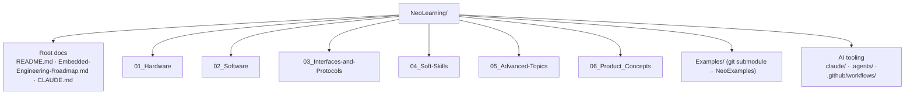
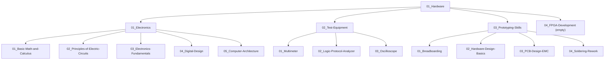
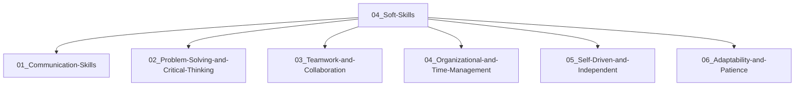
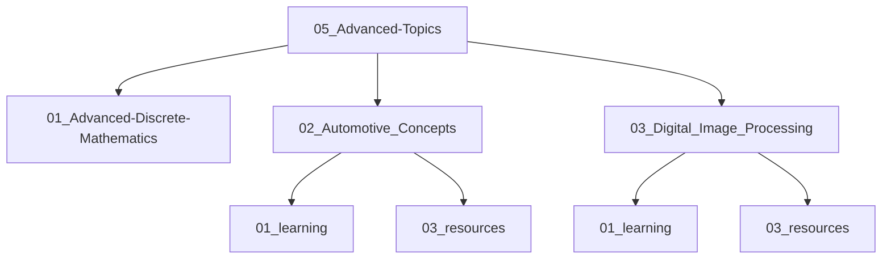
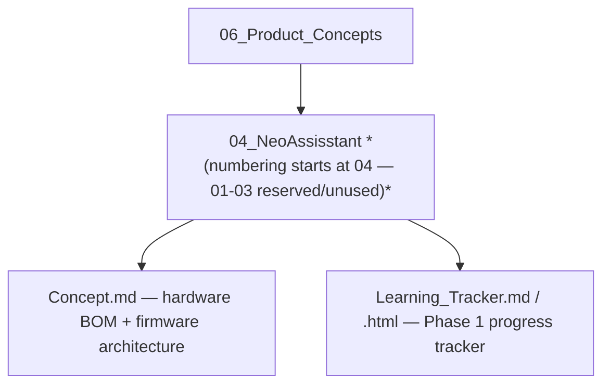
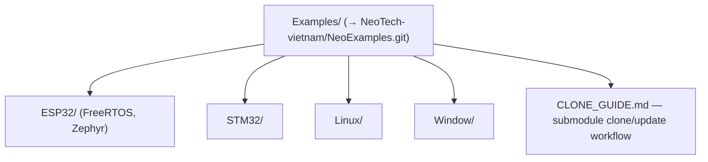

# Repo Structure Map

Mermaid diagrams describing the folder structure of **NeoLearning**, to make
it easier to see where you are in the repo. See [`CLAUDE.md`](CLAUDE.md) for
what each part means/is for; see [`README.md`](README.md) for the full study
content index.

The diagrams are split into 2 layers: one **overview** diagram (root → the 6
top-level sections), and one **detailed** diagram per top-level section (down
to every sub-level that currently exists on disk).

---

## Overview

---

## 01_Hardware

---

## 02_Software

```mermaid
graph TD
    SW["02_Software"]

    SW --> S1["01_Programming-Languages"]
    S1 --> S1a["01_C"]
    S1 --> S1b["02_Cpp"]
    S1 --> S1c["03_Python"]
    S1 --> S1d["04_Assembly"]
    S1 --> S1e["05_Rust"]
    S1 --> S1f["06_Zig"]
    S1 --> S1g["07_Go *(not in README)*"]

    SW --> S2["02_Programming-Fundamentals"]
    S2 --> S2a["00_Basic-Discrete-Mathematics"]
    S2 --> S2b["01_Algorithms-and-Data-Structures"]
    S2 --> S2c["02_Design-Patterns"]
    S2 --> S2d["03_State-Machines"]
    S2 --> S2e["04_Memory-Management"]

    SW --> S3["03_Microcontrollers"]
    S3 --> S3a["01_GPIO"]
    S3 --> S3b["02_ADC-DAC"]
    S3 --> S3c["03_Timers-Counters"]
    S3 --> S3d["04_PWM"]
    S3 --> S3e["05_Watchdog"]
    S3 --> S3f["06_Interrupts"]
    S3 --> S3g["07_DMA"]
    S3 --> S3h["08_Clock-Management"]
    S3 --> S3i["09_Power-Management"]
    S3 --> S3j["10_Bootloader-DFU"]
    S3 --> S3k["11_RTC"]

    SW --> S4["04_Operating-Systems"]
    S4 --> S4a["01_OS-Fundamentals"]
    S4 --> S4b["02_Embedded-Linux"]
    S4 --> S4c["03_RTOS"]

    SW --> S5["05_Build-System"]
    S5 --> S5a["01_Compilers-GCC"]
    S5 --> S5b["02_Make-CMake"]
    S5 --> S5c["03_Bash-Scripting"]
    S5 --> S5d["04_Docker"]

    SW --> S6["06_Debugging"]
    S6 --> S6a["01_JTAG-SWD"]
    S6 --> S6b["02_GDB"]
    S6 --> S6c["03_OpenOCD"]

    SW --> S7["07_Version-Control"]
    S7 --> S7a["01_Git"]
    S7 --> S7b["02_SVN"]

    SW --> S8["08_SDLC-Models"]
    S8 --> S8a["01_Agile-SCRUM"]
    S8 --> S8b["02_V-Model"]

    SW --> S9["09_Testing"]
    S9 --> S9a["01_TDD-and-Unit-Testing"]
    S9 --> S9b["02_CI-CD-Pipelines"]
    S9 --> S9c["03_SIL-HIL-Testing"]
    S9 --> S9d["04_Standards-and-Certifications"]

    SW --> S10["10_Memory-Technologies-and-File-Systems"]
    S10 --> S10a["01_Flash-Memory (NOR/NAND, eMMC, SD Card)"]
    S10 --> S10b["02_EEPROM"]
    S10 --> S10c["03_SRAM-DRAM"]
    S10 --> S10d["04_File-Systems"]
    S10 --> S10e["05_Memory-Organization *(not in README)*"]

    SW --> S11["11_Hardware-Simulation-Emulation"]
    S11 --> S11a["01_QEMU"]
    S11 --> S11b["02_Renode"]

    SW --> S12["12_Sensors-and-Actuators"]
    S12 --> S12a["01_Sensors"]
    S12 --> S12b["02_Actuators"]

    SW --> S13["13_Digital-Signal-Processing"]
    S13 --> S13a["01_DSP-Basics-and-Filter-Design"]
    S13 --> S13b["02_Discrete-Fourier-Transform-FFT"]

    SW --> S14["14_Control-Theory"]
    S14 --> S14a["01_PID-Controller"]
    S14 --> S14b["02_MATLAB-Simulink"]

    SW --> S15["15_Embedded-Security"]
    S15 --> S15a["01_Hardware-Hacking"]
    S15 --> S15b["02_Cryptography"]
    S15 --> S15c["03_Secure-Boot-and-Firmware-Update"]

    SW --> S16["16_Embedded-GUI (empty)"]

    SW --> S17["17_IoT"]
    S17 --> S17a["01_Delta-OTA-Firmware-Update"]

    SW --> S18["18_Edge-AI"]
    S18 --> S18a["01_AI-and-ML-Basics"]
    S18 --> S18b["02_TensorFlow-Lite"]
    S18 --> S18c["03_TinyML"]

    SW --> S19["19_AUTOSAR"]
    S19 --> S19a["01_Classic_Platform *(not in README)*"]
```

---

## 03_Interfaces-and-Protocols

```mermaid
graph TD
    IF["03_Interfaces-and-Protocols"]

    IF --> I1["01_Basic"]
    I1 --> I1a["01_UART"]
    I1 --> I1b["02_I2C"]
    I1 --> I1c["03_SPI"]
    I1 --> I1d["04_SDIO"]
    I1 --> I1e["05_I3C"]
    I1 --> I1f["06_1-Wire"]

    IF --> I2["02_High-Speed"]
    I2 --> I2a["01_Ethernet"]
    I2 --> I2b["02_USB"]
    I2 --> I2c["03_PCIe"]

    IF --> I3["03_Wireless"]
    I3 --> I3a["01_Bluetooth"]
    I3 --> I3b["02_Wi-Fi"]
    I3 --> I3c["03_LoRa"]
    I3 --> I3d["04_Zigbee"]
    I3 --> I3e["05_Thread"]
    I3 --> I3f["06_Matter"]
    I3 --> I3g["07_UWB"]

    IF --> I4["04_Industrial"]
    I4 --> I4a["01_Modbus"]
    I4 --> I4b["02_Profinet"]
    I4 --> I4c["03_EtherCAT"]
    I4 --> I4d["04_MQTT"]
    I4 --> I4e["05_CoAP"]
    I4 --> I4f["06_RS485"]

    IF --> I5["05_Automotive"]
    I5 --> I5a["01_CAN"]
    I5 --> I5b["02_LIN"]
    I5 --> I5c["03_MOST"]
    I5 --> I5d["04_FlexRay"]

    IF --> I6["06_Network"]
    I6 --> I6a["01_TCP-IP"]
    I6 --> I6b["02_UDP"]
    I6 --> I6c["03_Network_Fundamentals *(not in README)*"]

    IF --> I7["07_Cellular"]
    I7 --> I7a["01_GSM-LTE"]
    I7 --> I7b["02_LTE-M-5G"]
    I7 --> I7c["03_NB-IoT"]

    IF --> I8["08_Digital-Audio-Protocols"]
    I8 --> I8a["01_I2S"]
    I8 --> I8b["02_PCM"]

    IF --> I9["09_Display-and-Camera-Protocols"]
    I9 --> I9a["01_SCCB"]
    I9 --> I9b["02_MIPI-CSI-2"]
    I9 --> I9c["03_MIPI-DSI"]
    I9 --> I9d["04_HDMI"]
```

---

## 04_Soft-Skills

---

## 05_Advanced-Topics

---

## 06_Product_Concepts

---

## Examples/ (submodule)

---

## Notes (mismatches between disk and README.md)

The following folders exist on disk but are **not** listed in `README.md` —
this is part of why the structure feels messy:

- `02_Software/01_Programming-Languages/07_Go`
- `02_Software/10_Memory-Technologies-and-File-Systems/05_Memory-Organization`
- `02_Software/19_AUTOSAR/01_Classic_Platform`
- `03_Interfaces-and-Protocols/06_Network/03_Network_Fundamentals`

If you'd like, I can update `README.md` to sync it back up (index matching
the real folder tree 100%) as a separate task.
